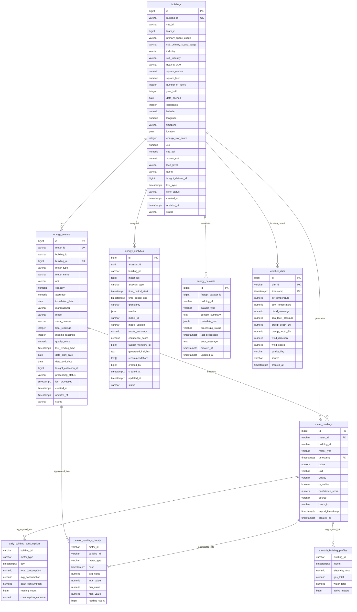
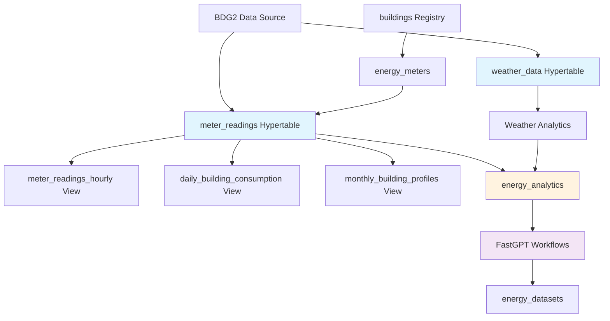

# EAIO Energy Database Documentation

## Database Overview

**Database Name**: `eaio_energy`  
**Database Management System**: TimescaleDB (PostgreSQL Extension)  
**Owner**: `eaio_user`  
**Connection**: Docker container `eaio_timescaledb_new` on port `5434`  

This database is designed for the Energy AI Optimizer (EAIO) system, focusing on energy consumption analytics and building performance optimization. It leverages TimescaleDB's time-series capabilities for efficient storage and querying of energy meter readings and weather data.

---

## Database Schema Structure

### Primary Schema: `energy`

The main schema containing all business logic tables and views for energy data management.

---

## Tables

### 1. buildings

**Purpose**: Central registry of all buildings in the system with metadata and characteristics.

| Column | Type | Constraints | Description |
|--------|------|-------------|-------------|
| `id` | bigint | PRIMARY KEY, AUTO_INCREMENT | Unique building identifier |
| `building_id` | varchar(255) | NOT NULL, UNIQUE | External building identifier |
| `site_id` | varchar(50) | NOT NULL | Site location identifier |
| `team_id` | bigint | | Associated team identifier |
| `primary_space_usage` | varchar(100) | | Main building usage type |
| `sub_primary_space_usage` | varchar(100) | | Sub-category of usage |
| `industry` | varchar(100) | | Industry classification |
| `sub_industry` | varchar(100) | | Sub-industry classification |
| `heating_type` | varchar(50) | | Heating system type |
| `square_meters` | numeric(10,2) | | Building area in square meters |
| `square_feet` | numeric(10,2) | | Building area in square feet |
| `number_of_floors` | integer | | Total number of floors |
| `year_built` | integer | | Construction year |
| `date_opened` | date | | Opening/operation start date |
| `occupants` | integer | | Number of occupants |
| `latitude` | numeric(10,8) | | Geographic latitude |
| `longitude` | numeric(11,8) | | Geographic longitude |
| `timezone` | varchar(50) | | Timezone identifier |
| `location` | point | | PostGIS point geometry |
| `energy_star_score` | integer | | Energy Star rating score |
| `eui` | numeric(10,2) | | Energy Use Intensity |
| `site_eui` | numeric(10,2) | | Site Energy Use Intensity |
| `source_eui` | numeric(10,2) | | Source Energy Use Intensity |
| `leed_level` | varchar(20) | | LEED certification level |
| `rating` | varchar(50) | | Overall building rating |
| `fastgpt_dataset_id` | bigint | | FastGPT dataset reference |
| `last_sync` | timestamptz | | Last synchronization timestamp |
| `sync_status` | varchar(20) | DEFAULT 'active' | Synchronization status |
| `created_at` | timestamptz | DEFAULT now() | Record creation timestamp |
| `updated_at` | timestamptz | DEFAULT now() | Last update timestamp |
| `status` | varchar(20) | DEFAULT 'active' | Record status |

**Indexes**:
- `buildings_pkey` (PRIMARY KEY on `id`)
- `buildings_building_id_key` (UNIQUE on `building_id`)
- `idx_buildings_building_id`, `idx_buildings_site_id`, `idx_buildings_team_id`, `idx_buildings_usage`, `idx_buildings_eui`

---

### 2. energy_meters

**Purpose**: Registry of all energy meters installed in buildings with metadata and configuration.

| Column | Type | Constraints | Description |
|--------|------|-------------|-------------|
| `id` | bigint | PRIMARY KEY, AUTO_INCREMENT | Unique meter identifier |
| `meter_id` | varchar(255) | NOT NULL, UNIQUE | External meter identifier |
| `building_id` | varchar(255) | NOT NULL | Associated building ID |
| `building_ref` | bigint | FOREIGN KEY → `buildings(id)` | Reference to buildings table |
| `meter_type` | varchar(50) | NOT NULL | Type of meter (electricity, gas, water) |
| `meter_name` | varchar(255) | | Descriptive meter name |
| `unit` | varchar(20) | | Measurement unit |
| `capacity` | numeric(12,2) | | Meter capacity/range |
| `accuracy` | numeric(5,2) | | Meter accuracy percentage |
| `installation_date` | date | | Installation date |
| `manufacturer` | varchar(100) | | Meter manufacturer |
| `model` | varchar(100) | | Meter model |
| `serial_number` | varchar(100) | | Serial number |
| `total_readings` | integer | DEFAULT 0 | Total number of readings |
| `missing_readings` | integer | DEFAULT 0 | Count of missing readings |
| `quality_score` | numeric(5,2) | | Data quality score |
| `last_reading_time` | timestamptz | | Timestamp of last reading |
| `data_start_date` | date | | First available data date |
| `data_end_date` | date | | Last available data date |
| `fastgpt_collection_id` | bigint | | FastGPT collection reference |
| `processing_status` | varchar(20) | DEFAULT 'ready' | Processing status |
| `last_processed` | timestamptz | | Last processing timestamp |
| `created_at` | timestamptz | DEFAULT now() | Record creation timestamp |
| `updated_at` | timestamptz | DEFAULT now() | Last update timestamp |
| `status` | varchar(20) | DEFAULT 'active' | Record status |

**Indexes**:
- `energy_meters_pkey` (PRIMARY KEY on `id`)
- `energy_meters_meter_id_key` (UNIQUE on `meter_id`)
- `idx_meters_building_id`, `idx_meters_building_ref`, `idx_meters_meter_id`, `idx_meters_type`

**Foreign Keys**:
- `energy_meters_building_ref_fkey`: `building_ref` → `buildings(id)`

---

### 3. meter_readings ⚡ (Hypertable)

**Purpose**: Time-series data storage for all energy meter readings with high-frequency data ingestion.

| Column | Type | Constraints | Description |
|--------|------|-------------|-------------|
| `id` | bigint | AUTO_INCREMENT | Unique reading identifier |
| `meter_id` | varchar(255) | NOT NULL | Associated meter ID |
| `building_id` | varchar(255) | NOT NULL | Associated building ID |
| `meter_type` | varchar(50) | NOT NULL | Type of measurement |
| `timestamp` | timestamptz | NOT NULL | Reading timestamp |
| `value` | numeric(15,6) | | Measured value |
| `unit` | varchar(20) | | Measurement unit |
| `quality` | varchar(20) | DEFAULT 'good' | Data quality indicator |
| `is_outlier` | boolean | DEFAULT false | Outlier detection flag |
| `confidence_score` | numeric(3,2) | | Reading confidence score |
| `source` | varchar(50) | DEFAULT 'bdg2' | Data source system |
| `batch_id` | varchar(100) | | Import batch identifier |
| `import_timestamp` | timestamptz | DEFAULT now() | Import timestamp |
| `created_at` | timestamptz | DEFAULT now() | Record creation timestamp |

**Primary Key**: `(meter_id, timestamp)`  
**Hypertable Configuration**: Partitioned by `timestamp` with 108 chunks

**Indexes**:
- `meter_readings_pkey` (PRIMARY KEY on `meter_id`, `timestamp`)
- `idx_meter_readings_building_id`, `idx_meter_readings_building_time`
- `idx_meter_readings_meter_id`, `idx_meter_readings_meter_time`
- `idx_meter_readings_meter_type`, `idx_meter_readings_timestamp`
- `idx_meter_readings_quality` (partial index for non-good quality)

**TimescaleDB Features**:
- Automatic partitioning by time
- Continuous aggregation triggers
- Insert blocking triggers for optimization

---

### 4. weather_data ⚡ (Hypertable)

**Purpose**: Historical and real-time weather data for correlation with energy consumption.

| Column | Type | Constraints | Description |
|--------|------|-------------|-------------|
| `id` | bigint | AUTO_INCREMENT | Unique weather record identifier |
| `site_id` | varchar(50) | NOT NULL | Site location identifier |
| `timestamp` | timestamptz | NOT NULL | Weather observation timestamp |
| `air_temperature` | numeric(5,2) | | Air temperature (°C or °F) |
| `dew_temperature` | numeric(5,2) | | Dew point temperature |
| `cloud_coverage` | numeric(4,2) | | Cloud coverage percentage |
| `sea_level_pressure` | numeric(7,2) | | Atmospheric pressure |
| `precip_depth_1hr` | numeric(6,2) | | 1-hour precipitation depth |
| `precip_depth_6hr` | numeric(6,2) | | 6-hour precipitation depth |
| `wind_direction` | numeric(5,2) | | Wind direction (degrees) |
| `wind_speed` | numeric(5,2) | | Wind speed |
| `quality_flag` | varchar(20) | DEFAULT 'good' | Data quality flag |
| `source` | varchar(50) | DEFAULT 'bdg2' | Weather data source |
| `created_at` | timestamptz | DEFAULT now() | Record creation timestamp |

**Primary Key**: `(site_id, timestamp)`  
**Hypertable Configuration**: Partitioned by `timestamp` with 25 chunks

**Indexes**:
- `weather_data_pkey` (PRIMARY KEY on `site_id`, `timestamp`)
- `idx_weather_site_time`, `idx_weather_temperature`, `idx_weather_conditions`

---

### 5. energy_analytics

**Purpose**: Storage for energy analysis results, insights, and AI-generated recommendations.

| Column | Type | Constraints | Description |
|--------|------|-------------|-------------|
| `id` | bigint | PRIMARY KEY, AUTO_INCREMENT | Unique analysis identifier |
| `analysis_id` | uuid | DEFAULT gen_random_uuid() | External analysis identifier |
| `building_id` | varchar(255) | NOT NULL | Associated building ID |
| `meter_ids` | text[] | | Array of analyzed meter IDs |
| `analysis_type` | varchar(50) | | Type of analysis performed |
| `time_period_start` | timestamptz | | Analysis period start |
| `time_period_end` | timestamptz | | Analysis period end |
| `granularity` | varchar(20) | | Data granularity used |
| `results` | jsonb | | Structured analysis results |
| `model_id` | varchar(100) | | AI model identifier |
| `model_version` | varchar(20) | | Model version used |
| `model_accuracy` | numeric(5,4) | | Model accuracy score |
| `confidence_score` | numeric(5,4) | | Result confidence score |
| `fastgpt_workflow_id` | bigint | | FastGPT workflow reference |
| `generated_insights` | text | | AI-generated insights |
| `recommendations` | text[] | | Array of recommendations |
| `created_by` | bigint | | User who created analysis |
| `created_at` | timestamptz | DEFAULT now() | Record creation timestamp |
| `updated_at` | timestamptz | DEFAULT now() | Last update timestamp |
| `status` | varchar(20) | DEFAULT 'completed' | Analysis status |

**Indexes**:
- `energy_analytics_pkey` (PRIMARY KEY on `id`)
- `idx_analytics_building`, `idx_analytics_type`, `idx_analytics_time_period`
- `idx_analytics_results` (GIN index on JSONB)

---

### 6. energy_datasets

**Purpose**: Management of FastGPT datasets for AI training and inference.

| Column | Type | Constraints | Description |
|--------|------|-------------|-------------|
| `id` | bigint | PRIMARY KEY, AUTO_INCREMENT | Unique dataset identifier |
| `fastgpt_dataset_id` | bigint | NOT NULL | FastGPT dataset ID |
| `building_id` | varchar(255) | NOT NULL | Associated building ID |
| `dataset_type` | varchar(50) | | Type of dataset |
| `content_summary` | text | | Dataset content summary |
| `metadata_json` | jsonb | | Dataset metadata |
| `processing_status` | varchar(20) | DEFAULT 'pending' | Processing status |
| `last_processed` | timestamptz | | Last processing timestamp |
| `error_message` | text | | Error message if any |
| `created_at` | timestamptz | DEFAULT now() | Record creation timestamp |
| `updated_at` | timestamptz | DEFAULT now() | Last update timestamp |

**Indexes**:
- `energy_datasets_pkey` (PRIMARY KEY on `id`)
- `idx_energy_datasets_building`, `idx_energy_datasets_fastgpt`, `idx_energy_datasets_type`

---

## Views (Materialized Continuous Aggregations)

### 1. meter_readings_hourly

**Purpose**: Hourly aggregated meter readings for performance optimization.

| Column | Type | Description |
|--------|------|-------------|
| `meter_id` | varchar(255) | Meter identifier |
| `building_id` | varchar(255) | Building identifier |
| `meter_type` | varchar(50) | Meter type |
| `hour` | timestamptz | Hour timestamp |
| `avg_value` | numeric | Average hourly value |
| `total_value` | numeric | Total hourly consumption |
| `min_value` | numeric | Minimum hourly value |
| `max_value` | numeric | Maximum hourly value |
| `reading_count` | bigint | Number of readings in hour |

**Source**: Materialized view backed by `_materialized_hypertable_3`

---

### 2. daily_building_consumption

**Purpose**: Daily consumption aggregates per building and meter type.

| Column | Type | Description |
|--------|------|-------------|
| `building_id` | varchar(255) | Building identifier |
| `meter_type` | varchar(50) | Meter type |
| `day` | timestamptz | Day timestamp |
| `total_consumption` | numeric | Total daily consumption |
| `avg_consumption` | numeric | Average daily consumption |
| `peak_consumption` | numeric | Peak consumption |
| `reading_count` | bigint | Number of readings |
| `consumption_variance` | numeric | Consumption variance |

**Source**: Materialized view backed by `_materialized_hypertable_4`

---

### 3. monthly_building_profiles

**Purpose**: Monthly energy profiles by building with meter type breakdown.

| Column | Type | Description |
|--------|------|-------------|
| `building_id` | varchar(255) | Building identifier |
| `month` | timestamptz | Month timestamp |
| `electricity_total` | numeric | Total monthly electricity |
| `gas_total` | numeric | Total monthly gas |
| `water_total` | numeric | Total monthly water |
| `active_meters` | bigint | Number of active meters |

**Source**: Materialized view backed by `_materialized_hypertable_5`

---

## Entity Relationship Diagram (ERD)

---

## Database Features

### TimescaleDB Extensions

1. **Hypertables**:
   - `meter_readings`: 108 chunks, partitioned by timestamp
   - `weather_data`: 25 chunks, partitioned by timestamp

2. **Continuous Aggregations**:
   - Automatic hourly, daily, and monthly aggregations
   - Materialized views for performance optimization
   - Incremental refresh capabilities

3. **Data Retention**: 
   - Configurable chunk dropping policies
   - Compression policies for older data

### Performance Optimizations

1. **Indexing Strategy**:
   - Time-based indexes on hypertables
   - Composite indexes for common query patterns
   - GIN indexes for JSONB data
   - Partial indexes for quality filtering

2. **Data Quality**:
   - Outlier detection mechanisms
   - Quality scoring system
   - Confidence metrics for analytics

### Integration Points

1. **FastGPT Integration**:
   - Dataset management through `energy_datasets`
   - Workflow tracking in analytics
   - Collection references in meters

2. **External Systems**:
   - BDG2 data source integration
   - Team-based data access control
   - Sync status tracking

---

## Data Flow Architecture

---

## Security and Access Control

- **Database Owner**: `eaio_user`
- **Connection Security**: Docker network isolation
- **Data Encryption**: At-rest encryption available
- **Access Patterns**: Team-based data segregation via `team_id`

---

## Maintenance and Monitoring

### Key Metrics to Monitor

1. **Performance Metrics**:
   - Query response times
   - Chunk utilization
   - Index usage statistics

2. **Data Quality Metrics**:
   - Missing readings count
   - Quality score distributions
   - Outlier detection rates

3. **System Health**:
   - Sync status monitoring
   - Processing queue lengths
   - Error rates in analytics

### Recommended Maintenance Tasks

1. **Regular Tasks**:
   - Chunk compression for old data
   - Index maintenance and statistics updates
   - Data retention policy enforcement

2. **Periodic Tasks**:
   - Analytics result cleanup
   - Dataset synchronization
   - Performance tuning reviews

---

## Version Information

- **TimescaleDB Version**: Latest (PostgreSQL 15 base)
- **Container**: `eaio_timescaledb_new`
- **Port**: 5434
- **Documentation Generated**: 2025-08-13

---

*This documentation was automatically generated by analyzing the live database structure. For updates or modifications, please refer to the database administrator.*