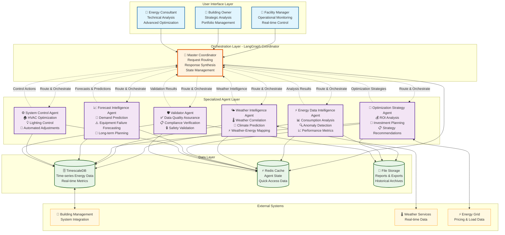
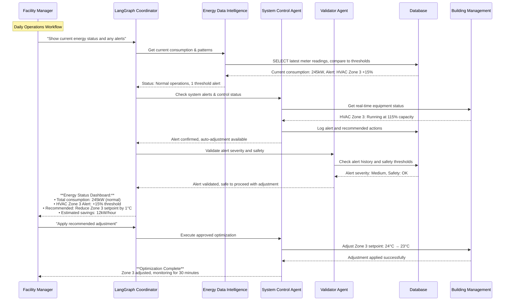
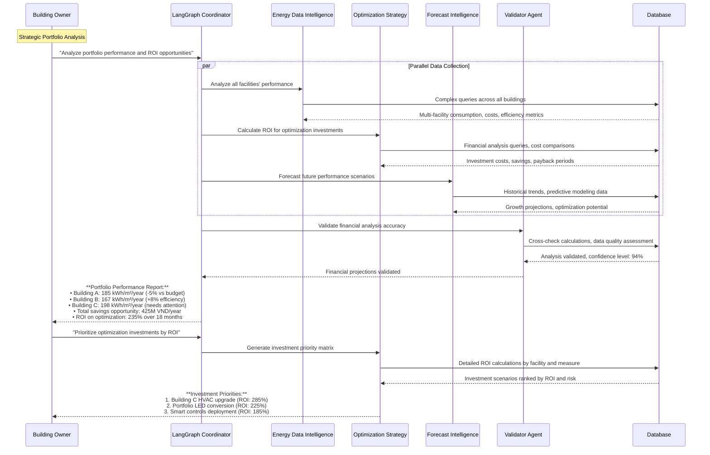
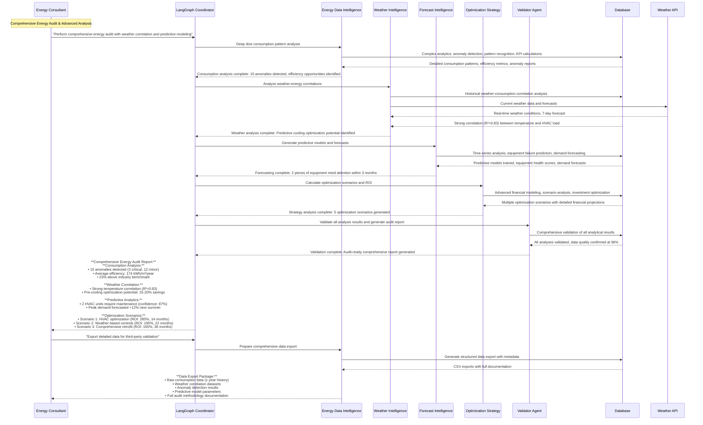
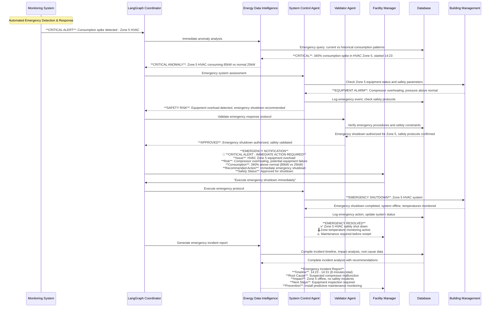

# EAIO Multi-Agent System Architecture V1.0

## Executive Summary

The Energy AI Optimizer (EAIO) implements a sophisticated multi-agent system designed to serve three distinct stakeholder groups: Facility Managers, Building Owners, and Energy Consultants. Following Anthropic's principles for building effective agents and AWS's multi-agent system patterns, this architecture employs specialized agents coordinated through LangGraph workflows to deliver comprehensive energy management solutions.

## Table of Contents

1. [Stakeholder Chat Input Analysis](#1-stakeholder-chat-input-analysis)
2. [Complete System Architecture Overview](#2-complete-system-architecture-overview)
3. [Agent Specialization Matrix](#3-agent-specialization-matrix)
4. [Database Integration Architecture](#4-database-integration-architecture)
5. [Multi-Agent Workflow Designs](#5-multi-agent-workflow-designs)
6. [Agent Orchestration Patterns](#6-agent-orchestration-patterns)
7. [Implementation Framework](#7-implementation-framework)

---

## 1. Stakeholder Chat Input Analysis

### 1.1 Facility Manager Chat Inputs

Based on the requirements analysis, Facility Managers need comprehensive operational monitoring and control capabilities. Their chat inputs focus on real-time operations, reporting, and immediate response to energy issues.

#### 1.1.1 Reporting & Monitoring Queries

**Daily/Monthly/Quarterly Reports**
- "Hiển thị báo cáo tiêu thụ năng lượng hôm nay của tòa nhà A"
- "Cho tôi xem báo cáo năng lượng tháng này so với tháng trước"
- "Tạo báo cáo quý 1 cho cơ sở tôi phụ trách"
- "So sánh tiêu thụ điện tuần này với cùng kỳ năm ngoái"

**Budget vs Actual Analysis**
- "Tiêu thụ năng lượng hiện tại so với ngân sách như thế nào?"
- "Tôi đã vượt ngân sách năng lượng bao nhiêu phần trăm?"
- "Dự báo chi phí năng lượng cuối tháng dựa trên xu hướng hiện tại"
- "So sánh chi phí thực tế với kế hoạch đã đề ra"

**Real-time Monitoring**
- "Tình trạng tiêu thụ năng lượng hiện tại của tòa nhà như thế nào?"
- "Có chỉ số nào đang cao hơn mức bình thường không?"
- "Hiển thị dashboard năng lượng real-time cho tất cả các hệ thống"
- "Công suất hiện tại của hệ thống điều hòa là bao nhiêu?"

#### 1.1.2 Alert & Threshold Management

**Threshold Violation Analysis**
- "Hệ thống nào đang vượt ngưỡng tiêu thụ?"
- "Tại sao hệ thống HVAC tầng 3 lại tiêu thụ cao bất thường?"
- "Danh sách các thiết bị đang hoạt động ngoài khung giờ quy định"
- "Phân tích nguyên nhân tăng đột biến tiêu thụ lúc 14:30"

**Alert Management**
- "Hiển thị tất cả cảnh báo năng lượng trong 24 giờ qua"
- "Cảnh báo nào cần xử lý ngay lập tức?"
- "Lưu lại lịch sử cảnh báo của hệ thống chiếu sáng tầng 2"
- "Thiết lập cảnh báo khi tiêu thụ vượt 200kW trong giờ cao điểm"

#### 1.1.3 System-specific Analysis

**Individual System Reports**
- "Báo cáo chi tiết hệ thống điện vận hành tháng này"
- "Phân tích tiêu thụ của hệ thống Heatpump so với định mức"
- "Chi phí điện tiện ích công cộng trong quý vừa qua"
- "Suất tiêu hao của hệ thống KDDV so với tiêu chuẩn"
- "Hiệu suất hoạt động của hệ thống trông giữ xe"

**Hourly Tracking**
- "Biểu đồ tiêu thụ theo giờ trong ngày hôm nay"
- "Khung giờ nào tiêu thụ năng lượng cao nhất?"
- "Phân tích pattern tiêu thụ từ 6AM đến 6PM"
- "So sánh tiêu thụ giờ cao điểm vs giờ thấp điểm"

#### 1.1.4 Export & Visualization

**Chart Generation**
- "Tạo biểu đồ tiêu thụ năng lượng 7 ngày qua"
- "Biểu đồ so sánh hiệu suất các hệ thống trong tháng"
- "Đồ thị xu hướng tiêu thụ 3 tháng gần nhất"
- "Dashboard trực quan cho cuộc họp báo cáo tuần"

**Excel Export**
- "Xuất báo cáo tài chính năng lượng ra file Excel"
- "Tạo file Excel theo mẫu báo cáo tài chính tiêu chuẩn"
- "Xuất dữ liệu thô để phân tích nâng cao"
- "Tạo template báo cáo tùy chỉnh cho ban lãnh đạo"

### 1.2 Building Owner Chat Inputs

Building Owners focus on strategic oversight, portfolio management, and high-level financial analysis across multiple facilities.

#### 1.2.1 Portfolio-wide Reporting

**Multi-facility Overview**
- "Hiển thị tổng quan tiêu thụ năng lượng tất cả cơ sở"
- "Báo cáo tổng hợp theo tháng/quý/năm cho toàn bộ portfolio"
- "Dashboard điều hành cho 5 tòa nhà đang quản lý"
- "Tình hình năng lượng toàn bộ hệ thống trong Q1/2025"

**Cross-facility Comparisons**
- "So sánh hiệu suất năng lượng giữa các cơ sở"
- "Tòa nhà nào đang hoạt động hiệu quả nhất?"
- "Phân tích chênh lệch tiêu thụ giữa Building A và Building B"
- "Ranking cơ sở theo mức độ tiết kiệm năng lượng"

#### 1.2.2 Financial Analysis

**Budget Management**
- "Tổng chi phí năng lượng so với ngân sách toàn portfolio"
- "Dự báo tổng chi phí năng lượng cuối năm"
- "Phân bổ ngân sách tối ưu cho các cơ sở năm tới"
- "ROI của các dự án tiết kiệm năng lượng đã triển khai"

**Cost per m² Analysis**
- "Chi phí năng lượng/m² của từng tòa nhà"
- "So sánh cost per m² với benchmark ngành"
- "Tòa nhà nào có chi phí vận hành cao nhất?"
- "Xu hướng thay đổi chi phí/m² trong 12 tháng qua"

#### 1.2.3 Strategic Planning

**Investment Decisions**
- "Cơ sở nào cần đầu tư nâng cấp hệ thống năng lượng?"
- "ROI dự kiến nếu triển khai smart building cho toàn bộ portfolio?"
- "Ưu tiên đầu tư tiết kiệm năng lượng theo từng cơ sở"
- "Phân tích khả năng thu hồi vốn các dự án năng lượng xanh"

**Performance Benchmarking**
- "Xếp hạng hiệu suất năng lượng các tòa nhà so với tiêu chuẩn"
- "Cơ sở nào đạt chứng nhận green building?"
- "Gap analysis để đạt mục tiêu carbon neutral 2030"
- "So sánh với competitor trong ngành về hiệu suất năng lượng"

### 1.3 Energy Consultant Chat Inputs

Energy Consultants require advanced analytical capabilities, custom modeling, and sophisticated optimization tools.

#### 1.3.1 Data Aggregation & Analysis

**Building-level Aggregation**
- "Tổng hợp tiêu thụ năng lượng theo từng tòa nhà trong portfolio"
- "Phân nhóm dữ liệu tiêu thụ theo loại hình căn hộ"
- "Mô hình sử dụng năng lượng tổng thể của khu phức hợp"
- "Pattern tiêu thụ khác biệt giữa residential và commercial units"

**Custom KPI Development**
- "Tính toán EUI (Energy Use Intensity) cho từng tòa nhà"
- "Tạo KPI tiêu thụ năng lượng trên mét vuông theo seasons"
- "Chỉ số hiệu suất năng lượng tùy chỉnh theo building type"
- "Benchmark customized dựa trên climate zone và occupancy patterns"

#### 1.3.2 Advanced Analytics

**Anomaly Detection**
- "Phát hiện bất thường trong pattern tiêu thụ năng lượng"
- "Thiết bị nào có dấu hiệu hoạt động không bình thường?"
- "Machine learning model để detect equipment malfunction"
- "Identify outliers trong consumption data sử dụng unsupervised algorithms"
- "Root cause analysis cho các anomaly được phát hiện"

**Behavioral Pattern Analysis**
- "Phân tích behavior pattern tiêu thụ năng lượng theo thời gian"
- "Xu hướng thay đổi habit sử dụng năng lượng của occupants"
- "Correlation giữa occupancy schedule và energy consumption"
- "Seasonal behavior analysis và impact lên overall consumption"

#### 1.3.3 Predictive Analytics

**Time-series Forecasting**
- "Dự đoán tiêu thụ năng lượng 6 tháng tới sử dụng ARIMA model"
- "Forecast peak demand để optimize capacity planning"
- "Predict maintenance needs dựa trên energy consumption patterns"
- "Model dự báo tác động của weather changes lên energy usage"

**Equipment Prediction**
- "Dự đoán thời điểm cần thay thế HVAC equipment"
- "Predictive maintenance schedule dựa trên performance degradation"
- "Estimate remaining useful life của major energy-consuming equipment"
- "Risk assessment cho equipment failure và impact lên operations"

#### 1.3.4 Optimization & Control

**Weather-based Optimization**
- "Tối ưu hóa hệ thống điều hòa dựa trên dự báo thời tiết 7 ngày"
- "Adjust chiếu sáng công cộng theo natural light availability"
- "Pre-cooling strategy optimization cho hot weather days"
- "Seasonal optimization model cho HVAC operations"

**Advanced Visualization**
- "Tạo heat map tiêu thụ năng lượng theo zones và time periods"
- "Interactive dashboard với drill-down capabilities"
- "3D visualization của energy flow trong building"
- "Customizable reports với advanced charting options"
- "Real-time monitoring dashboard với predictive indicators"

### 1.4 Agent Mapping for Stakeholder Queries

#### 1.4.1 Query Classification Matrix

| Query Type | Primary Agent | Secondary Agents | Complexity Level |
|------------|---------------|------------------|------------------|
| **Real-time Monitoring** | Energy Data Intelligence | System Control, Validator | Low |
| **Historical Reports** | Energy Data Intelligence | Optimization Strategy | Medium |
| **Anomaly Detection** | Energy Data Intelligence | Validator, Forecast Intelligence | High |
| **Predictive Analytics** | Forecast Intelligence | Energy Data Intelligence, Weather Intelligence | High |
| **Financial Analysis** | Optimization Strategy | Energy Data Intelligence | Medium |
| **Weather Correlation** | Weather Intelligence | Energy Data Intelligence, Forecast Intelligence | High |
| **System Control** | System Control | Energy Data Intelligence, Validator | Medium |
| **Portfolio Comparison** | Optimization Strategy | Energy Data Intelligence | Medium |
| **Export/Visualization** | Energy Data Intelligence | Validator | Low |
| **Advanced Modeling** | Forecast Intelligence | Energy Data Intelligence, Weather Intelligence | High |

#### 1.4.2 Response Time SLA by Query Type

- **Simple Queries** (Real-time data, basic reports): < 3 seconds
- **Medium Complexity** (Comparisons, financial analysis): < 15 seconds  
- **Complex Analysis** (Anomaly detection, predictions): < 60 seconds
- **Advanced Modeling** (Custom analytics, forecasting): < 5 minutes

---

## 2. Complete System Architecture Overview

### 2.1 System Architecture Diagram



### 2.2 Architectural Principles

Based on Anthropic's effective agent principles and AWS multi-agent patterns:

**Simplicity First**: Each agent has a single, well-defined responsibility
**Transparent Operations**: All agent decisions and actions are logged and explainable
**Composable Design**: Agents can be combined in different workflows
**Robust Error Handling**: Graceful degradation when agents fail
**Scalable Coordination**: LangGraph manages complex multi-agent interactions

### 2.3 Core Agent Responsibilities

| Agent | Primary Function | Key Capabilities |
|-------|------------------|-------------------|
| **Energy Data Intelligence** | Data analysis & insights | Consumption patterns, anomaly detection, performance metrics |
| **Weather Intelligence** | Weather-energy correlation | Climate impact analysis, weather forecasting integration |
| **Optimization Strategy** | Strategic recommendations | ROI analysis, investment planning, cost optimization |
| **Forecast Intelligence** | Predictive analytics | Demand forecasting, equipment failure prediction |
| **System Control** | Operational control | HVAC optimization, automated adjustments |
| **Validator** | Quality assurance | Data validation, compliance checking, safety verification |

---

## 3. Agent Specialization Matrix

### 3.1 Stakeholder-Agent Mapping

```mermaid
graph TB
    subgraph "Stakeholder Requirements"
        subgraph "Facility Manager Needs"
            FM_R1[📊 Daily/Monthly/Quarterly Reports]
            FM_R2[⚡ Real-time Energy Monitoring]
            FM_R3[🚨 Threshold Alerts & Analysis]
            FM_R4[📈 Hourly Energy Tracking]
            FM_R5[🎯 System-specific Reports]
            FM_R6[📋 Visual Dashboards]
            FM_R7[📤 Excel Export Capabilities]
        end
        
        subgraph "Building Owner Needs"
            BO_R1[🏢 Multi-facility Reports]
            BO_R2[⚖️ Cross-facility Comparisons]
            BO_R3[💰 Budget vs Actual Analysis]
            BO_R4[🎯 Threshold Analysis]
            BO_R5[💵 Cost per m² Analysis]
        end
        
        subgraph "Energy Consultant Needs"
            EC_R1[📊 Data Aggregation & Grouping]
            EC_R2[🧮 Custom KPI Calculations]
            EC_R3[🔍 Anomaly Detection]
            EC_R4[📈 Behavioral Pattern Analysis]
            EC_R5[🔮 Time-series Prediction]
            EC_R6[📊 Advanced Visualization]
            EC_R7[🌤️ Weather-based Optimization]
        end
    end
    
    subgraph "Agent Specialization"
        EDA_SPEC[⚡ Energy Data Intelligence<br/>• Real-time monitoring<br/>• Performance analysis<br/>• Data aggregation<br/>• Report generation]
        
        WIA_SPEC[🌤️ Weather Intelligence<br/>• Weather correlation<br/>• Climate predictions<br/>• Optimization triggers]
        
        OSA_SPEC[🎯 Optimization Strategy<br/>• Cost analysis<br/>• ROI calculations<br/>• Strategic recommendations]
        
        FIA_SPEC[📈 Forecast Intelligence<br/>• Demand prediction<br/>• Trend analysis<br/>• Future planning]
        
        SCA_SPEC[⚙️ System Control<br/>• Automated adjustments<br/>• Threshold management<br/>• Real-time control]
        
        VA_SPEC[🛡️ Validator<br/>• Data quality<br/>• Compliance verification<br/>• Report validation]
    end
    
    %% Facility Manager Mappings
    FM_R1 --> EDA_SPEC
    FM_R2 --> EDA_SPEC
    FM_R2 --> SCA_SPEC
    FM_R3 --> SCA_SPEC
    FM_R3 --> VA_SPEC
    FM_R4 --> EDA_SPEC
    FM_R5 --> EDA_SPEC
    FM_R6 --> EDA_SPEC
    FM_R7 --> EDA_SPEC
    
    %% Building Owner Mappings
    BO_R1 --> EDA_SPEC
    BO_R2 --> OSA_SPEC
    BO_R3 --> OSA_SPEC
    BO_R4 --> VA_SPEC
    BO_R5 --> OSA_SPEC
    
    %% Energy Consultant Mappings
    EC_R1 --> EDA_SPEC
    EC_R2 --> EDA_SPEC
    EC_R3 --> EDA_SPEC
    EC_R4 --> FIA_SPEC
    EC_R5 --> FIA_SPEC
    EC_R6 --> EDA_SPEC
    EC_R7 --> WIA_SPEC
    EC_R7 --> SCA_SPEC
    
    classDef requirement fill:#e3f2fd,stroke:#1976d2,stroke-width:1px
    classDef agent fill:#f3e5f5,stroke:#4a148c,stroke-width:2px
    
    class FM_R1,FM_R2,FM_R3,FM_R4,FM_R5,FM_R6,FM_R7,BO_R1,BO_R2,BO_R3,BO_R4,BO_R5,EC_R1,EC_R2,EC_R3,EC_R4,EC_R5,EC_R6,EC_R7 requirement
    class EDA_SPEC,WIA_SPEC,OSA_SPEC,FIA_SPEC,SCA_SPEC,VA_SPEC agent
```



### 3.2 Agent Capability Matrix

| Capability | EDA | WIA | OSA | FIA | SCA | VA |
|------------|-----|-----|-----|-----|-----|-----|
| **Real-time Monitoring** | ●●● | ● | ● | ● | ●●● | ●● |
| **Historical Analysis** | ●●● | ●● | ●●● | ●●● | ● | ●● |
| **Anomaly Detection** | ●●● | ● | ● | ●● | ● | ●●● |
| **Predictive Analytics** | ● | ●● | ●● | ●●● | ● | ● |
| **Cost Analysis** | ●● | ● | ●●● | ●● | ● | ● |
| **Report Generation** | ●●● | ● | ●● | ● | ● | ●●● |
| **System Control** | ● | ● | ● | ● | ●●● | ●● |
| **Data Validation** | ●● | ● | ● | ● | ● | ●●● |
| **Weather Integration** | ● | ●●● | ●● | ●● | ●● | ● |
| **Compliance Checking** | ● | ● | ●● | ● | ●● | ●●● |

*Legend: ●●● Primary, ●● Secondary, ● Supporting*

---

## 4. Database Integration Architecture

### 4.1 EAIO TimescaleDB Schema Integration

**Database**: `eaio_energy` (TimescaleDB/PostgreSQL Extension)  
**Owner**: `eaio_user`  
**Connection**: Docker container `eaio_timescaledb_new` on port `5434`

### 4.2 Data Architecture Overview

```mermaid
graph TB
    subgraph EAIO_DB["EAIO Energy Database Schema"]
        subgraph CORE_TABLES["Core Tables"]
            BUILDINGS["🏢 buildings<br/>Building registry with metadata<br/>Geographic & operational parameters<br/>Energy performance metrics"]
            METERS["📊 energy_meters<br/>Meter registry & equipment mapping<br/>Data quality tracking<br/>Equipment monitoring"]
            READINGS["📈 meter_readings ⚡ Hypertable<br/>Time-series consumption data<br/>108 chunks partitioned by timestamp<br/>Real-time ingestion"]
        end
        
        subgraph ANALYTICS_TABLES["Analytics & Intelligence Tables"]
            WEATHER["🌡️ weather_data ⚡ Hypertable<br/>Climate & weather correlations<br/>25 chunks partitioned by timestamp<br/>Multi-site weather tracking"]
            ANALYTICS["🧠 energy_analytics<br/>AI-generated insights & results<br/>ML workflow integration<br/>JSONB structured results"]
            DATASETS["📚 energy_datasets<br/>ML dataset management<br/>AI training & inference data<br/>Processing status tracking"]
        end
        
        subgraph AGGREGATIONS["Materialized Continuous Aggregations"]
            HOURLY["⏰ meter_readings_hourly<br/>Hourly consumption aggregations<br/>Performance optimization<br/>Materialized hypertable"]
            DAILY["📅 daily_building_consumption<br/>Daily building performance metrics<br/>Consumption variance tracking<br/>Pattern analysis"]
            MONTHLY["📆 monthly_building_profiles<br/>Monthly energy profiles by type<br/>Electricity/Gas/Water breakdown<br/>Active meters tracking"]
        end
    end
    
    subgraph AGENT_ACCESS["Agent Data Access Patterns"]
        EDA_ACCESS["⚡ Energy Data Intelligence<br/>• buildings, energy_meters, meter_readings<br/>• meter_readings_hourly, daily_building_consumption<br/>• energy_analytics JSONB results"]
        
        WIA_ACCESS["🌤️ Weather Intelligence<br/>• weather_data hypertable<br/>• buildings location correlations<br/>• meter_readings weather-energy correlation"]
        
        OSA_ACCESS["🎯 Optimization Strategy<br/>• buildings EUI performance metrics<br/>• monthly_building_profiles<br/>• energy_analytics financial results"]
        
        FIA_ACCESS["📈 Forecast Intelligence<br/>• meter_readings time-series analysis<br/>• weather_data predictive models<br/>• daily/monthly aggregations trend analysis"]
        
        SCA_ACCESS["⚙️ System Control<br/>• energy_meters equipment status<br/>• meter_readings real-time monitoring<br/>• buildings control parameters"]
        
        VA_ACCESS["🛡️ Validator<br/>• energy_meters quality_score data validation<br/>• meter_readings quality confidence_score<br/>• energy_datasets processing validation"]
    end
    
    %% Data Flow Connections
    BUILDINGS --> EDA_ACCESS
    BUILDINGS --> WIA_ACCESS
    BUILDINGS --> OSA_ACCESS
    
    METERS --> EDA_ACCESS
    METERS --> SCA_ACCESS
    METERS --> VA_ACCESS
    
    READINGS --> EDA_ACCESS
    READINGS --> WIA_ACCESS
    READINGS --> FIA_ACCESS
    READINGS --> SCA_ACCESS
    
    WEATHER --> WIA_ACCESS
    WEATHER --> FIA_ACCESS
    
    ANALYTICS --> EDA_ACCESS
    ANALYTICS --> OSA_ACCESS
    ANALYTICS --> VA_ACCESS
    
    DATASETS --> VA_ACCESS
    DATASETS --> EDA_ACCESS
    
    HOURLY --> EDA_ACCESS
    HOURLY --> FIA_ACCESS
    HOURLY --> OSA_ACCESS
    
    DAILY --> EDA_ACCESS
    DAILY --> FIA_ACCESS
    DAILY --> OSA_ACCESS
    
    MONTHLY --> OSA_ACCESS
    MONTHLY --> FIA_ACCESS
    
    classDef table fill:#e8f5e8,stroke:#1b5e20,stroke-width:2px
    classDef view fill:#dcedc8,stroke:#558b2f,stroke-width:2px
    classDef agent fill:#f3e5f5,stroke:#4a148c,stroke-width:2px
    
    class BUILDINGS,METERS,READINGS,WEATHER,ANALYTICS,DATASETS table
    class HOURLY,DAILY,MONTHLY view
    class EDA_ACCESS,WIA_ACCESS,OSA_ACCESS,FIA_ACCESS,SCA_ACCESS,VA_ACCESS agent
```



### 4.3 TimescaleDB-Specific Schema Integration

**Hypertable Architecture:**
- **meter_readings**: 108 time-based chunks for high-frequency data ingestion
- **weather_data**: 25 time-based chunks for climate correlations
- **Continuous Aggregations**: Materialized hypertables for performance optimization

**Data Quality & AI Integration:**
- **Quality Tracking**: Built-in `quality_score`, `confidence_score`, `is_outlier` fields
- **ML Integration**: Dataset management for AI training and inference workflows
- **Structured Analytics**: JSONB results storage in `energy_analytics` table

### 4.4 Agent-Specific Data Access Patterns

**Query Patterns by Agent:**

- **Energy Data Intelligence**: 
  - Primary: `meter_readings`, `energy_meters`, `buildings` (high-frequency reads)
  - Analytics: `energy_analytics.results` (JSONB queries), materialized views
  - Aggregations: Hourly/daily consumption patterns, performance metrics

- **Weather Intelligence**: 
  - Primary: `weather_data` hypertable (time-series correlations)  
  - Correlation: `buildings.location` for geographic weather mapping
  - Integration: Real-time weather API sync with historical data

- **Optimization Strategy**: 
  - Financial: `buildings.eui`, `buildings.energy_star_score`, cost calculations
  - Portfolio: Cross-facility comparisons using `monthly_building_profiles`
  - ROI Analysis: Complex joins between buildings, analytics, and performance data

- **Forecast Intelligence**: 
  - Time-series: `meter_readings` pattern analysis and prediction modeling
  - Predictive: `weather_data` integration for demand forecasting
  - Equipment: `energy_meters.quality_score` degradation analysis

- **System Control**: 
  - Real-time: `meter_readings` live monitoring and threshold checking
  - Equipment: `energy_meters` status tracking and control parameter updates
  - Alerts: Integration with BMS systems for automated adjustments

- **Validator**: 
  - Quality Assurance: `meter_readings.quality`, `confidence_score` validation
  - Data Integrity: `energy_meters.missing_readings`, `total_readings` tracking
  - Processing: `energy_datasets.processing_status` and error handling

**TimescaleDB Performance Optimizations:**
- Automated time-based partitioning with chunk management
- Continuous aggregation policies for real-time materialized views
- Compression policies for historical data storage optimization
- Index strategies optimized for time-series and JSONB queries
- Connection pooling with agent-specific access permissions

---

## 5. Multi-Agent Workflow Designs

### 5.1 Facility Manager Workflow: Real-Time Monitoring & Alerts



### 5.2 Building Owner Workflow: Portfolio Analysis & ROI



### 5.3 Energy Consultant Workflow: Advanced Analytics & Optimization



### 5.4 Emergency Response Workflow



---

## 6. Agent Orchestration Patterns

### 6.1 Orchestration Patterns Based on Use Cases

Following Anthropic's principles for effective agents, we implement five core orchestration patterns:

#### 6.1.1 Sequential Processing Pattern (Prompt Chaining)

**Use Case**: Complex analysis requiring step-by-step validation
**Example**: Energy audit workflow

```python
# Pseudo-code for Sequential Pattern
def energy_audit_workflow(building_id):
    # Step 1: Data Collection
    raw_data = energy_data_agent.collect_consumption_data(building_id)
    
    # Step 2: Data Validation
    validated_data = validator_agent.validate_data_quality(raw_data)
    
    # Step 3: Pattern Analysis
    patterns = energy_data_agent.analyze_consumption_patterns(validated_data)
    
    # Step 4: Weather Correlation
    weather_correlation = weather_agent.correlate_with_weather(patterns)
    
    # Step 5: Optimization Strategy
    recommendations = optimization_agent.generate_strategies(weather_correlation)
    
    # Step 6: Final Validation
    final_report = validator_agent.validate_recommendations(recommendations)
    
    return final_report
```

#### 5.1.2 Parallel Processing Pattern (Parallelization)

**Use Case**: Independent data collection from multiple sources
**Example**: Portfolio dashboard generation

```python
# Pseudo-code for Parallel Pattern
async def portfolio_dashboard_workflow(facility_list):
    tasks = []
    
    # Parallel data collection
    for facility in facility_list:
        tasks.extend([
            energy_data_agent.get_current_status(facility),
            weather_agent.get_weather_impact(facility),
            control_agent.get_system_health(facility)
        ])
    
    # Execute all tasks in parallel
    results = await asyncio.gather(*tasks)
    
    # Synthesis phase
    dashboard = coordinator.synthesize_dashboard(results)
    
    return dashboard
```

#### 5.1.3 Routing Pattern (Classification)

**Use Case**: Route requests to appropriate specialists
**Example**: User query classification

```python
# Pseudo-code for Routing Pattern
def route_user_query(query, user_type):
    query_type = coordinator.classify_query(query)
    
    if query_type == "real_time_monitoring":
        return energy_data_agent.handle_monitoring_query(query)
    elif query_type == "predictive_analysis":
        return forecast_agent.handle_prediction_query(query)
    elif query_type == "system_control":
        return control_agent.handle_control_query(query)
    elif query_type == "cost_optimization":
        return optimization_agent.handle_optimization_query(query)
    else:
        return coordinator.handle_complex_query(query)
```

#### 5.1.4 Orchestrator-Workers Pattern

**Use Case**: Dynamic task breakdown and delegation
**Example**: Facility optimization project

```python
# Pseudo-code for Orchestrator-Workers Pattern
def facility_optimization_project(facility_id, scope):
    # Orchestrator analyzes scope and creates work plan
    work_plan = coordinator.create_optimization_plan(facility_id, scope)
    
    # Dynamically assign tasks to specialized agents
    tasks = {}
    for task in work_plan.tasks:
        if task.type == "energy_analysis":
            tasks[task.id] = energy_data_agent.execute_async(task)
        elif task.type == "weather_analysis":
            tasks[task.id] = weather_agent.execute_async(task)
        elif task.type == "cost_analysis":
            tasks[task.id] = optimization_agent.execute_async(task)
    
    # Coordinate task execution and dependencies
    results = coordinator.execute_with_dependencies(tasks, work_plan.dependencies)
    
    return coordinator.synthesize_final_report(results)
```

#### 5.1.5 Evaluator-Optimizer Pattern

**Use Case**: Iterative improvement of recommendations
**Example**: HVAC optimization with continuous refinement

```python
# Pseudo-code for Evaluator-Optimizer Pattern
def optimize_hvac_system(building_id, target_efficiency):
    current_solution = None
    iteration = 0
    max_iterations = 5
    
    while iteration < max_iterations:
        # Generate/refine optimization strategy
        if current_solution is None:
            current_solution = optimization_agent.generate_initial_strategy(building_id)
        else:
            current_solution = optimization_agent.refine_strategy(current_solution, feedback)
        
        # Evaluate the strategy
        evaluation = validator_agent.evaluate_strategy(current_solution)
        
        # Check if target is met
        if evaluation.efficiency_gain >= target_efficiency:
            return current_solution
        
        # Generate feedback for next iteration
        feedback = validator_agent.generate_improvement_feedback(evaluation)
        iteration += 1
    
    return current_solution  # Best solution found
```

### 5.2 State Management Architecture

Using LangGraph's state management capabilities:

```python
from typing import TypedDict, List, Optional
from langgraph.graph import StateGraph, END

class EAIOState(TypedDict):
    user_query: str
    user_type: str  # facility_manager, building_owner, energy_consultant
    facility_ids: List[str]
    current_step: str
    agent_results: dict
    final_response: Optional[str]
    error_state: Optional[str]
    
# State transitions managed by LangGraph
def create_eaio_workflow():
    workflow = StateGraph(EAIOState)
    
    # Add nodes (agents)
    workflow.add_node("coordinator", coordinator_agent)
    workflow.add_node("energy_data", energy_data_agent)
    workflow.add_node("weather", weather_agent)
    workflow.add_node("optimization", optimization_agent)
    workflow.add_node("forecast", forecast_agent)
    workflow.add_node("control", control_agent)
    workflow.add_node("validator", validator_agent)
    
    # Define edges (workflow transitions)
    workflow.add_edge("coordinator", "energy_data")
    workflow.add_conditional_edges("energy_data", route_next_agent)
    workflow.add_edge("validator", END)
    
    return workflow.compile()
```

### 5.3 Error Handling and Recovery

**Graceful Degradation Patterns**:

1. **Agent Failure Recovery**: If one agent fails, coordinator routes to backup strategies
2. **Data Quality Fallback**: Validator agent provides data quality warnings and alternative data sources
3. **System Overload Management**: Request queuing and priority-based processing
4. **Network Failure Resilience**: Local caching and offline operation capabilities

---

## 7. Implementation Framework

### 7.1 Technology Stack

**Core Framework**:
- **LangGraph**: Multi-agent orchestration and state management
- **Python 3.11+**: Primary development language
- **FastAPI**: API layer for external integrations
- **TimescaleDB**: Time-series data storage
- **Redis**: Caching and session management

**Agent Implementation**:
- **LangChain**: Agent framework and tool integration
- **Pydantic**: Data validation and serialization
- **SQLAlchemy**: Database ORM
- **Pandas**: Data processing and analysis
- **Scikit-learn**: Machine learning models

**Infrastructure**:
- **Docker**: Containerization
- **Kubernetes**: Orchestration (optional for scale)
- **AWS/Azure**: Cloud deployment options
- **Prometheus + Grafana**: Monitoring and observability

### 7.2 Agent Development Standards

**Based on Anthropic's Effective Agent Principles**:

1. **Single Responsibility**: Each agent has one clear, well-defined purpose
2. **Transparent Operations**: All agent decisions are logged and explainable
3. **Tool Design**: Clear boundaries, comprehensive documentation, usage examples
4. **Error Handling**: Graceful failure modes with informative error messages
5. **Testing**: Comprehensive unit tests, integration tests, and sandbox environments

**Agent Interface Standard**:
```python
from abc import ABC, abstractmethod
from typing import Dict, Any, Optional

class EAIOAgent(ABC):
    """Base class for all EAIO agents following Anthropic's principles"""
    
    @abstractmethod
    def process(self, input_data: Dict[str, Any], context: Dict[str, Any]) -> Dict[str, Any]:
        """Main processing method with clear input/output contracts"""
        pass
    
    @abstractmethod
    def validate_input(self, input_data: Dict[str, Any]) -> bool:
        """Input validation following defensive programming"""
        pass
    
    @abstractmethod
    def get_capabilities(self) -> Dict[str, Any]:
        """Return agent capabilities and limitations"""
        pass
    
    def log_decision(self, decision: str, reasoning: str, confidence: float):
        """Transparent decision logging"""
        self.logger.info({
            "agent": self.__class__.__name__,
            "decision": decision,
            "reasoning": reasoning,
            "confidence": confidence,
            "timestamp": datetime.utcnow().isoformat()
        })
```

### 7.3 Deployment Architecture

**Microservices Architecture**:
- Each agent deployed as independent microservice
- LangGraph coordinator as central orchestration service
- Shared database with agent-specific access patterns
- API gateway for external integrations

**Scalability Considerations**:
- Horizontal scaling for high-demand agents
- Agent pooling for concurrent request handling
- Caching strategies for frequent data access
- Asynchronous processing for long-running tasks

### 7.4 Success Metrics and Monitoring

**Performance Metrics**:
- Agent response time: < 2 seconds for simple queries, < 30 seconds for complex analysis
- System availability: 99.9% uptime target
- Concurrent user capacity: 100+ simultaneous users
- Data processing throughput: 10,000+ data points per minute

**Quality Metrics**:
- Prediction accuracy: >90% for energy forecasts
- Anomaly detection precision: >95%
- User satisfaction: >4.5/5.0 rating
- False positive rate: <5% for alerts

**Business Impact Metrics**:
- Energy savings achieved: 15-30% average improvement
- Cost reduction: $50K-$500K annually per facility
- ROI on optimization recommendations: >200% within 18 months
- User adoption rate: >90% active usage within 3 months

---

## Conclusion

The EAIO Multi-Agent System Architecture provides a robust, scalable foundation for energy optimization across diverse stakeholder needs. By following Anthropic's principles for effective agents and AWS's multi-agent system patterns, this architecture ensures:

- **Specialized Excellence**: Each agent excels in its domain while contributing to the overall system
- **Transparent Operations**: All agent decisions are traceable and explainable
- **Flexible Orchestration**: Multiple workflow patterns support various use cases
- **Scalable Design**: Architecture supports growth from single facilities to large portfolios
- **Reliable Operations**: Comprehensive error handling and monitoring ensure system reliability

The system delivers measurable business value through intelligent automation, predictive insights, and optimized energy management strategies tailored to each stakeholder's specific requirements.