# EAIO Multi-Agent System Architecture V1.3

## Executive Summary

The Energy AI Optimizer (EAIO) implements a sophisticated multi-agent system designed to serve three distinct stakeholder groups: Facility Managers, Building Owners, and Energy Consultants. Built on Langflow's orchestration platform with native Hugging Face model integration, this architecture employs 6 specialized agents using feasible foundation models from the Hugging Face Hub to deliver comprehensive energy management solutions with proven performance benchmarks.

## Table of Contents

1. [Stakeholder Chat Input Analysis](#1-stakeholder-chat-input-analysis)
2. [Complete System Architecture Overview](#2-complete-system-architecture-overview)
3. [Agent Specialization Matrix](#3-agent-specialization-matrix)
4. [Database Integration Architecture](#4-database-integration-architecture)
5. [Multi-Agent Workflow Designs](#5-multi-agent-workflow-designs)
6. [Agent Orchestration Patterns](#6-agent-orchestration-patterns)
7. [Hugging Face Models Integration](#7-hugging-face-models-integration)
8. [Implementation Framework](#8-implementation-framework)

---

## 1. Stakeholder Chat Input Analysis

### 1.1 Facility Manager Chat Inputs

Based on the requirements analysis, Facility Managers need comprehensive operational monitoring and control capabilities. Their chat inputs focus on real-time operations, reporting, and immediate response to energy issues.

#### 1.1.1 Reporting & Monitoring Queries

**Daily/Monthly/Quarterly Reports**
- "Hiển thị báo cáo tiêu thụ năng lượng hôm nay của tòa nhà A"
- "Cho tôi xem báo cáo năng lượng tháng này so với tháng trước"
- "Tạo báo cáo quý 1 cho cơ sở tôi phụ trách"
- "So sánh tiêu thụ điện tuần này với cùng kỳ năm ngoái"

**Budget vs Actual Analysis**
- "Tiêu thụ năng lượng hiện tại so với ngân sách như thế nào?"
- "Tôi đã vượt ngân sách năng lượng bao nhiêu phần trăm?"
- "Dự báo chi phí năng lượng cuối tháng dựa trên xu hướng hiện tại"
- "So sánh chi phí thực tế với kế hoạch đã đề ra"

**Real-time Monitoring**
- "Tình trạng tiêu thụ năng lượng hiện tại của tòa nhà như thế nào?"
- "Có chỉ số nào đang cao hơn mức bình thường không?"
- "Hiển thị dashboard năng lượng real-time cho tất cả các hệ thống"
- "Công suất hiện tại của hệ thống điều hòa là bao nhiêu?"

#### 1.1.2 Alert & Threshold Management

**Threshold Violation Analysis**
- "Hệ thống nào đang vượt ngưỡng tiêu thụ?"
- "Tại sao hệ thống HVAC tầng 3 lại tiêu thụ cao bất thường?"
- "Danh sách các thiết bị đang hoạt động ngoài khung giờ quy định"
- "Phân tích nguyên nhân tăng đột biến tiêu thụ lúc 14:30"

**Alert Management**
- "Hiển thị tất cả cảnh báo năng lượng trong 24 giờ qua"
- "Cảnh báo nào cần xử lý ngay lập tức?"
- "Lưu lại lịch sử cảnh báo của hệ thống chiếu sáng tầng 2"
- "Thiết lập cảnh báo khi tiêu thụ vượt 200kW trong giờ cao điểm"

#### 1.1.3 System-specific Analysis

**Individual System Reports**
- "Báo cáo chi tiết hệ thống điện vận hành tháng này"
- "Phân tích tiêu thụ của hệ thống Heatpump so với định mức"
- "Chi phí điện tiện ích công cộng trong quý vừa qua"
- "Suất tiêu hao của hệ thống KDDV so với tiêu chuẩn"
- "Hiệu suất hoạt động của hệ thống trông giữ xe"

**Hourly Tracking**
- "Biểu đồ tiêu thụ theo giờ trong ngày hôm nay"
- "Khung giờ nào tiêu thụ năng lượng cao nhất?"
- "Phân tích pattern tiêu thụ từ 6AM đến 6PM"
- "So sánh tiêu thụ giờ cao điểm vs giờ thấp điểm"

#### 1.1.4 Export & Visualization

**Chart Generation**
- "Tạo biểu đồ tiêu thụ năng lượng 7 ngày qua"
- "Biểu đồ so sánh hiệu suất các hệ thống trong tháng"
- "Đồ thị xu hướng tiêu thụ 3 tháng gần nhất"
- "Dashboard trực quan cho cuộc họp báo cáo tuần"

**Excel Export**
- "Xuất báo cáo tài chính năng lượng ra file Excel"
- "Tạo file Excel theo mẫu báo cáo tài chính tiêu chuẩn"
- "Xuất dữ liệu thô để phân tích nâng cao"
- "Tạo template báo cáo tùy chỉnh cho ban lãnh đạo"

### 1.2 Building Owner Chat Inputs

Building Owners focus on strategic oversight, portfolio management, and high-level financial analysis across multiple facilities.

#### 1.2.1 Portfolio-wide Reporting

**Multi-facility Overview**
- "Hiển thị tổng quan tiêu thụ năng lượng tất cả cơ sở"
- "Báo cáo tổng hợp theo tháng/quý/năm cho toàn bộ portfolio"
- "Dashboard điều hành cho 5 tòa nhà đang quản lý"
- "Tình hình năng lượng toàn bộ hệ thống trong Q1/2025"

**Cross-facility Comparisons**
- "So sánh hiệu suất năng lượng giữa các cơ sở"
- "Tòa nhà nào đang hoạt động hiệu quả nhất?"
- "Phân tích chênh lệch tiêu thụ giữa Building A và Building B"
- "Ranking cơ sở theo mức độ tiết kiệm năng lượng"

#### 1.2.2 Financial Analysis

**Budget Management**
- "Tổng chi phí năng lượng so với ngân sách toàn portfolio"
- "Dự báo tổng chi phí năng lượng cuối năm"
- "Phân bổ ngân sách tối ưu cho các cơ sở năm tới"
- "ROI của các dự án tiết kiệm năng lượng đã triển khai"

**Cost per m² Analysis**
- "Chi phí năng lượng/m² của từng tòa nhà"
- "So sánh cost per m² với benchmark ngành"
- "Tòa nhà nào có chi phí vận hành cao nhất?"
- "Xu hướng thay đổi chi phí/m² trong 12 tháng qua"

#### 1.2.3 Strategic Planning

**Investment Decisions**
- "Cơ sở nào cần đầu tư nâng cấp hệ thống năng lượng?"
- "ROI dự kiến nếu triển khai smart building cho toàn bộ portfolio?"
- "Ưu tiên đầu tư tiết kiệm năng lượng theo từng cơ sở"
- "Phân tích khả năng thu hồi vốn các dự án năng lượng xanh"

**Performance Benchmarking**
- "Xếp hạng hiệu suất năng lượng các tòa nhà so với tiêu chuẩn"
- "Cơ sở nào đạt chứng nhận green building?"
- "Gap analysis để đạt mục tiêu carbon neutral 2030"
- "So sánh với competitor trong ngành về hiệu suất năng lượng"

### 1.3 Energy Consultant Chat Inputs

Energy Consultants require advanced analytical capabilities, custom modeling, and sophisticated optimization tools.

#### 1.3.1 Data Aggregation & Analysis

**Building-level Aggregation**
- "Tổng hợp tiêu thụ năng lượng theo từng tòa nhà trong portfolio"
- "Phân nhóm dữ liệu tiêu thụ theo loại hình căn hộ"
- "Mô hình sử dụng năng lượng tổng thể của khu phức hợp"
- "Pattern tiêu thụ khác biệt giữa residential và commercial units"

**Custom KPI Development**
- "Tính toán EUI (Energy Use Intensity) cho từng tòa nhà"
- "Tạo KPI tiêu thụ năng lượng trên mét vuông theo seasons"
- "Chỉ số hiệu suất năng lượng tùy chỉnh theo building type"
- "Benchmark customized dựa trên climate zone và occupancy patterns"

#### 1.3.2 Advanced Analytics

**Anomaly Detection**
- "Phát hiện bất thường trong pattern tiêu thụ năng lượng"
- "Thiết bị nào có dấu hiệu hoạt động không bình thường?"
- "Machine learning model để detect equipment malfunction"
- "Identify outliers trong consumption data sử dụng unsupervised algorithms"
- "Root cause analysis cho các anomaly được phát hiện"

**Behavioral Pattern Analysis**
- "Phân tích behavior pattern tiêu thụ năng lượng theo thời gian"
- "Xu hướng thay đổi habit sử dụng năng lượng của occupants"
- "Correlation giữa occupancy schedule và energy consumption"
- "Seasonal behavior analysis và impact lên overall consumption"

#### 1.3.3 Predictive Analytics

**Time-series Forecasting**
- "Dự đoán tiêu thụ năng lượng 6 tháng tới sử dụng ARIMA model"
- "Forecast peak demand để optimize capacity planning"
- "Predict maintenance needs dựa trên energy consumption patterns"
- "Model dự báo tác động của weather changes lên energy usage"

**Equipment Prediction**
- "Dự đoán thời điểm cần thay thế HVAC equipment"
- "Predictive maintenance schedule dựa trên performance degradation"
- "Estimate remaining useful life của major energy-consuming equipment"
- "Risk assessment cho equipment failure và impact lên operations"

#### 1.3.4 Optimization & Control

**Weather-based Optimization**
- "Tối ưu hóa hệ thống điều hòa dựa trên dự báo thời tiết 7 ngày"
- "Adjust chiếu sáng công cộng theo natural light availability"
- "Pre-cooling strategy optimization cho hot weather days"
- "Seasonal optimization model cho HVAC operations"

**Advanced Visualization**
- "Tạo heat map tiêu thụ năng lượng theo zones và time periods"
- "Interactive dashboard với drill-down capabilities"
- "3D visualization của energy flow trong building"
- "Customizable reports với advanced charting options"
- "Real-time monitoring dashboard với predictive indicators"

### 1.4 Agent Mapping for Stakeholder Queries

#### 1.4.1 Query Classification Matrix

| Query Type | Primary Agent | Hugging Face Model | Secondary Agents | Complexity Level |
|------------|---------------|-------------------|------------------|------------------|
| **Real-time Monitoring** | Energy Data Intelligence | `google/timesfm-1.0-200m` | System Control, Validator | Low |
| **Historical Reports** | Energy Data Intelligence | `ibm-granite/granite-timeseries-ttm-r1` | Optimization Strategy | Medium |
| **Anomaly Detection** | Energy Data Intelligence | `keras-io/timeseries-anomaly-detection` | Validator, Forecast Intelligence | High |
| **Predictive Analytics** | Forecast Intelligence | TimesFM + `time-series-foundation-models/Lag-Llama` | Energy Data Intelligence, Weather Intelligence | High |
| **Financial Analysis** | Optimization Strategy | TRL `huggingface/trl` GRPO | Energy Data Intelligence | Medium |
| **Weather Correlation** | Weather Intelligence | `ecmwf/aifs-single-0.2.1` | Energy Data Intelligence, Forecast Intelligence | High |
| **System Control** | System Control | TRL GRPO + Physics Constraints | Energy Data Intelligence, Validator | Medium |
| **Portfolio Comparison** | Optimization Strategy | TRL Multi-Objective | Energy Data Intelligence | Medium |
| **Export/Visualization** | Energy Data Intelligence | `google/timesfm-1.0-200m` | Validator | Low |
| **Advanced Modeling** | Forecast Intelligence | Ensemble: TimesFM + Lag-Llama + Granite | Energy Data Intelligence, Weather Intelligence | High |

#### 1.4.2 Response Time SLA by Query Type & Model

- **Simple Queries** (Real-time data, basic reports): < 2 seconds
  - *Hugging Face API inference with lightweight models*
- **Medium Complexity** (Comparisons, financial analysis): < 10 seconds  
  - *Granite TTM < 1M parameters for fast processing*
- **Complex Analysis** (Anomaly detection, predictions): < 30 seconds
  - *TimesFM zero-shot capabilities, no training required*
- **Advanced Modeling** (Custom analytics, forecasting): < 2 minutes
  - *Ensemble models with parallel processing via Langflow*

---

## 2. Complete System Architecture Overview

### 2.1 System Architecture Diagram

```mermaid
graph TB
    subgraph UI_LAYER["User Interface Layer"]
        FM[👷 Facility Manager<br/>Operational Monitoring<br/>Real-time Control]
        BO[🏢 Building Owner<br/>Strategic Analysis<br/>Portfolio Management]
        EC[🔬 Energy Consultant<br/>Technical Analysis<br/>Advanced Optimization]
    end
    
    subgraph ORCHESTRATION["Orchestration Layer - Langflow Platform"]
        COORD[🎯 Langflow Coordinator<br/>Hugging Face Model Orchestration<br/>Response Synthesis<br/>State Management]
    end
    
    subgraph HF_AGENTS["Hugging Face Specialized Agent Layer"]
        EDA[⚡ Energy Data Intelligence Agent<br/>🤗 google/timesfm-1.0-200m<br/>🤗 ibm-granite/granite-timeseries-ttm-r1<br/>🤗 keras-io/timeseries-anomaly-detection]
        
        WIA[🌤️ Weather Intelligence Agent<br/>🤗 ecmwf/aifs-single-0.2.1<br/>🤗 Prithvi Weather-Climate IBM-NASA<br/>🤗 sklearn-docs/anomaly-detection]
        
        OSA[🎯 Optimization Strategy Agent<br/>🤗 huggingface/trl GRPO<br/>🤗 sklearn-docs/anomaly-detection<br/>📊 Multi-objective TRL Training]
        
        FIA[📈 Forecast Intelligence Agent<br/>🤗 google/timesfm-1.0-200m<br/>🤗 time-series-foundation-models/Lag-Llama<br/>🤗 ibm-granite/granite-timeseries-ttm-r1]
        
        SCA[⚙️ System Control Agent<br/>🤗 huggingface/trl GRPO<br/>⚙️ Physics-informed Constraints<br/>🏠 Real-time HVAC Control]
        
        VA[🛡️ Validator Agent<br/>🤗 sklearn-docs/anomaly-detection<br/>🤗 keras-io/timeseries-anomaly-detection<br/>🤗 FantasticGNU/AnomalyGPT]
    end
    
    subgraph DATA_LAYER["Data Layer"]
        TSDB[(🗄️ TimescaleDB<br/>Time-series Energy Data<br/>Real-time Metrics)]
        
        CACHE[(⚡ Redis Cache<br/>Agent State<br/>Quick Access Data)]
        
        FILES[(📁 File Storage<br/>Reports & Exports<br/>Historical Archives)]
    end
    
    subgraph EXTERNAL["External Systems"]
        BMS[🏢 Building Management<br/>System Integration]
        WEATHER_API[🌡️ Weather Services<br/>Real-time Data]
        ENERGY_GRID[⚡ Energy Grid<br/>Pricing & Load Data]
    end
    
    %% User Flow
    FM --> COORD
    BO --> COORD
    EC --> COORD
    
    %% Agent Coordination
    COORD -.->|Route & Orchestrate| EDA
    COORD -.->|Route & Orchestrate| WIA
    COORD -.->|Route & Orchestrate| OSA
    COORD -.->|Route & Orchestrate| FIA
    COORD -.->|Route & Orchestrate| SCA
    COORD -.->|Route & Orchestrate| VA
    
    %% Data Access
    EDA --> TSDB
    WIA --> TSDB
    OSA --> TSDB
    FIA --> TSDB
    SCA --> TSDB
    VA --> TSDB
    
    %% State Management
    COORD --> CACHE
    EDA --> CACHE
    WIA --> CACHE
    OSA --> CACHE
    FIA --> CACHE
    SCA --> CACHE
    VA --> CACHE
    
    %% External Integration
    TSDB <--> BMS
    WIA <--> WEATHER_API
    OSA <--> ENERGY_GRID
    
    %% File Operations
    EDA --> FILES
    OSA --> FILES
    VA --> FILES
    
    %% Response Flow
    EDA -.->|Analysis Results| COORD
    WIA -.->|Weather Intelligence| COORD
    OSA -.->|Optimization Strategies| COORD
    FIA -.->|Forecasts & Predictions| COORD
    SCA -.->|Control Actions| COORD
    VA -.->|Validation Results| COORD
    
    %% Styling
    classDef user fill:#e1f5fe,stroke:#01579b,stroke-width:2px
    classDef coordinator fill:#fff3e0,stroke:#e65100,stroke-width:3px
    classDef agent fill:#f3e5f5,stroke:#4a148c,stroke-width:2px
    classDef database fill:#e8f5e8,stroke:#1b5e20,stroke-width:2px
    classDef external fill:#fff8e1,stroke:#ff8f00,stroke-width:1px
    
    class FM,BO,EC user
    class COORD coordinator
    class EDA,WIA,OSA,FIA,SCA,VA agent
    class TSDB,CACHE,FILES database
    class BMS,WEATHER_API,ENERGY_GRID external
```



### 2.2 Architectural Principles

Based on Langflow's platform capabilities and Hugging Face model integration:

**Model Accessibility**: All models available on Hugging Face Hub with clear licensing
**Langflow Compatibility**: Native integration via Text Generation and Embeddings components
**Zero-Shot Capabilities**: Foundation models requiring minimal training data
**Resource Optimization**: Lightweight models (< 1M parameters) for resource-constrained environments
**Scalable Deployment**: API-based inference with horizontal scaling support
**Performance Monitoring**: Integration with Langfuse and Hugging Face metrics

### 2.3 Hugging Face Agent Model Specifications

| Agent | Primary Hugging Face Model | Key Capabilities | Performance Targets |
|-------|---------------------------|------------------|--------------------|
| **Energy Data Intelligence** | `google/timesfm-1.0-200m` | Zero-shot time-series forecasting, 512 context length | R² ≥ 0.94, < 2s response |
| **Weather Intelligence** | `ecmwf/aifs-single-0.2.1` | Weather forecasting framework, 6-12 hour accuracy | Hurricane tracking within 5km |
| **Optimization Strategy** | TRL `huggingface/trl` GRPO | Memory-efficient reinforcement learning, multi-objective | 17-41% energy savings |
| **Forecast Intelligence** | Ensemble: TimesFM + `Lag-Llama` + `Granite TTM` | Multi-horizon probabilistic forecasting, equipment prediction | R² ≥ 0.95, 95% confidence intervals |
| **System Control** | TRL GRPO + Physics Constraints | Real-time control policies, safety validation | < 100ms response time |
| **Validator** | `sklearn-docs/anomaly-detection` + `AnomalyGPT` | Statistical + Industrial LVLM validation | 99.5% validation accuracy |

---

## 3. Agent Specialization Matrix

### 3.1 Stakeholder-Agent Mapping

```mermaid
graph TB
    subgraph STAKEHOLDER_REQ["Stakeholder Requirements"]
        subgraph FM_NEEDS["Facility Manager Needs"]
            FM_R1[📊 Daily/Monthly/Quarterly Reports]
            FM_R2[⚡ Real-time Energy Monitoring]
            FM_R3[🚨 Threshold Alerts & Analysis]
            FM_R4[📈 Hourly Energy Tracking]
            FM_R5[🎯 System-specific Reports]
            FM_R6[📋 Visual Dashboards]
            FM_R7[📤 Excel Export Capabilities]
        end
        
        subgraph BO_NEEDS["Building Owner Needs"]
            BO_R1[🏢 Multi-facility Reports]
            BO_R2[⚖️ Cross-facility Comparisons]
            BO_R3[💰 Budget vs Actual Analysis]
            BO_R4[🎯 Threshold Analysis]
            BO_R5[💵 Cost per m² Analysis]
        end
        
        subgraph EC_NEEDS["Energy Consultant Needs"]
            EC_R1[📊 Data Aggregation & Grouping]
            EC_R2[🧮 Custom KPI Calculations]
            EC_R3[🔍 Anomaly Detection]
            EC_R4[📈 Behavioral Pattern Analysis]
            EC_R5[🔮 Time-series Prediction]
            EC_R6[📊 Advanced Visualization]
            EC_R7[🌤️ Weather-based Optimization]
        end
    end
    
    subgraph HF_AGENT_SPEC["Hugging Face Agent Specialization"]
        EDA_SPEC[⚡ Energy Data Intelligence<br/>🤗 google/timesfm-1.0-200m<br/>🤗 ibm-granite/granite-timeseries-ttm-r1<br/>• Zero-shot forecasting<br/>• Anomaly detection]
        
        WIA_SPEC[🌤️ Weather Intelligence<br/>🤗 ecmwf/aifs-single-0.2.1<br/>🤗 Prithvi Weather-Climate<br/>• 6-12 hour accuracy<br/>• Hurricane tracking < 5km]
        
        OSA_SPEC[🎯 Optimization Strategy<br/>🤗 TRL huggingface/trl GRPO<br/>🤗 sklearn-docs/anomaly-detection<br/>• Multi-objective optimization<br/>• 17-41% energy savings]
        
        FIA_SPEC[📈 Forecast Intelligence<br/>🤗 TimesFM + Lag-Llama + Granite<br/>• Multi-horizon forecasting<br/>• Equipment failure prediction<br/>• R² ≥ 0.95 accuracy]
        
        SCA_SPEC[⚙️ System Control<br/>🤗 TRL GRPO + Physics<br/>• Real-time control < 100ms<br/>• Physics-informed constraints<br/>• Safety validation 100%]
        
        VA_SPEC[🛡️ Validator<br/>🤗 sklearn + keras + AnomalyGPT<br/>• Statistical validation<br/>• Industrial LVLM detection<br/>• 99.5% accuracy]
    end
    
    %% Facility Manager Mappings
    FM_R1 --> EDA_SPEC
    FM_R2 --> EDA_SPEC
    FM_R2 --> SCA_SPEC
    FM_R3 --> SCA_SPEC
    FM_R3 --> VA_SPEC
    FM_R4 --> EDA_SPEC
    FM_R5 --> EDA_SPEC
    FM_R6 --> EDA_SPEC
    FM_R7 --> EDA_SPEC
    
    %% Building Owner Mappings
    BO_R1 --> EDA_SPEC
    BO_R2 --> OSA_SPEC
    BO_R3 --> OSA_SPEC
    BO_R4 --> VA_SPEC
    BO_R5 --> OSA_SPEC
    
    %% Energy Consultant Mappings
    EC_R1 --> EDA_SPEC
    EC_R2 --> EDA_SPEC
    EC_R3 --> EDA_SPEC
    EC_R4 --> FIA_SPEC
    EC_R5 --> FIA_SPEC
    EC_R6 --> EDA_SPEC
    EC_R7 --> WIA_SPEC
    EC_R7 --> SCA_SPEC
    
    classDef requirement fill:#e3f2fd,stroke:#1976d2,stroke-width:1px
    classDef agent fill:#f3e5f5,stroke:#4a148c,stroke-width:2px
    
    class FM_R1,FM_R2,FM_R3,FM_R4,FM_R5,FM_R6,FM_R7,BO_R1,BO_R2,BO_R3,BO_R4,BO_R5,EC_R1,EC_R2,EC_R3,EC_R4,EC_R5,EC_R6,EC_R7 requirement
    class EDA_SPEC,WIA_SPEC,OSA_SPEC,FIA_SPEC,SCA_SPEC,VA_SPEC agent
```



### 3.2 Hugging Face Model Capability Matrix

| Capability | EDA (TimesFM/Granite) | WIA (ECMWF/Prithvi) | OSA (TRL GRPO) | FIA (Ensemble) | SCA (TRL Physics) | VA (Multi-Layer) |
|------------|-----|-----|-----|-----|-----|-----|
| **Zero-shot Inference** | ●●● | ●●● | ●● | ●●● | ●● | ●●● |
| **Real-time Processing** | ●●● | ●● | ● | ●● | ●●● | ●●● |
| **Uncertainty Quantification** | ●●● | ●● | ●● | ●●● | ●● | ●●● |
| **Multi-horizon Forecasting** | ●●● | ●● | ● | ●●● | ● | ● |
| **Physics Validation** | ● | ●●● | ●● | ●● | ●●● | ●●● |
| **Memory Efficiency** | ●●● | ●● | ●●● | ●● | ●●● | ●●● |
| **API Scalability** | ●●● | ●●● | ●● | ●●● | ●● | ●●● |
| **Model Size (Parameters)** | 200M/1M | 2.3B/Variable | Variable | 200M+Variable | Variable | Variable |
| **Langflow Integration** | ●●● | ●●● | ●● | ●●● | ●● | ●●● |
| **Performance Benchmarks** | R²≥0.94 | 5km Hurricane | 17-41% savings | R²≥0.95 | <100ms | 99.5% accuracy |

*Legend: ●●● Excellent, ●● Good, ● Basic*

---

## 4. Database Integration Architecture

### 4.1 EAIO TimescaleDB Schema Integration

**Database**: `eaio_energy` (TimescaleDB/PostgreSQL Extension)  
**Owner**: `eaio_user`  
**Connection**: Docker container `eaio_timescaledb_new` on port `5434`

### 4.2 Data Architecture Overview

```mermaid
graph TB
    subgraph EAIO_DB["EAIO Energy Database Schema"]
        subgraph CORE_TABLES["Core Tables"]
            BUILDINGS["🏢 buildings<br/>Building registry with metadata<br/>Geographic & operational parameters<br/>Energy performance metrics"]
            METERS["📊 energy_meters<br/>Meter registry & equipment mapping<br/>Data quality tracking<br/>Equipment monitoring"]
            READINGS["📈 meter_readings ⚡ Hypertable<br/>Time-series consumption data<br/>108 chunks partitioned by timestamp<br/>Real-time ingestion"]
        end
        
        subgraph ANALYTICS_TABLES["Analytics & Intelligence Tables"]
            WEATHER["🌡️ weather_data ⚡ Hypertable<br/>Climate & weather correlations<br/>25 chunks partitioned by timestamp<br/>Multi-site weather tracking"]
            ANALYTICS["🧠 energy_analytics<br/>AI-generated insights & results<br/>ML workflow integration<br/>JSONB structured results"]
            DATASETS["📚 energy_datasets<br/>ML dataset management<br/>AI training & inference data<br/>Processing status tracking"]
        end
        
        subgraph AGGREGATIONS["Materialized Continuous Aggregations"]
            HOURLY["⏰ meter_readings_hourly<br/>Hourly consumption aggregations<br/>Performance optimization<br/>Materialized hypertable"]
            DAILY["📅 daily_building_consumption<br/>Daily building performance metrics<br/>Consumption variance tracking<br/>Pattern analysis"]
            MONTHLY["📆 monthly_building_profiles<br/>Monthly energy profiles by type<br/>Electricity/Gas/Water breakdown<br/>Active meters tracking"]
        end
    end
    
    subgraph AGENT_ACCESS["Hugging Face Agent Data Access Patterns"]
        EDA_ACCESS["⚡ Energy Data Intelligence<br/>🤗 TimesFM 512 context length<br/>🤗 Granite TTM < 1M params<br/>• meter_readings zero-shot inference<br/>• energy_analytics JSONB results"]
        
        WIA_ACCESS["🌤️ Weather Intelligence<br/>🤗 ECMWF AIFS framework<br/>🤗 Prithvi 2.3B parameters<br/>• weather_data 6-12h forecasting<br/>• Hurricane tracking < 5km accuracy"]
        
        OSA_ACCESS["🎯 Optimization Strategy<br/>🤗 TRL GRPO memory-efficient<br/>🤗 sklearn pattern analysis<br/>• monthly_building_profiles optimization<br/>• 17-41% energy savings target"]
        
        FIA_ACCESS["📈 Forecast Intelligence<br/>🤗 TimesFM + Lag-Llama + Granite<br/>• meter_readings ensemble forecasting<br/>• weather_data multi-horizon prediction<br/>• R² ≥ 0.95 confidence intervals"]
        
        SCA_ACCESS["⚙️ System Control<br/>🤗 TRL GRPO + Physics constraints<br/>• energy_meters real-time < 100ms<br/>• buildings control parameter optimization<br/>• Safety validation 100%"]
        
        VA_ACCESS["🛡️ Validator<br/>🤗 sklearn + keras + AnomalyGPT<br/>• energy_meters quality validation<br/>• meter_readings statistical validation<br/>• Industrial LVLM anomaly detection"]
    end
    
    %% Data Flow Connections
    BUILDINGS --> EDA_ACCESS
    BUILDINGS --> WIA_ACCESS
    BUILDINGS --> OSA_ACCESS
    
    METERS --> EDA_ACCESS
    METERS --> SCA_ACCESS
    METERS --> VA_ACCESS
    
    READINGS --> EDA_ACCESS
    READINGS --> WIA_ACCESS
    READINGS --> FIA_ACCESS
    READINGS --> SCA_ACCESS
    
    WEATHER --> WIA_ACCESS
    WEATHER --> FIA_ACCESS
    
    ANALYTICS --> EDA_ACCESS
    ANALYTICS --> OSA_ACCESS
    ANALYTICS --> VA_ACCESS
    
    DATASETS --> VA_ACCESS
    DATASETS --> EDA_ACCESS
    
    HOURLY --> EDA_ACCESS
    HOURLY --> FIA_ACCESS
    HOURLY --> OSA_ACCESS
    
    DAILY --> EDA_ACCESS
    DAILY --> FIA_ACCESS
    DAILY --> OSA_ACCESS
    
    MONTHLY --> OSA_ACCESS
    MONTHLY --> FIA_ACCESS
    
    classDef table fill:#e8f5e8,stroke:#1b5e20,stroke-width:2px
    classDef view fill:#dcedc8,stroke:#558b2f,stroke-width:2px
    classDef agent fill:#f3e5f5,stroke:#4a148c,stroke-width:2px
    
    class BUILDINGS,METERS,READINGS,WEATHER,ANALYTICS,DATASETS table
    class HOURLY,DAILY,MONTHLY view
    class EDA_ACCESS,WIA_ACCESS,OSA_ACCESS,FIA_ACCESS,SCA_ACCESS,VA_ACCESS agent
```



### 4.3 TimescaleDB-Specific Schema Integration

**Hypertable Architecture:**
- **meter_readings**: 108 time-based chunks for high-frequency data ingestion
- **weather_data**: 25 time-based chunks for climate correlations
- **Continuous Aggregations**: Materialized hypertables for performance optimization

**Data Quality & Hugging Face Model Integration:**
- **Quality Tracking**: Built-in `quality_score`, `confidence_score`, `is_outlier` fields for model validation
- **Zero-Shot Ready**: Dataset structure optimized for TimesFM 512 context length
- **Model Results Storage**: JSONB results storage in `energy_analytics` table for Hugging Face model outputs
- **API-Ready Format**: Data formatted for Hugging Face API inference calls

### 4.4 Hugging Face Model-Specific Data Access Patterns

**Query Patterns by Hugging Face Model:**

- **Energy Data Intelligence** (`google/timesfm-1.0-200m` + `ibm-granite/granite-timeseries-ttm-r1`): 
  - **Zero-Shot Queries**: `meter_readings` formatted for 512 context length
  - **Granite TTM**: Lightweight < 1M parameter inference for real-time analytics
  - **TimesFM API**: Batch processing for multi-building forecasting
  - **Model Output**: JSONB storage in `energy_analytics.results` with confidence scores

- **Weather Intelligence** (`ecmwf/aifs-single-0.2.1` + Prithvi Weather-Climate): 
  - **ECMWF AIFS**: `weather_data` hypertable for 6-12 hour forecasting framework
  - **Prithvi Model**: 2.3B parameter inference for Hurricane tracking (< 5km accuracy)
  - **Spatial Resolution**: Up to 12x downscaling for localized predictions
  - **API Integration**: Real-time weather correlation with building location data

- **Optimization Strategy** (TRL `huggingface/trl` GRPO + `sklearn-docs/anomaly-detection`): 
  - **GRPO Training**: Memory-efficient reinforcement learning on `monthly_building_profiles`
  - **Multi-Objective**: Cost minimization, comfort maximization, carbon reduction
  - **Sklearn Analysis**: Pattern recognition in optimization strategies
  - **Performance Target**: 17-41% energy savings validation

- **Forecast Intelligence** (Ensemble: TimesFM + `Lag-Llama` + `Granite TTM`): 
  - **Ensemble Strategy**: Dynamic weights based on forecast horizon
  - **Probabilistic Forecasting**: `Lag-Llama` for uncertainty quantification (95% confidence)
  - **Multi-Horizon**: Short/medium/long-term prediction with R² ≥ 0.95
  - **Equipment Prediction**: Failure analysis using `energy_meters.quality_score`

- **System Control** (TRL GRPO + Physics Constraints): 
  - **Real-Time Control**: < 100ms response time for `meter_readings` monitoring
  - **Physics Validation**: Thermodynamic constraints enforcement (100% validation)
  - **Multi-Agent Coordination**: Zone-level optimization with safety interlocks
  - **BMS Integration**: Automated adjustments with control parameter updates

- **Validator** (`sklearn-docs/anomaly-detection` + `keras-io/timeseries-anomaly-detection` + `FantasticGNU/AnomalyGPT`): 
  - **Multi-Layer Validation**: Statistical + Autoencoder + Industrial LVLM approach
  - **Data Quality**: 99.5% validation accuracy across all data sources
  - **Industrial LVLM**: First Large Vision-Language Model for energy system anomaly detection
  - **Processing Status**: `energy_datasets.processing_status` tracking with error handling

**TimescaleDB Performance Optimizations for Hugging Face Models:**
- **Zero-Shot Optimization**: Automated time-based partitioning optimized for 512 context length queries
- **API-Ready Views**: Continuous aggregation policies for Hugging Face API batch processing
- **Model Output Storage**: Compression policies for JSONB model results and historical data
- **Inference Indexing**: Index strategies optimized for time-series + Hugging Face model outputs
- **Scalable Connections**: Connection pooling with agent-specific Hugging Face API rate limits

---

## 5. Multi-Agent Workflow Designs

### 5.1 Facility Manager Workflow: Real-Time Monitoring & Alerts

```mermaid
sequenceDiagram
    participant FM as Facility Manager
    participant COORD as LangGraph Coordinator
    participant EDA as Energy Data Intelligence
    participant SCA as System Control Agent
    participant VA as Validator Agent
    participant DB as Database
    participant BMS as Building Management
    
    Note over FM: Daily Operations Workflow
    
    FM->>COORD: "Show current energy status and any alerts"
    
    COORD->>EDA: Get current consumption & patterns
    EDA->>DB: SELECT latest meter readings, compare to thresholds
    DB-->>EDA: Current consumption: 245kW, Alert: HVAC Zone 3 +15%
    EDA-->>COORD: Status: Normal operations, 1 threshold alert
    
    COORD->>SCA: Check system alerts & control status
    SCA->>BMS: Get real-time equipment status
    BMS-->>SCA: HVAC Zone 3: Running at 115% capacity
    SCA->>DB: Log alert and recommended actions
    SCA-->>COORD: Alert confirmed, auto-adjustment available
    
    COORD->>VA: Validate alert severity and safety
    VA->>DB: Check alert history and safety thresholds
    DB-->>VA: Alert severity: Medium, Safety: OK
    VA-->>COORD: Alert validated, safe to proceed with adjustment
    
    COORD-->>FM: **Energy Status Dashboard:**<br/>• Total consumption: 245kW (normal)<br/>• HVAC Zone 3 Alert: +15% threshold<br/>• Recommended: Reduce Zone 3 setpoint by 1°C<br/>• Estimated savings: 12kW/hour
    
    FM->>COORD: "Apply recommended adjustment"
    COORD->>SCA: Execute approved optimization
    SCA->>BMS: Adjust Zone 3 setpoint: 24°C → 23°C
    BMS-->>SCA: Adjustment applied successfully
    SCA-->>FM: **Optimization Complete**<br/>Zone 3 adjusted, monitoring for 30 minutes
```



### 5.2 Building Owner Workflow: Portfolio Analysis & ROI

```mermaid
sequenceDiagram
    participant BO as Building Owner
    participant COORD as LangGraph Coordinator
    participant EDA as Energy Data Intelligence
    participant OSA as Optimization Strategy
    participant FIA as Forecast Intelligence
    participant VA as Validator Agent
    participant DB as Database
    
    Note over BO: Strategic Portfolio Analysis
    
    BO->>COORD: "Analyze portfolio performance and ROI opportunities"
    
    par Parallel Data Collection
        COORD->>EDA: Analyze all facilities' performance
        EDA->>DB: Complex queries across all buildings
        DB-->>EDA: Multi-facility consumption, costs, efficiency metrics
        
        COORD->>OSA: Calculate ROI for optimization investments
        OSA->>DB: Financial analysis queries, cost comparisons
        DB-->>OSA: Investment costs, savings, payback periods
        
        COORD->>FIA: Forecast future performance scenarios
        FIA->>DB: Historical trends, predictive modeling data
        DB-->>FIA: Growth projections, optimization potential
    end
    
    COORD->>VA: Validate financial analysis accuracy
    VA->>DB: Cross-check calculations, data quality assessment
    DB-->>VA: Analysis validated, confidence level: 94%
    VA-->>COORD: Financial projections validated
    
    COORD-->>BO: **Portfolio Performance Report:**<br/>• Building A: 185 kWh/m²/year (-5% vs budget)<br/>• Building B: 167 kWh/m²/year (+8% efficiency)<br/>• Building C: 198 kWh/m²/year (needs attention)<br/>• Total savings opportunity: 425M VND/year<br/>• ROI on optimization: 235% over 18 months
    
    BO->>COORD: "Prioritize optimization investments by ROI"
    COORD->>OSA: Generate investment priority matrix
    OSA->>DB: Detailed ROI calculations by facility and measure
    DB-->>OSA: Investment scenarios ranked by ROI and risk
    OSA-->>BO: **Investment Priorities:**<br/>1. Building C HVAC upgrade (ROI: 285%)<br/>2. Portfolio LED conversion (ROI: 225%)<br/>3. Smart controls deployment (ROI: 185%)
```



### 5.3 Energy Consultant Workflow: Advanced Analytics & Optimization

```mermaid
sequenceDiagram
    participant EC as Energy Consultant
    participant COORD as LangGraph Coordinator
    participant EDA as Energy Data Intelligence
    participant WIA as Weather Intelligence
    participant FIA as Forecast Intelligence
    participant OSA as Optimization Strategy
    participant VA as Validator Agent
    participant DB as Database
    participant WEATHER as Weather API
    
    Note over EC: Comprehensive Energy Audit & Advanced Analysis
    
    EC->>COORD: "Perform comprehensive energy audit with weather correlation and predictive modeling"
    
    COORD->>EDA: Deep dive consumption pattern analysis
    EDA->>DB: Complex analytics: anomaly detection, pattern recognition, KPI calculations
    DB-->>EDA: Detailed consumption patterns, efficiency metrics, anomaly reports
    EDA-->>COORD: Consumption analysis complete: 15 anomalies detected, efficiency opportunities identified
    
    COORD->>WIA: Analyze weather-energy correlations
    WIA->>DB: Historical weather-consumption correlation analysis
    WIA->>WEATHER: Current weather data and forecasts
    WEATHER-->>WIA: Real-time weather conditions, 7-day forecast
    DB-->>WIA: Strong correlation (R²=0.83) between temperature and HVAC load
    WIA-->>COORD: Weather analysis complete: Predictive cooling optimization potential identified
    
    COORD->>FIA: Generate predictive models and forecasts
    FIA->>DB: Time-series analysis, equipment failure prediction, demand forecasting
    DB-->>FIA: Predictive models trained, equipment health scores, demand forecasts
    FIA-->>COORD: Forecasting complete: 2 pieces of equipment need attention within 3 months
    
    COORD->>OSA: Calculate optimization scenarios and ROI
    OSA->>DB: Advanced financial modeling, scenario analysis, investment optimization
    DB-->>OSA: Multiple optimization scenarios with detailed financial projections
    OSA-->>COORD: Strategy analysis complete: 5 optimization scenarios generated
    
    COORD->>VA: Validate all analysis results and generate audit report
    VA->>DB: Comprehensive validation of all analytical results
    DB-->>VA: All analyses validated, data quality confirmed at 96%
    VA-->>COORD: Validation complete: Audit-ready comprehensive report generated
    
    COORD-->>EC: **Comprehensive Energy Audit Report:**<br/>**Consumption Analysis:**<br/>• 15 anomalies detected (3 critical, 12 minor)<br/>• Average efficiency: 174 kWh/m²/year<br/>• 23% above industry benchmark<br/><br/>**Weather Correlation:**<br/>• Strong temperature correlation (R²=0.83)<br/>• Pre-cooling optimization potential: 15-20% savings<br/><br/>**Predictive Analytics:**<br/>• 2 HVAC units require maintenance (confidence: 87%)<br/>• Peak demand forecasted +12% next summer<br/><br/>**Optimization Scenarios:**<br/>• Scenario 1: HVAC optimization (ROI: 285%, 14 months)<br/>• Scenario 2: Weather-based controls (ROI: 195%, 22 months)<br/>• Scenario 3: Comprehensive retrofit (ROI: 165%, 36 months)
    
    EC->>COORD: "Export detailed data for third-party validation"
    COORD->>EDA: Prepare comprehensive data export
    EDA->>DB: Generate structured data export with metadata
    DB-->>EDA: CSV exports with full documentation
    EDA-->>EC: **Data Export Package:**<br/>• Raw consumption data (1-year history)<br/>• Weather correlation datasets<br/>• Anomaly detection results<br/>• Predictive model parameters<br/>• Full audit methodology documentation
```



### 5.4 Emergency Response Workflow


---

## 6. Agent Orchestration Patterns

### 6.1 Orchestration Patterns Based on Use Cases

Following Anthropic's principles for effective agents, we implement five core orchestration patterns:

#### 6.1.1 Sequential Processing Pattern (Prompt Chaining)

**Use Case**: Complex analysis requiring step-by-step validation
**Example**: Energy audit workflow

```python
# Pseudo-code for Sequential Pattern
def energy_audit_workflow(building_id):
    # Step 1: Data Collection
    raw_data = energy_data_agent.collect_consumption_data(building_id)
    
    # Step 2: Data Validation
    validated_data = validator_agent.validate_data_quality(raw_data)
    
    # Step 3: Pattern Analysis
    patterns = energy_data_agent.analyze_consumption_patterns(validated_data)
    
    # Step 4: Weather Correlation
    weather_correlation = weather_agent.correlate_with_weather(patterns)
    
    # Step 5: Optimization Strategy
    recommendations = optimization_agent.generate_strategies(weather_correlation)
    
    # Step 6: Final Validation
    final_report = validator_agent.validate_recommendations(recommendations)
    
    return final_report
```

#### 5.1.2 Parallel Processing Pattern (Parallelization)

**Use Case**: Independent data collection from multiple sources
**Example**: Portfolio dashboard generation

```python
# Pseudo-code for Parallel Pattern
async def portfolio_dashboard_workflow(facility_list):
    tasks = []
    
    # Parallel data collection
    for facility in facility_list:
        tasks.extend([
            energy_data_agent.get_current_status(facility),
            weather_agent.get_weather_impact(facility),
            control_agent.get_system_health(facility)
        ])
    
    # Execute all tasks in parallel
    results = await asyncio.gather(*tasks)
    
    # Synthesis phase
    dashboard = coordinator.synthesize_dashboard(results)
    
    return dashboard
```

#### 5.1.3 Routing Pattern (Classification)

**Use Case**: Route requests to appropriate specialists
**Example**: User query classification

```python
# Pseudo-code for Routing Pattern
def route_user_query(query, user_type):
    query_type = coordinator.classify_query(query)
    
    if query_type == "real_time_monitoring":
        return energy_data_agent.handle_monitoring_query(query)
    elif query_type == "predictive_analysis":
        return forecast_agent.handle_prediction_query(query)
    elif query_type == "system_control":
        return control_agent.handle_control_query(query)
    elif query_type == "cost_optimization":
        return optimization_agent.handle_optimization_query(query)
    else:
        return coordinator.handle_complex_query(query)
```

#### 5.1.4 Orchestrator-Workers Pattern

**Use Case**: Dynamic task breakdown and delegation
**Example**: Facility optimization project

```python
# Pseudo-code for Orchestrator-Workers Pattern
def facility_optimization_project(facility_id, scope):
    # Orchestrator analyzes scope and creates work plan
    work_plan = coordinator.create_optimization_plan(facility_id, scope)
    
    # Dynamically assign tasks to specialized agents
    tasks = {}
    for task in work_plan.tasks:
        if task.type == "energy_analysis":
            tasks[task.id] = energy_data_agent.execute_async(task)
        elif task.type == "weather_analysis":
            tasks[task.id] = weather_agent.execute_async(task)
        elif task.type == "cost_analysis":
            tasks[task.id] = optimization_agent.execute_async(task)
    
    # Coordinate task execution and dependencies
    results = coordinator.execute_with_dependencies(tasks, work_plan.dependencies)
    
    return coordinator.synthesize_final_report(results)
```

#### 5.1.5 Evaluator-Optimizer Pattern

**Use Case**: Iterative improvement of recommendations
**Example**: HVAC optimization with continuous refinement

```python
# Pseudo-code for Evaluator-Optimizer Pattern
def optimize_hvac_system(building_id, target_efficiency):
    current_solution = None
    iteration = 0
    max_iterations = 5
    
    while iteration < max_iterations:
        # Generate/refine optimization strategy
        if current_solution is None:
            current_solution = optimization_agent.generate_initial_strategy(building_id)
        else:
            current_solution = optimization_agent.refine_strategy(current_solution, feedback)
        
        # Evaluate the strategy
        evaluation = validator_agent.evaluate_strategy(current_solution)
        
        # Check if target is met
        if evaluation.efficiency_gain >= target_efficiency:
            return current_solution
        
        # Generate feedback for next iteration
        feedback = validator_agent.generate_improvement_feedback(evaluation)
        iteration += 1
    
    return current_solution  # Best solution found
```

### 5.2 State Management Architecture

Using LangGraph's state management capabilities:

```python
from typing import TypedDict, List, Optional
from langgraph.graph import StateGraph, END

class EAIOState(TypedDict):
    user_query: str
    user_type: str  # facility_manager, building_owner, energy_consultant
    facility_ids: List[str]
    current_step: str
    agent_results: dict
    final_response: Optional[str]
    error_state: Optional[str]
    
# State transitions managed by LangGraph
def create_eaio_workflow():
    workflow = StateGraph(EAIOState)
    
    # Add nodes (agents)
    workflow.add_node("coordinator", coordinator_agent)
    workflow.add_node("energy_data", energy_data_agent)
    workflow.add_node("weather", weather_agent)
    workflow.add_node("optimization", optimization_agent)
    workflow.add_node("forecast", forecast_agent)
    workflow.add_node("control", control_agent)
    workflow.add_node("validator", validator_agent)
    
    # Define edges (workflow transitions)
    workflow.add_edge("coordinator", "energy_data")
    workflow.add_conditional_edges("energy_data", route_next_agent)
    workflow.add_edge("validator", END)
    
    return workflow.compile()
```

### 5.3 Error Handling and Recovery

**Graceful Degradation Patterns**:

1. **Agent Failure Recovery**: If one agent fails, coordinator routes to backup strategies
2. **Data Quality Fallback**: Validator agent provides data quality warnings and alternative data sources
3. **System Overload Management**: Request queuing and priority-based processing
4. **Network Failure Resilience**: Local caching and offline operation capabilities

---

## 7. Hugging Face Models Integration

### 7.1 Feasible Model Recommendations for EAIO Agents

Dựa trên nghiên cứu về các model Hugging Face khả thi với Langflow, các giải pháp thực tế sau đây được khuyến nghị cho từng EAIO agent:

### 7.2 Agent-Specific Model Mapping

#### 7.2.1 Energy Data Intelligence Agent

**🎯 Recommended Models:**
- **Primary**: `google/timesfm-1.0-200m` - TimesFM foundation model (200M parameters)
- **Secondary**: `ibm-granite/granite-timeseries-ttm-r1` - IBM Granite TTM (< 1M parameters)
- **Tertiary**: `time-series-foundation-models/Lag-Llama` - First open-source foundation model for time series
- **Anomaly Detection**: `keras-io/timeseries-anomaly-detection` - Autoencoder approach

**✅ Feasibility Rationale:**
- TimesFM supports zero-shot forecasting on 512 time points
- Granite TTM has < 1M parameters, suitable for resource constraints
- Lag-Llama supports probabilistic forecasting with uncertainty quantification
- Direct integration via Langflow's Hugging Face Text Generation Component

**🔧 Integration Specifications:**
```python
# Langflow Integration Pattern
{
  "component": "HuggingFaceTextGeneration",
  "model_id": "google/timesfm-1.0-200m",
  "parameters": {
    "context_length": 512,
    "horizon_length": "variable",
    "zero_shot": true,
    "uncertainty_quantification": true
  }
}
```

#### 7.2.2 Weather Intelligence Agent

**🎯 Recommended Models:**
- **Primary**: `ecmwf/aifs-single-0.2.1` - ECMWF weather forecasting framework
- **Secondary**: Prithvi Weather-Climate model (IBM-NASA) - 2.3B parameters on IBM Granite page
- **Pattern Analysis**: `sklearn-docs/anomaly-detection` - Weather pattern anomaly detection

**✅ Feasibility Rationale:**
- ECMWF AIFS is open framework for weather forecasting systems
- Prithvi model achieves 6-12 hour forecasting accuracy with Hurricane tracking within 5km
- Sklearn models are available on Hugging Face Spaces
- Compatible with Langflow's Embeddings and Text Generation components

**🔧 Integration Specifications:**
```python
# Langflow Integration Pattern
{
  "component": "HuggingFaceEmbeddings",
  "model_id": "ecmwf/aifs-single-0.2.1",
  "parameters": {
    "forecast_horizon": "6-12 hours",
    "spatial_resolution": "up to 12x",
    "weather_variables": ["temperature", "humidity", "solar_radiation", "wind_speed"]
  }
}
```

#### 7.2.3 Optimization Strategy Agent

**🎯 Recommended Models:**
- **Primary**: TRL (Transformer Reinforcement Learning) library models
- **Secondary**: `sklearn-docs/anomaly-detection` - Optimization pattern analysis
- **Custom**: Fine-tuned models using GRPO Trainer from TRL

**✅ Feasibility Rationale:**
- TRL supports Group Relative Policy Optimization (GRPO)
- Can be fine-tuned for multi-objective optimization
- Memory-efficient compared to PPO for large-scale optimization
- Direct integration with Langflow via custom components

**🔧 Integration Specifications:**
```python
# Langflow Integration Pattern
{
  "component": "CustomTRLComponent",
  "method": "GRPO",
  "parameters": {
    "objectives": ["cost_minimization", "comfort_maximization", "carbon_reduction"],
    "memory_efficient": true,
    "physics_constraints": true
  }
}
```

#### 7.2.4 Forecast Intelligence Agent

**🎯 Recommended Models:**
- **Primary**: `google/timesfm-1.0-200m` - Multi-horizon forecasting
- **Secondary**: `time-series-foundation-models/Lag-Llama` - Equipment failure prediction
- **Ensemble**: `ibm-granite/granite-timeseries-ttm-r1` - Lightweight ensemble component

**✅ Feasibility Rationale:**
- TimesFM + Lag-Llama ensemble for multi-horizon prediction
- Lag-Llama provides probabilistic forecasting with confidence intervals
- Granite TTM is lightweight, suitable for real-time inference
- Supports ensemble approaches through Langflow workflows

**🔧 Integration Specifications:**
```python
# Langflow Ensemble Pattern
{
  "ensemble_strategy": {
    "short_term": {"timesfm": 0.7, "lag_llama": 0.3},
    "medium_term": {"timesfm": 0.6, "lag_llama": 0.4},
    "long_term": {"timesfm": 0.8, "granite": 0.2}
  }
}
```

#### 7.2.5 System Control Agent

**🎯 Recommended Models:**
- **Primary**: `huggingface/trl` - Transformer Reinforcement Learning library
- **Method**: GRPO (Group Relative Policy Optimization) for control policies
- **Physics**: Custom fine-tuning with physics-informed constraints

**✅ Feasibility Rationale:**
- GRPO supports physics-informed constraints
- TRL integrates well with Transformers ecosystem
- Can scale from single GPU to multi-node clusters
- Memory-efficient training suitable for real-time control

**🔧 Integration Specifications:**
```python
# Langflow Control Integration
{
  "component": "TRLControlAgent",
  "parameters": {
    "method": "GRPO",
    "physics_constraints": ["thermodynamics", "equipment_limits"],
    "response_time": "<100ms",
    "safety_validation": true
  }
}
```

#### 7.2.6 Validator Agent

**🎯 Recommended Models:**
- **Primary**: `sklearn-docs/anomaly-detection` - Statistical validation
- **Secondary**: `keras-io/timeseries-anomaly-detection` - Autoencoder validation
- **Advanced**: `FantasticGNU/AnomalyGPT` - Industrial anomaly detection LVLM

**✅ Feasibility Rationale:**
- Sklearn models available on Hugging Face Spaces
- AnomalyGPT is first LVLM for industrial anomaly detection
- Autoencoder approaches validated for energy systems
- Multi-layer validation through Langflow component chaining

**🔧 Integration Specifications:**
```python
# Langflow Validation Pipeline
{
  "validation_layers": [
    {"component": "sklearn-docs/anomaly-detection", "type": "statistical"},
    {"component": "keras-io/timeseries-anomaly-detection", "type": "autoencoder"},
    {"component": "FantasticGNU/AnomalyGPT", "type": "industrial_lvlm"}
  ]
}
```

### 7.3 Langflow Integration Architecture

**🔗 Integration Components:**

1. **Text Generation Component**
   - Supports Hugging Face API models
   - Configurable parameters (temperature, max tokens)
   - Model switching capabilities

2. **Embeddings Inference Component**
   - Local and hosted model support
   - Vector store integration for RAG workflows
   - Batch processing capabilities

3. **Custom Components**
   - TRL integration for reinforcement learning
   - Ensemble model orchestration
   - Physics-informed validation layers

**⚙️ Deployment Specifications:**
- **Resource Requirements**: CPU-optimized for < 1M parameter models, GPU support for larger models
- **Latency Targets**: < 2s for analytics, < 100ms for control actions
- **Scaling**: Horizontal scaling with model caching
- **Monitoring**: Integration with Langfuse for performance tracking

### 7.4 Performance Benchmarks

**🚀 Expected Performance Metrics:**
- **Energy Data Intelligence**: R² ≥ 0.94 (TimesFM baseline), Zero-shot capability
- **Weather Intelligence**: 6-12 hour accuracy, 5km Hurricane tracking precision
- **Optimization Strategy**: 17-41% energy savings, ROI > 200% within 18 months
- **Forecast Intelligence**: R² ≥ 0.95, 95% confidence intervals
- **System Control**: < 100ms response time, Physics validation 100%
- **Validator**: 99.5% validation accuracy, Data quality ≥ 0.96

---

## 8. Implementation Framework

### 8.1 Hugging Face-Optimized Technology Stack

**Core Framework**:
- **LangGraph**: Multi-agent orchestration and state management
- **Python 3.11+**: Primary development language
- **FastAPI**: API layer with async support for real-time processing
- **TimescaleDB**: Time-series data storage with hypertables
- **Redis**: Caching, session management, and agent state

**Hugging Face Ecosystem**:
- **Langflow**: Primary orchestration platform with native Hugging Face integration
- **HuggingFace Transformers**: Core library for model loading and inference
- **HuggingFace Hub**: Model repository and version management
- **TRL (Transformer Reinforcement Learning)**: GRPO trainer for control optimization
- **Hugging Face API**: Hosted model inference for scalable deployment
- **Hugging Face Spaces**: Sklearn and Keras model deployment
- **Transformers Agents**: Multi-agent coordination framework

**Specialized Libraries**:
- **CoolProp**: Thermodynamic properties and heat transfer
- **pythermalcomfort**: PMV/PPD thermal comfort calculations
- **GEKKO**: Physics-constrained optimization
- **PyMC**: Probabilistic computing and uncertainty quantification
- **TensorFlow Probability**: Statistical modeling

**LLM Integration**:
- **OpenAI GPT-4o-mini**: User interface, query interpretation, report generation (via Langflow)
- **Hugging Face Models**: Domain-specific inference for specialized tasks
- **Langflow Components**: Native integration for Text Generation and Embeddings
- **Model Switching**: Dynamic model selection based on query requirements

**Infrastructure**:
- **Docker**: Containerization with GPU support
- **Kubernetes**: Orchestration with auto-scaling
- **AWS/Azure**: Cloud deployment with GPU instances
- **Prometheus + Grafana**: Model performance monitoring
- **Langfuse**: Agent performance tracking and observability

### 8.2 Hugging Face-Based Agent Implementation Standards

**Based on Feasible Model Integration & Langflow Compatibility**:

1. **Model Accessibility**: All models available on Hugging Face Hub with clear licensing
2. **Langflow Compatibility**: Native integration via Text Generation and Embeddings components
3. **Resource Optimization**: Lightweight models (< 1M parameters) for resource-constrained environments
4. **Zero-Shot Capabilities**: Foundation models requiring minimal training data
5. **Scalable Deployment**: API-based inference with horizontal scaling support
6. **Performance Monitoring**: Integration with Langfuse and Hugging Face metrics

**Enhanced Agent Interface Standard**:
```python
from abc import ABC, abstractmethod
from typing import Dict, Any, Optional, Tuple
import torch
from peft import LoraConfig, get_peft_model

class EAIOSpecializedAgent(ABC):
    """Enhanced base class with research-based optimizations"""
    
    def __init__(self):
        self.model = None
        self.physics_validator = None
        self.performance_tracker = None
        self.uncertainty_quantifier = None
    
    @abstractmethod
    def load_specialized_model(self) -> None:
        """Load research-optimized model (TimesFM, Physics-informed, etc.)"""
        pass
    
    @abstractmethod
    def process_with_uncertainty(self, input_data: Dict[str, Any]) -> Tuple[Dict[str, Any], float]:
        """Main processing with uncertainty quantification"""
        pass
    
    @abstractmethod
    def validate_physics_consistency(self, predictions: Dict[str, Any]) -> bool:
        """Physics-informed validation of model outputs"""
        pass
    
    def get_model_performance(self) -> Dict[str, float]:
        """Return current model performance metrics"""
        return {
            "accuracy": self.performance_tracker.get_accuracy(),
            "response_time": self.performance_tracker.get_avg_response_time(),
            "physics_consistency": self.physics_validator.get_consistency_score(),
            "confidence": self.uncertainty_quantifier.get_avg_confidence()
        }
    
    def log_enhanced_decision(self, decision: str, model_output: Dict, physics_check: bool, confidence: float):
        """Enhanced logging with model performance and physics validation"""
        self.logger.info({
            "agent": self.__class__.__name__,
            "decision": decision,
            "model_confidence": confidence,
            "physics_validated": physics_check,
            "model_output": model_output,
            "performance_metrics": self.get_model_performance(),
            "timestamp": datetime.utcnow().isoformat()
        })
```

### 7.3 Research-Based Agent Model Configurations

#### 7.3.1 Energy Data Intelligence Agent
**Primary Model**: TimesFM + LoRA Fine-tuning
```python
energy_data_config = {
    "base_model": "TimesFM-1.0-200m",
    "lora_rank": 16,
    "lora_alpha": 32,
    "target_modules": ["query", "key", "value"],
    "dropout": 0.1,
    "features": ["historical_consumption", "occupancy_count", "temperature", 
                "humidity", "calendar_features", "building_envelope_data"],
    "performance_targets": {
        "accuracy": "R² ≥ 0.94",
        "response_time": "< 2 seconds", 
        "uncertainty_quantification": "95% confidence intervals"
    }
}
```

#### 7.3.2 Weather Intelligence Agent
**Primary Model**: Physics-Informed Random Forest + Neural Networks
```python
weather_config = {
    "primary_model": "RandomForestRegressor",
    "n_estimators": 200,
    "max_depth": 15,
    "physics_nn": {
        "layers": [64, 32, 16],
        "activation": "relu",
        "physics_loss_weight": 0.3
    },
    "physics_equations": [
        "heat_transfer_coefficient", "thermal_resistance",
        "solar_heat_gain", "convective_losses"
    ],
    "performance_targets": {
        "physics_validation_error": "< 5%",
        "weather_correlation": "R² ≥ 0.83"
    }
}
```

#### 7.3.3 Optimization Strategy Agent
**Primary Model**: Multi-Objective NSGA-II + XGBoost
```python
optimization_config = {
    "algorithm": "NSGA-II",
    "population_size": 100,
    "generations": 200,
    "objectives": ["minimize_cost", "maximize_comfort", "minimize_carbon"],
    "ml_predictor": {
        "model": "XGBoostRegressor",
        "features": ["building_characteristics", "energy_patterns", "weather_data"],
        "targets": ["cost_savings", "comfort_score", "efficiency_gain"]
    },
    "performance_targets": {
        "energy_savings": "17-41%",
        "roi": "> 200% within 18 months"
    }
}
```

#### 7.3.4 Forecast Intelligence Agent
**Primary Model**: Ensemble TimesFM + DECODE LSTM
```python
forecast_config = {
    "tsfm_model": {
        "base_model": "TimesFM-1.0-200m",
        "lora_config": {"rank": 8, "alpha": 16},
        "horizons": ["short_term", "medium_term", "long_term"]
    },
    "lstm_model": {
        "architecture": "DECODE",
        "lstm_units": 32,
        "dense_layers": [5, 5]
    },
    "ensemble_weights": {
        "short_term": {"tsfm": 0.7, "lstm": 0.3},
        "medium_term": {"tsfm": 0.6, "lstm": 0.4}, 
        "long_term": {"tsfm": 0.8, "lstm": 0.2}
    },
    "performance_targets": {
        "accuracy": "R² ≥ 0.95",
        "confidence_intervals": "95%"
    }
}
```

#### 7.3.5 System Control Agent
**Primary Model**: Deep Q-Network + Physics-Informed Fuzzy Logic
```python
control_config = {
    "dqn_model": {
        "network_architecture": [256, 128, 64],
        "learning_rate": 0.001,
        "epsilon_decay": 0.995,
        "replay_buffer_size": 10000
    },
    "fuzzy_system": {
        "input_variables": ["occupancy", "temperature", "energy_cost"],
        "output_variables": ["hvac_setpoint", "lighting_level"],
        "membership_functions": "gaussian",
        "rules": "physics_informed_comfort_rules"
    },
    "physics_constraints": {
        "temperature_limits": "[18°C, 26°C]",
        "equipment_capacity": "manufacturer_specifications",
        "energy_balance": "first_law_thermodynamics"
    },
    "performance_targets": {
        "response_time": "< 100ms",
        "physics_validation": "100%"
    }
}
```

#### 7.3.6 Validator Agent
**Primary Model**: Multi-Layer Statistical + Physics Validation
```python
validation_config = {
    "data_quality": {
        "statistical_methods": ["outlier_detection", "drift_detection"],
        "quality_metrics": ["completeness", "accuracy", "consistency"],
        "thresholds": {"outlier_zscore": 3.0, "drift_pvalue": 0.05}
    },
    "physics_validation": {
        "energy_balance_tolerance": 0.05,
        "thermodynamic_checks": ["conservation_laws", "efficiency_limits"],
        "equipment_constraints": "manufacturer_specifications"
    },
    "ml_validation": {
        "cross_validation": "time_series_split", 
        "ensemble_agreement": "majority_voting",
        "confidence_threshold": 0.85
    },
    "performance_targets": {
        "validation_accuracy": "99.5%",
        "data_quality_score": "≥ 0.96"
    }
}
```

### 7.4 Enhanced Deployment Architecture

**Research-Optimized Microservices Architecture**:
- Each agent deployed with specialized model infrastructure (GPU support for TSFM models)
- LangGraph coordinator with hybrid LLM integration (ChatGPT-4o-mini interface)
- TimescaleDB with hypertables optimized for time-series and physics data
- API gateway with async support for real-time processing
- Model serving infrastructure with LoRA adapter management

**Performance-Oriented Scalability**:
- GPU-enabled horizontal scaling for TimesFM and physics-informed models
- Agent pooling with model caching for faster inference
- Redis caching for frequent physics calculations and model predictions
- Asynchronous processing with uncertainty quantification pipeline

### 7.4 Research-Validated Success Metrics and Performance Targets

**Agent-Specific Performance Metrics**:
- **Energy Data Intelligence**: R² ≥ 0.94 (TimesFM baseline), < 2s response time, 95% confidence intervals
- **Weather Intelligence**: Physics validation error < 5%, weather correlation R² ≥ 0.83
- **Optimization Strategy**: 17-41% energy savings (MAS literature), ROI > 200% within 18 months
- **Forecast Intelligence**: Multi-horizon accuracy R² ≥ 0.95, uncertainty quantification 95% confidence
- **System Control**: < 100ms response time, physics constraints validation 100%
- **Validator**: 99.5% validation accuracy, data quality score ≥ 0.96

**System-Wide Quality Metrics**:
- **Forecasting Accuracy**: R² ≥ 0.94 (research-proven baseline)
- **Physics Consistency**: Energy balance error < 5% (physics-informed validation)
- **Anomaly Detection**: Precision >95%, False positive rate <3%
- **Real-time Processing**: < 2s for analytics, < 100ms for control actions
- **System Availability**: 99.9% uptime with graceful degradation

**Research-Based Business Impact Metrics**:
- **Energy Savings**: 17-41% improvement (Multi-Agent Systems literature)
- **Forecasting Accuracy**: 25-35% improvement over traditional methods
- **Cost Reduction**: $50K-$500K annually per facility
- **ROI**: >200% within 18 months (optimization strategies)
- **Model Efficiency**: 67% less memory usage (LoRA fine-tuning)
- **Training Efficiency**: 33% faster inference (TSFM optimization)

---

## Research-Based Implementation Roadmap

### Phase 1: Foundation with Hybrid LLM Interface (Months 1-3)
1. **MVP Implementation**:
   - ChatGPT-4o-mini for user interface and query interpretation
   - Basic DECODE LSTM for energy forecasting
   - TimescaleDB setup with core tables
   - LangGraph coordinator for basic workflows

2. **Performance Targets**:
   - User interface response: < 3 seconds
   - Basic forecasting accuracy: R² ≥ 0.85
   - Proof of concept for all 6 agent types

### Phase 2: Specialized Models Integration (Months 4-8)
1. **Core Analytics Enhancement**:
   - TimesFM + LoRA fine-tuning for Energy Data Intelligence
   - Physics-informed Random Forest for Weather Intelligence
   - NSGA-II optimization for Strategy Agent
   - DQN + Fuzzy Logic for System Control
   - Multi-layer validation system

2. **Performance Targets**:
   - Forecasting accuracy: R² ≥ 0.94
   - Physics validation error: < 5%
   - Real-time control response: < 100ms
   - Energy savings: 17-25% demonstrated

### Phase 3: Advanced Optimization & Scaling (Months 9-12)
1. **Advanced Features**:
   - Ensemble forecasting with uncertainty quantification
   - Multi-objective portfolio optimization
   - Predictive maintenance integration
   - Advanced anomaly detection with root cause analysis

2. **Performance Targets**:
   - Full research-validated performance metrics
   - Multi-building portfolio support
   - 17-41% energy savings achieved
   - 99.9% system availability

## Enhanced Conclusion

The research-enhanced EAIO Multi-Agent System Architecture leverages cutting-edge findings from energy informatics, time-series foundation models, and physics-informed machine learning to deliver:

### **Research-Proven Performance**:
- **TimesFM + LoRA**: 25-35% accuracy improvement over traditional methods
- **Physics-Informed Validation**: Ensures thermodynamic consistency and safety
- **Multi-Agent Systems**: Demonstrated 17-41% energy savings in literature
- **Uncertainty Quantification**: 95% confidence intervals for all predictions

### **Hybrid Intelligence Architecture**:
- **Specialized Models**: Core analytics optimized for energy domain
- **LLM Interface**: ChatGPT-4o-mini for natural language interaction
- **Physics Integration**: Domain knowledge embedded in all predictions
- **Transfer Learning**: TSFM models effective with 2-3 months training data

### **Measurable Business Impact**:
- **Accuracy**: R² ≥ 0.94 for energy forecasting (research-validated)
- **Efficiency**: 67% memory reduction, 33% faster processing (LoRA optimization)
- **Savings**: 17-41% energy reduction with comfort maintenance
- **ROI**: >200% return within 18 months
- **Scalability**: Transfer learning enables rapid multi-building deployment

The system represents a scientifically-grounded approach to building energy optimization, combining the interpretability of physics-informed models with the power of modern foundation models and the scalability of multi-agent systems.