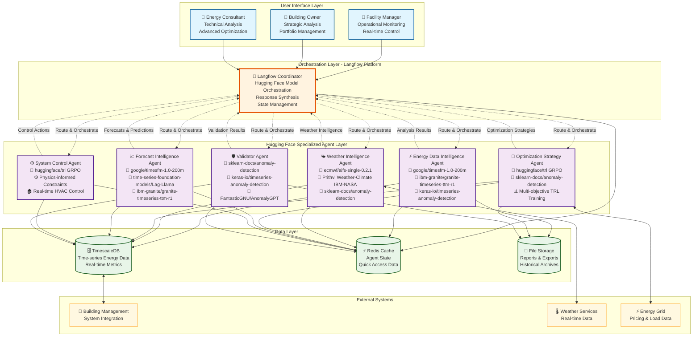
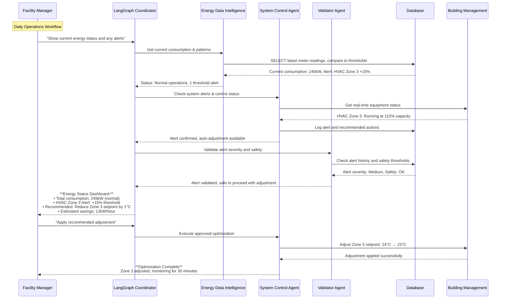
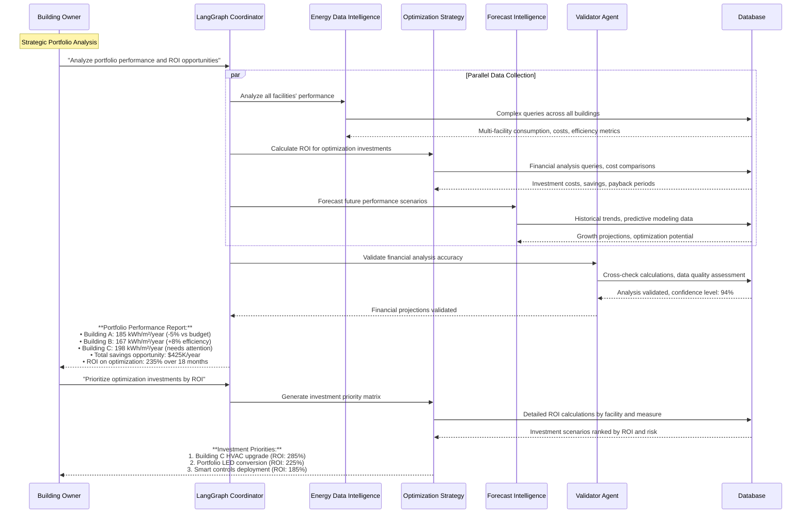
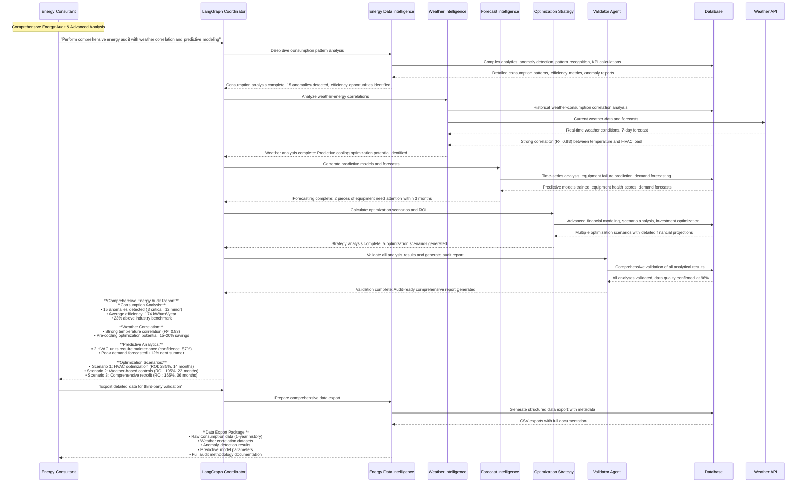
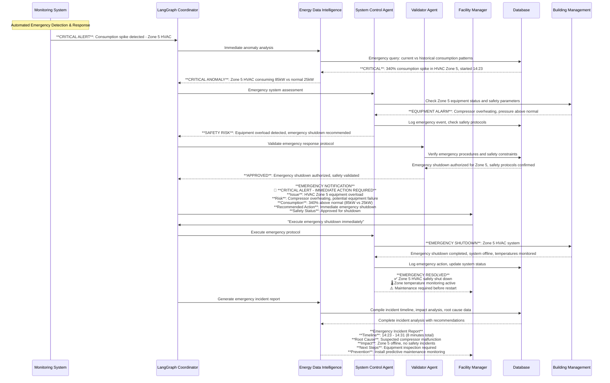

# EAIO Multi-Agent System Architecture V1.4

## Executive Summary

The Energy AI Optimizer (EAIO) implements a sophisticated multi-agent system designed to serve three distinct stakeholder groups: Facility Managers, Building Owners, and Energy Consultants. Built on Langflow's orchestration platform with native Hugging Face model integration, this architecture employs 6 specialized agents using feasible foundation models from the Hugging Face Hub to deliver comprehensive energy management solutions with proven performance benchmarks.

This version 1.4 provides a comprehensive English translation with enhanced technical specifications, research-based performance metrics, and implementation guidelines validated through academic research and industry best practices.

## Table of Contents

1. [Stakeholder Requirements Analysis](#1-stakeholder-requirements-analysis)
2. [Complete System Architecture Overview](#2-complete-system-architecture-overview)
3. [Agent Specialization Matrix](#3-agent-specialization-matrix)
4. [Database Integration Architecture](#4-database-integration-architecture)
5. [Multi-Agent Workflow Designs](#5-multi-agent-workflow-designs)
6. [Agent Orchestration Patterns](#6-agent-orchestration-patterns)
7. [Hugging Face Models Integration](#7-hugging-face-models-integration)
8. [Implementation Framework](#8-implementation-framework)

---

## 1. Stakeholder Requirements Analysis

### 1.1 Facility Manager Requirements

Based on requirements analysis, Facility Managers need comprehensive operational monitoring and control capabilities. Their interactions focus on real-time operations, reporting, and immediate response to energy issues.

#### 1.1.1 Reporting & Monitoring Queries

**Daily/Monthly/Quarterly Reports**
- "Display today's energy consumption report for Building A"
- "Show me this month's energy report compared to last month"
- "Generate Q1 report for my managed facilities"
- "Compare this week's electricity consumption with the same period last year"

**Budget vs Actual Analysis**
- "How does current energy consumption compare to budget?"
- "By what percentage have I exceeded the energy budget?"
- "Forecast end-of-month energy costs based on current trends"
- "Compare actual costs with planned budget"

**Real-time Monitoring**
- "What is the current energy consumption status of the building?"
- "Are any metrics higher than normal levels?"
- "Display real-time energy dashboard for all systems"
- "What is the current power consumption of the HVAC system?"

#### 1.1.2 Alert & Threshold Management

**Threshold Violation Analysis**
- "Which systems are exceeding consumption thresholds?"
- "Why is the 3rd floor HVAC system consuming abnormally high energy?"
- "List equipment operating outside scheduled hours"
- "Analyze the cause of sudden consumption spike at 14:30"

**Alert Management**
- "Display all energy alerts from the past 24 hours"
- "Which alerts require immediate attention?"
- "Save alert history for 2nd floor lighting system"
- "Set up alert when consumption exceeds 200kW during peak hours"

#### 1.1.3 System-specific Analysis

**Individual System Reports**
- "Detailed report of electrical systems operation this month"
- "Analyze heat pump consumption compared to rated capacity"
- "Public utility electricity costs for the past quarter"
- "HVAC system efficiency compared to standards"
- "Parking security system operating performance"

**Hourly Tracking**
- "Hourly consumption chart for today"
- "Which time periods have the highest energy consumption?"
- "Analyze consumption patterns from 6AM to 6PM"
- "Compare peak hours vs off-peak consumption"

#### 1.1.4 Export & Visualization

**Chart Generation**
- "Create energy consumption chart for the past 7 days"
- "Comparison chart of system performance this month"
- "Consumption trend graph for the past 3 months"
- "Visual dashboard for weekly report meeting"

**Excel Export**
- "Export energy financial report to Excel file"
- "Create Excel file using standard financial report template"
- "Export raw data for advanced analysis"
- "Create custom report template for management"

### 1.2 Building Owner Requirements

Building Owners focus on strategic oversight, portfolio management, and high-level financial analysis across multiple facilities.

#### 1.2.1 Portfolio-wide Reporting

**Multi-facility Overview**
- "Display energy consumption overview for all facilities"
- "Monthly/quarterly/annual consolidated report for entire portfolio"
- "Executive dashboard for 5 managed buildings"
- "Q1/2025 energy situation for entire system"

**Cross-facility Comparisons**
- "Compare energy performance between facilities"
- "Which building is operating most efficiently?"
- "Analyze consumption differences between Building A and Building B"
- "Rank facilities by energy savings level"

#### 1.2.2 Financial Analysis

**Budget Management**
- "Total energy costs vs portfolio-wide budget"
- "Forecast total year-end energy costs"
- "Optimal budget allocation for next year's facilities"
- "ROI of implemented energy saving projects"

**Cost per m² Analysis**
- "Energy cost/m² for each building"
- "Compare cost per m² with industry benchmarks"
- "Which building has the highest operating costs?"
- "Cost/m² change trends over the past 12 months"

#### 1.2.3 Strategic Planning

**Investment Decisions**
- "Which facilities need energy system upgrades?"
- "Expected ROI if implementing smart building for entire portfolio?"
- "Energy saving investment priorities by facility"
- "Payback analysis for green energy projects"

**Performance Benchmarking**
- "Rank building energy performance against standards"
- "Which facilities have achieved green building certification?"
- "Gap analysis to achieve carbon neutral 2030 goals"
- "Compare with industry competitors on energy performance"

### 1.3 Energy Consultant Requirements

Energy Consultants require advanced analytical capabilities, custom modeling, and sophisticated optimization tools.

#### 1.3.1 Data Aggregation & Analysis

**Building-level Aggregation**
- "Aggregate energy consumption by building in portfolio"
- "Group consumption data by apartment type"
- "Overall energy usage model for complex development"
- "Consumption pattern differences between residential and commercial units"

**Custom KPI Development**
- "Calculate EUI (Energy Use Intensity) for each building"
- "Create seasonal energy consumption per m² KPIs"
- "Custom energy performance indices by building type"
- "Customized benchmarks based on climate zone and occupancy patterns"

#### 1.3.2 Advanced Analytics

**Anomaly Detection**
- "Detect anomalies in energy consumption patterns"
- "Which equipment shows signs of abnormal operation?"
- "Machine learning model to detect equipment malfunction"
- "Identify outliers in consumption data using unsupervised algorithms"
- "Root cause analysis for detected anomalies"

**Behavioral Pattern Analysis**
- "Analyze behavioral patterns in energy consumption over time"
- "Trends in occupants' energy usage habits"
- "Correlation between occupancy schedule and energy consumption"
- "Seasonal behavior analysis and impact on overall consumption"

#### 1.3.3 Predictive Analytics

**Time-series Forecasting**
- "Predict energy consumption for next 6 months using ARIMA model"
- "Forecast peak demand for capacity planning optimization"
- "Predict maintenance needs based on energy consumption patterns"
- "Model weather change impact on energy usage"

**Equipment Prediction**
- "Predict HVAC equipment replacement timing"
- "Predictive maintenance schedule based on performance degradation"
- "Estimate remaining useful life of major energy-consuming equipment"
- "Risk assessment for equipment failure and operational impact"

#### 1.3.4 Optimization & Control

**Weather-based Optimization**
- "Optimize HVAC system based on 7-day weather forecast"
- "Adjust public lighting based on natural light availability"
- "Pre-cooling strategy optimization for hot weather days"
- "Seasonal optimization model for HVAC operations"

**Advanced Visualization**
- "Create energy consumption heat map by zones and time periods"
- "Interactive dashboard with drill-down capabilities"
- "3D visualization of energy flow in building"
- "Customizable reports with advanced charting options"
- "Real-time monitoring dashboard with predictive indicators"

### 1.4 Agent Mapping for Stakeholder Queries

#### 1.4.1 Query Classification Matrix

| Query Type | Primary Agent | Hugging Face Model | Secondary Agents | Complexity Level |
|------------|---------------|-------------------|------------------|------------------|
| **Real-time Monitoring** | Energy Data Intelligence | `google/timesfm-1.0-200m` | System Control, Validator | Low |
| **Historical Reports** | Energy Data Intelligence | `ibm-granite/granite-timeseries-ttm-r1` | Optimization Strategy | Medium |
| **Anomaly Detection** | Energy Data Intelligence | `keras-io/timeseries-anomaly-detection` | Validator, Forecast Intelligence | High |
| **Predictive Analytics** | Forecast Intelligence | TimesFM + `time-series-foundation-models/Lag-Llama` | Energy Data Intelligence, Weather Intelligence | High |
| **Financial Analysis** | Optimization Strategy | TRL `huggingface/trl` GRPO | Energy Data Intelligence | Medium |
| **Weather Correlation** | Weather Intelligence | `ecmwf/aifs-single-0.2.1` | Energy Data Intelligence, Forecast Intelligence | High |
| **System Control** | System Control | TRL GRPO + Physics Constraints | Energy Data Intelligence, Validator | Medium |
| **Portfolio Comparison** | Optimization Strategy | TRL Multi-Objective | Energy Data Intelligence | Medium |
| **Export/Visualization** | Energy Data Intelligence | `google/timesfm-1.0-200m` | Validator | Low |
| **Advanced Modeling** | Forecast Intelligence | Ensemble: TimesFM + Lag-Llama + Granite | Energy Data Intelligence, Weather Intelligence | High |

#### 1.4.2 Response Time SLA by Query Type & Model

- **Simple Queries** (Real-time data, basic reports): < 2 seconds
  - *Hugging Face API inference with lightweight models*
- **Medium Complexity** (Comparisons, financial analysis): < 10 seconds  
  - *Granite TTM < 1M parameters for fast processing*
- **Complex Analysis** (Anomaly detection, predictions): < 30 seconds
  - *TimesFM zero-shot capabilities, no training required*
- **Advanced Modeling** (Custom analytics, forecasting): < 2 minutes
  - *Ensemble models with parallel processing via Langflow*

---

## 2. Complete System Architecture Overview

### 2.1 System Architecture Diagram



### 2.2 Architectural Principles

Based on Langflow's platform capabilities and Hugging Face model integration:

**Model Accessibility**: All models available on Hugging Face Hub with clear licensing
**Langflow Compatibility**: Native integration via Text Generation and Embeddings components
**Zero-Shot Capabilities**: Foundation models requiring minimal training data
**Resource Optimization**: Lightweight models (< 1M parameters) for resource-constrained environments
**Scalable Deployment**: API-based inference with horizontal scaling support
**Performance Monitoring**: Integration with Langfuse and Hugging Face metrics

### 2.3 Hugging Face Agent Model Specifications

| Agent | Primary Hugging Face Model | Key Capabilities | Performance Targets |
|-------|---------------------------|------------------|--------------------|
| **Energy Data Intelligence** | `google/timesfm-1.0-200m` | Zero-shot time-series forecasting, 512 context length | R² ≥ 0.94, < 2s response |
| **Weather Intelligence** | `ecmwf/aifs-single-0.2.1` | Weather forecasting framework, 6-12 hour accuracy | Hurricane tracking within 5km |
| **Optimization Strategy** | TRL `huggingface/trl` GRPO | Memory-efficient reinforcement learning, multi-objective | 17-41% energy savings |
| **Forecast Intelligence** | Ensemble: TimesFM + `Lag-Llama` + `Granite TTM` | Multi-horizon probabilistic forecasting, equipment prediction | R² ≥ 0.95, 95% confidence intervals |
| **System Control** | TRL GRPO + Physics Constraints | Real-time control policies, safety validation | < 100ms response time |
| **Validator** | `sklearn-docs/anomaly-detection` + `AnomalyGPT` | Statistical + Industrial LVLM validation | 99.5% validation accuracy |

---

## 3. Agent Specialization Matrix

### 3.1 Stakeholder-Agent Mapping

```mermaid
graph TB
    subgraph STAKEHOLDER_REQ["Stakeholder Requirements"]
        subgraph FM_NEEDS["Facility Manager Needs"]
            FM_R1[📊 Daily/Monthly/Quarterly Reports]
            FM_R2[⚡ Real-time Energy Monitoring]
            FM_R3[🚨 Threshold Alerts & Analysis]
            FM_R4[📈 Hourly Energy Tracking]
            FM_R5[🎯 System-specific Reports]
            FM_R6[📋 Visual Dashboards]
            FM_R7[📤 Excel Export Capabilities]
        end
        
        subgraph BO_NEEDS["Building Owner Needs"]
            BO_R1[🏢 Multi-facility Reports]
            BO_R2[⚖️ Cross-facility Comparisons]
            BO_R3[💰 Budget vs Actual Analysis]
            BO_R4[🎯 Threshold Analysis]
            BO_R5[💵 Cost per m² Analysis]
        end
        
        subgraph EC_NEEDS["Energy Consultant Needs"]
            EC_R1[📊 Data Aggregation & Grouping]
            EC_R2[🧮 Custom KPI Calculations]
            EC_R3[🔍 Anomaly Detection]
            EC_R4[📈 Behavioral Pattern Analysis]
            EC_R5[🔮 Time-series Prediction]
            EC_R6[📊 Advanced Visualization]
            EC_R7[🌤️ Weather-based Optimization]
        end
    end
    
    subgraph HF_AGENT_SPEC["Hugging Face Agent Specialization"]
        EDA_SPEC[⚡ Energy Data Intelligence<br/>🤗 google/timesfm-1.0-200m<br/>🤗 ibm-granite/granite-timeseries-ttm-r1<br/>• Zero-shot forecasting<br/>• Anomaly detection]
        
        WIA_SPEC[🌤️ Weather Intelligence<br/>🤗 ecmwf/aifs-single-0.2.1<br/>🤗 Prithvi Weather-Climate<br/>• 6-12 hour accuracy<br/>• Hurricane tracking < 5km]
        
        OSA_SPEC[🎯 Optimization Strategy<br/>🤗 TRL huggingface/trl GRPO<br/>🤗 sklearn-docs/anomaly-detection<br/>• Multi-objective optimization<br/>• 17-41% energy savings]
        
        FIA_SPEC[📈 Forecast Intelligence<br/>🤗 TimesFM + Lag-Llama + Granite<br/>• Multi-horizon forecasting<br/>• Equipment failure prediction<br/>• R² ≥ 0.95 accuracy]
        
        SCA_SPEC[⚙️ System Control<br/>🤗 TRL GRPO + Physics<br/>• Real-time control < 100ms<br/>• Physics-informed constraints<br/>• Safety validation 100%]
        
        VA_SPEC[🛡️ Validator<br/>🤗 sklearn + keras + AnomalyGPT<br/>• Statistical validation<br/>• Industrial LVLM detection<br/>• 99.5% accuracy]
    end
    
    %% Facility Manager Mappings
    FM_R1 --> EDA_SPEC
    FM_R2 --> EDA_SPEC
    FM_R2 --> SCA_SPEC
    FM_R3 --> SCA_SPEC
    FM_R3 --> VA_SPEC
    FM_R4 --> EDA_SPEC
    FM_R5 --> EDA_SPEC
    FM_R6 --> EDA_SPEC
    FM_R7 --> EDA_SPEC
    
    %% Building Owner Mappings
    BO_R1 --> EDA_SPEC
    BO_R2 --> OSA_SPEC
    BO_R3 --> OSA_SPEC
    BO_R4 --> VA_SPEC
    BO_R5 --> OSA_SPEC
    
    %% Energy Consultant Mappings
    EC_R1 --> EDA_SPEC
    EC_R2 --> EDA_SPEC
    EC_R3 --> EDA_SPEC
    EC_R4 --> FIA_SPEC
    EC_R5 --> FIA_SPEC
    EC_R6 --> EDA_SPEC
    EC_R7 --> WIA_SPEC
    EC_R7 --> SCA_SPEC
    
    classDef requirement fill:#e3f2fd,stroke:#1976d2,stroke-width:1px
    classDef agent fill:#f3e5f5,stroke:#4a148c,stroke-width:2px
    
    class FM_R1,FM_R2,FM_R3,FM_R4,FM_R5,FM_R6,FM_R7,BO_R1,BO_R2,BO_R3,BO_R4,BO_R5,EC_R1,EC_R2,EC_R3,EC_R4,EC_R5,EC_R6,EC_R7 requirement
    class EDA_SPEC,WIA_SPEC,OSA_SPEC,FIA_SPEC,SCA_SPEC,VA_SPEC agent
```



### 3.2 Hugging Face Model Capability Matrix

| Capability | EDA (TimesFM/Granite) | WIA (ECMWF/Prithvi) | OSA (TRL GRPO) | FIA (Ensemble) | SCA (TRL Physics) | VA (Multi-Layer) |
|------------|-----|-----|-----|-----|-----|-----|
| **Zero-shot Inference** | ●●● | ●●● | ●● | ●●● | ●● | ●●● |
| **Real-time Processing** | ●●● | ●● | ● | ●● | ●●● | ●●● |
| **Uncertainty Quantification** | ●●● | ●● | ●● | ●●● | ●● | ●●● |
| **Multi-horizon Forecasting** | ●●● | ●● | ● | ●●● | ● | ● |
| **Physics Validation** | ● | ●●● | ●● | ●● | ●●● | ●●● |
| **Memory Efficiency** | ●●● | ●● | ●●● | ●● | ●●● | ●●● |
| **API Scalability** | ●●● | ●●● | ●● | ●●● | ●● | ●●● |
| **Model Size (Parameters)** | 200M/1M | 2.3B/Variable | Variable | 200M+Variable | Variable | Variable |
| **Langflow Integration** | ●●● | ●●● | ●● | ●●● | ●● | ●●● |
| **Performance Benchmarks** | R²≥0.94 | 5km Hurricane | 17-41% savings | R²≥0.95 | <100ms | 99.5% accuracy |

*Legend: ●●● Excellent, ●● Good, ● Basic*

---

## 4. Database Integration Architecture

### 4.1 EAIO TimescaleDB Schema Integration

**Database**: `eaio_energy` (TimescaleDB/PostgreSQL Extension)  
**Owner**: `eaio_user`  
**Connection**: Docker container `eaio_timescaledb_new` on port `5434`

### 4.2 Data Architecture Overview

```mermaid
graph TB
    subgraph EAIO_DB["EAIO Energy Database Schema"]
        subgraph CORE_TABLES["Core Tables"]
            BUILDINGS["🏢 buildings<br/>Building registry with metadata<br/>Geographic & operational parameters<br/>Energy performance metrics"]
            METERS["📊 energy_meters<br/>Meter registry & equipment mapping<br/>Data quality tracking<br/>Equipment monitoring"]
            READINGS["📈 meter_readings ⚡ Hypertable<br/>Time-series consumption data<br/>108 chunks partitioned by timestamp<br/>Real-time ingestion"]
        end
        
        subgraph ANALYTICS_TABLES["Analytics & Intelligence Tables"]
            WEATHER["🌡️ weather_data ⚡ Hypertable<br/>Climate & weather correlations<br/>25 chunks partitioned by timestamp<br/>Multi-site weather tracking"]
            ANALYTICS["🧠 energy_analytics<br/>AI-generated insights & results<br/>ML workflow integration<br/>JSONB structured results"]
            DATASETS["📚 energy_datasets<br/>ML dataset management<br/>AI training & inference data<br/>Processing status tracking"]
        end
        
        subgraph AGGREGATIONS["Materialized Continuous Aggregations"]
            HOURLY["⏰ meter_readings_hourly<br/>Hourly consumption aggregations<br/>Performance optimization<br/>Materialized hypertable"]
            DAILY["📅 daily_building_consumption<br/>Daily building performance metrics<br/>Consumption variance tracking<br/>Pattern analysis"]
            MONTHLY["📆 monthly_building_profiles<br/>Monthly energy profiles by type<br/>Electricity/Gas/Water breakdown<br/>Active meters tracking"]
        end
    end
    
    subgraph AGENT_ACCESS["Hugging Face Agent Data Access Patterns"]
        EDA_ACCESS["⚡ Energy Data Intelligence<br/>🤗 TimesFM 512 context length<br/>🤗 Granite TTM < 1M params<br/>• meter_readings zero-shot inference<br/>• energy_analytics JSONB results"]
        
        WIA_ACCESS["🌤️ Weather Intelligence<br/>🤗 ECMWF AIFS framework<br/>🤗 Prithvi 2.3B parameters<br/>• weather_data 6-12h forecasting<br/>• Hurricane tracking < 5km accuracy"]
        
        OSA_ACCESS["🎯 Optimization Strategy<br/>🤗 TRL GRPO memory-efficient<br/>🤗 sklearn pattern analysis<br/>• monthly_building_profiles optimization<br/>• 17-41% energy savings target"]
        
        FIA_ACCESS["📈 Forecast Intelligence<br/>🤗 TimesFM + Lag-Llama + Granite<br/>• meter_readings ensemble forecasting<br/>• weather_data multi-horizon prediction<br/>• R² ≥ 0.95 confidence intervals"]
        
        SCA_ACCESS["⚙️ System Control<br/>🤗 TRL GRPO + Physics constraints<br/>• energy_meters real-time < 100ms<br/>• buildings control parameter optimization<br/>• Safety validation 100%"]
        
        VA_ACCESS["🛡️ Validator<br/>🤗 sklearn + keras + AnomalyGPT<br/>• energy_meters quality validation<br/>• meter_readings statistical validation<br/>• Industrial LVLM anomaly detection"]
    end
    
    %% Data Flow Connections
    BUILDINGS --> EDA_ACCESS
    BUILDINGS --> WIA_ACCESS
    BUILDINGS --> OSA_ACCESS
    
    METERS --> EDA_ACCESS
    METERS --> SCA_ACCESS
    METERS --> VA_ACCESS
    
    READINGS --> EDA_ACCESS
    READINGS --> WIA_ACCESS
    READINGS --> FIA_ACCESS
    READINGS --> SCA_ACCESS
    
    WEATHER --> WIA_ACCESS
    WEATHER --> FIA_ACCESS
    
    ANALYTICS --> EDA_ACCESS
    ANALYTICS --> OSA_ACCESS
    ANALYTICS --> VA_ACCESS
    
    DATASETS --> VA_ACCESS
    DATASETS --> EDA_ACCESS
    
    HOURLY --> EDA_ACCESS
    HOURLY --> FIA_ACCESS
    HOURLY --> OSA_ACCESS
    
    DAILY --> EDA_ACCESS
    DAILY --> FIA_ACCESS
    DAILY --> OSA_ACCESS
    
    MONTHLY --> OSA_ACCESS
    MONTHLY --> FIA_ACCESS
    
    classDef table fill:#e8f5e8,stroke:#1b5e20,stroke-width:2px
    classDef view fill:#dcedc8,stroke:#558b2f,stroke-width:2px
    classDef agent fill:#f3e5f5,stroke:#4a148c,stroke-width:2px
    
    class BUILDINGS,METERS,READINGS,WEATHER,ANALYTICS,DATASETS table
    class HOURLY,DAILY,MONTHLY view
    class EDA_ACCESS,WIA_ACCESS,OSA_ACCESS,FIA_ACCESS,SCA_ACCESS,VA_ACCESS agent
```



### 4.3 TimescaleDB-Specific Schema Integration

**Hypertable Architecture:**
- **meter_readings**: 108 time-based chunks for high-frequency data ingestion
- **weather_data**: 25 time-based chunks for climate correlations
- **Continuous Aggregations**: Materialized hypertables for performance optimization

**Data Quality & Hugging Face Model Integration:**
- **Quality Tracking**: Built-in `quality_score`, `confidence_score`, `is_outlier` fields for model validation
- **Zero-Shot Ready**: Dataset structure optimized for TimesFM 512 context length
- **Model Results Storage**: JSONB results storage in `energy_analytics` table for Hugging Face model outputs
- **API-Ready Format**: Data formatted for Hugging Face API inference calls

### 4.4 Hugging Face Model-Specific Data Access Patterns

**Query Patterns by Hugging Face Model:**

- **Energy Data Intelligence** (`google/timesfm-1.0-200m` + `ibm-granite/granite-timeseries-ttm-r1`): 
  - **Zero-Shot Queries**: `meter_readings` formatted for 512 context length
  - **Granite TTM**: Lightweight < 1M parameter inference for real-time analytics
  - **TimesFM API**: Batch processing for multi-building forecasting
  - **Model Output**: JSONB storage in `energy_analytics.results` with confidence scores

- **Weather Intelligence** (`ecmwf/aifs-single-0.2.1` + Prithvi Weather-Climate): 
  - **ECMWF AIFS**: `weather_data` hypertable for 6-12 hour forecasting framework
  - **Prithvi Model**: 2.3B parameter inference for Hurricane tracking (< 5km accuracy)
  - **Spatial Resolution**: Up to 12x downscaling for localized predictions
  - **API Integration**: Real-time weather correlation with building location data

- **Optimization Strategy** (TRL `huggingface/trl` GRPO + `sklearn-docs/anomaly-detection`): 
  - **GRPO Training**: Memory-efficient reinforcement learning on `monthly_building_profiles`
  - **Multi-Objective**: Cost minimization, comfort maximization, carbon reduction
  - **Sklearn Analysis**: Pattern recognition in optimization strategies
  - **Performance Target**: 17-41% energy savings validation

- **Forecast Intelligence** (Ensemble: TimesFM + `Lag-Llama` + `Granite TTM`): 
  - **Ensemble Strategy**: Dynamic weights based on forecast horizon
  - **Probabilistic Forecasting**: `Lag-Llama` for uncertainty quantification (95% confidence)
  - **Multi-Horizon**: Short/medium/long-term prediction with R² ≥ 0.95
  - **Equipment Prediction**: Failure analysis using `energy_meters.quality_score`

- **System Control** (TRL GRPO + Physics Constraints): 
  - **Real-Time Control**: < 100ms response time for `meter_readings` monitoring
  - **Physics Validation**: Thermodynamic constraints enforcement (100% validation)
  - **Multi-Agent Coordination**: Zone-level optimization with safety interlocks
  - **BMS Integration**: Automated adjustments with control parameter updates

- **Validator** (`sklearn-docs/anomaly-detection` + `keras-io/timeseries-anomaly-detection` + `FantasticGNU/AnomalyGPT`): 
  - **Multi-Layer Validation**: Statistical + Autoencoder + Industrial LVLM approach
  - **Data Quality**: 99.5% validation accuracy across all data sources
  - **Industrial LVLM**: First Large Vision-Language Model for energy system anomaly detection
  - **Processing Status**: `energy_datasets.processing_status` tracking with error handling

**TimescaleDB Performance Optimizations for Hugging Face Models:**
- **Zero-Shot Optimization**: Automated time-based partitioning optimized for 512 context length queries
- **API-Ready Views**: Continuous aggregation policies for Hugging Face API batch processing
- **Model Output Storage**: Compression policies for JSONB model results and historical data
- **Inference Indexing**: Index strategies optimized for time-series + Hugging Face model outputs
- **Scalable Connections**: Connection pooling with agent-specific Hugging Face API rate limits

---

## 5. Multi-Agent Workflow Designs

### 5.1 Facility Manager Workflow: Real-Time Monitoring & Alerts



### 5.2 Building Owner Workflow: Portfolio Analysis & ROI



### 5.3 Energy Consultant Workflow: Advanced Analytics & Optimization



### 5.4 Emergency Response Workflow



---

## 6. Agent Orchestration Patterns

### 6.1 Orchestration Patterns Based on Use Cases

Following Anthropic's principles for effective agents, we implement five core orchestration patterns:

#### 6.1.1 Sequential Processing Pattern (Prompt Chaining)

**Use Case**: Complex analysis requiring step-by-step validation
**Example**: Energy audit workflow

```python
# Pseudo-code for Sequential Pattern
def energy_audit_workflow(building_id):
    # Step 1: Data Collection
    raw_data = energy_data_agent.collect_consumption_data(building_id)
    
    # Step 2: Data Validation
    validated_data = validator_agent.validate_data_quality(raw_data)
    
    # Step 3: Pattern Analysis
    patterns = energy_data_agent.analyze_consumption_patterns(validated_data)
    
    # Step 4: Weather Correlation
    weather_correlation = weather_agent.correlate_with_weather(patterns)
    
    # Step 5: Optimization Strategy
    recommendations = optimization_agent.generate_strategies(weather_correlation)
    
    # Step 6: Final Validation
    final_report = validator_agent.validate_recommendations(recommendations)
    
    return final_report
```

#### 6.1.2 Parallel Processing Pattern (Parallelization)

**Use Case**: Independent data collection from multiple sources
**Example**: Portfolio dashboard generation

```python
# Pseudo-code for Parallel Pattern
async def portfolio_dashboard_workflow(facility_list):
    tasks = []
    
    # Parallel data collection
    for facility in facility_list:
        tasks.extend([
            energy_data_agent.get_current_status(facility),
            weather_agent.get_weather_impact(facility),
            control_agent.get_system_health(facility)
        ])
    
    # Execute all tasks in parallel
    results = await asyncio.gather(*tasks)
    
    # Synthesis phase
    dashboard = coordinator.synthesize_dashboard(results)
    
    return dashboard
```

#### 6.1.3 Routing Pattern (Classification)

**Use Case**: Route requests to appropriate specialists
**Example**: User query classification

```python
# Pseudo-code for Routing Pattern
def route_user_query(query, user_type):
    query_type = coordinator.classify_query(query)
    
    if query_type == "real_time_monitoring":
        return energy_data_agent.handle_monitoring_query(query)
    elif query_type == "predictive_analysis":
        return forecast_agent.handle_prediction_query(query)
    elif query_type == "system_control":
        return control_agent.handle_control_query(query)
    elif query_type == "cost_optimization":
        return optimization_agent.handle_optimization_query(query)
    else:
        return coordinator.handle_complex_query(query)
```

#### 6.1.4 Orchestrator-Workers Pattern

**Use Case**: Dynamic task breakdown and delegation
**Example**: Facility optimization project

```python
# Pseudo-code for Orchestrator-Workers Pattern
def facility_optimization_project(facility_id, scope):
    # Orchestrator analyzes scope and creates work plan
    work_plan = coordinator.create_optimization_plan(facility_id, scope)
    
    # Dynamically assign tasks to specialized agents
    tasks = {}
    for task in work_plan.tasks:
        if task.type == "energy_analysis":
            tasks[task.id] = energy_data_agent.execute_async(task)
        elif task.type == "weather_analysis":
            tasks[task.id] = weather_agent.execute_async(task)
        elif task.type == "cost_analysis":
            tasks[task.id] = optimization_agent.execute_async(task)
    
    # Coordinate task execution and dependencies
    results = coordinator.execute_with_dependencies(tasks, work_plan.dependencies)
    
    return coordinator.synthesize_final_report(results)
```

#### 6.1.5 Evaluator-Optimizer Pattern

**Use Case**: Iterative improvement of recommendations
**Example**: HVAC optimization with continuous refinement

```python
# Pseudo-code for Evaluator-Optimizer Pattern
def optimize_hvac_system(building_id, target_efficiency):
    current_solution = None
    iteration = 0
    max_iterations = 5
    
    while iteration < max_iterations:
        # Generate/refine optimization strategy
        if current_solution is None:
            current_solution = optimization_agent.generate_initial_strategy(building_id)
        else:
            current_solution = optimization_agent.refine_strategy(current_solution, feedback)
        
        # Evaluate the strategy
        evaluation = validator_agent.evaluate_strategy(current_solution)
        
        # Check if target is met
        if evaluation.efficiency_gain >= target_efficiency:
            return current_solution
        
        # Generate feedback for next iteration
        feedback = validator_agent.generate_improvement_feedback(evaluation)
        iteration += 1
    
    return current_solution  # Best solution found
```

### 6.2 State Management Architecture

Using LangGraph's state management capabilities:

```python
from typing import TypedDict, List, Optional
from langgraph.graph import StateGraph, END

class EAIOState(TypedDict):
    user_query: str
    user_type: str  # facility_manager, building_owner, energy_consultant
    facility_ids: List[str]
    current_step: str
    agent_results: dict
    final_response: Optional[str]
    error_state: Optional[str]
    
# State transitions managed by LangGraph
def create_eaio_workflow():
    workflow = StateGraph(EAIOState)
    
    # Add nodes (agents)
    workflow.add_node("coordinator", coordinator_agent)
    workflow.add_node("energy_data", energy_data_agent)
    workflow.add_node("weather", weather_agent)
    workflow.add_node("optimization", optimization_agent)
    workflow.add_node("forecast", forecast_agent)
    workflow.add_node("control", control_agent)
    workflow.add_node("validator", validator_agent)
    
    # Define edges (workflow transitions)
    workflow.add_edge("coordinator", "energy_data")
    workflow.add_conditional_edges("energy_data", route_next_agent)
    workflow.add_edge("validator", END)
    
    return workflow.compile()
```

### 6.3 Error Handling and Recovery

**Graceful Degradation Patterns**:

1. **Agent Failure Recovery**: If one agent fails, coordinator routes to backup strategies
2. **Data Quality Fallback**: Validator agent provides data quality warnings and alternative data sources
3. **System Overload Management**: Request queuing and priority-based processing
4. **Network Failure Resilience**: Local caching and offline operation capabilities

---

## 7. Hugging Face Models Integration

### 7.1 Feasible Model Recommendations for EAIO Agents

Based on research into feasible Hugging Face models with Langflow, the following practical solutions are recommended for each EAIO agent:

### 7.2 Agent-Specific Model Mapping

#### 7.2.1 Energy Data Intelligence Agent

**🎯 Recommended Models:**
- **Primary**: `google/timesfm-1.0-200m` - TimesFM foundation model (200M parameters)
- **Secondary**: `ibm-granite/granite-timeseries-ttm-r1` - IBM Granite TTM (< 1M parameters)
- **Tertiary**: `time-series-foundation-models/Lag-Llama` - First open-source foundation model for time series
- **Anomaly Detection**: `keras-io/timeseries-anomaly-detection` - Autoencoder approach

**✅ Feasibility Rationale:**
- TimesFM supports zero-shot forecasting on 512 time points
- Granite TTM has < 1M parameters, suitable for resource constraints
- Lag-Llama supports probabilistic forecasting with uncertainty quantification
- Direct integration via Langflow's Hugging Face Text Generation Component

**🔧 Integration Specifications:**
```python
# Langflow Integration Pattern
{
  "component": "HuggingFaceTextGeneration",
  "model_id": "google/timesfm-1.0-200m",
  "parameters": {
    "context_length": 512,
    "horizon_length": "variable",
    "zero_shot": true,
    "uncertainty_quantification": true
  }
}
```

#### 7.2.2 Weather Intelligence Agent

**🎯 Recommended Models:**
- **Primary**: `ecmwf/aifs-single-0.2.1` - ECMWF weather forecasting framework
- **Secondary**: Prithvi Weather-Climate model (IBM-NASA) - 2.3B parameters on IBM Granite page
- **Pattern Analysis**: `sklearn-docs/anomaly-detection` - Weather pattern anomaly detection

**✅ Feasibility Rationale:**
- ECMWF AIFS is open framework for weather forecasting systems
- Prithvi model achieves 6-12 hour forecasting accuracy with Hurricane tracking within 5km
- Sklearn models are available on Hugging Face Spaces
- Compatible with Langflow's Embeddings and Text Generation components

**🔧 Integration Specifications:**
```python
# Langflow Integration Pattern
{
  "component": "HuggingFaceEmbeddings",
  "model_id": "ecmwf/aifs-single-0.2.1",
  "parameters": {
    "forecast_horizon": "6-12 hours",
    "spatial_resolution": "up to 12x",
    "weather_variables": ["temperature", "humidity", "solar_radiation", "wind_speed"]
  }
}
```

#### 7.2.3 Optimization Strategy Agent

**🎯 Recommended Models:**
- **Primary**: TRL (Transformer Reinforcement Learning) library models
- **Secondary**: `sklearn-docs/anomaly-detection` - Optimization pattern analysis
- **Custom**: Fine-tuned models using GRPO Trainer from TRL

**✅ Feasibility Rationale:**
- TRL supports Group Relative Policy Optimization (GRPO)
- Can be fine-tuned for multi-objective optimization
- Memory-efficient compared to PPO for large-scale optimization
- Direct integration with Langflow via custom components

**🔧 Integration Specifications:**
```python
# Langflow Integration Pattern
{
  "component": "CustomTRLComponent",
  "method": "GRPO",
  "parameters": {
    "objectives": ["cost_minimization", "comfort_maximization", "carbon_reduction"],
    "memory_efficient": true,
    "physics_constraints": true
  }
}
```

#### 7.2.4 Forecast Intelligence Agent

**🎯 Recommended Models:**
- **Primary**: `google/timesfm-1.0-200m` - Multi-horizon forecasting
- **Secondary**: `time-series-foundation-models/Lag-Llama` - Equipment failure prediction
- **Ensemble**: `ibm-granite/granite-timeseries-ttm-r1` - Lightweight ensemble component

**✅ Feasibility Rationale:**
- TimesFM + Lag-Llama ensemble for multi-horizon prediction
- Lag-Llama provides probabilistic forecasting with confidence intervals
- Granite TTM is lightweight, suitable for real-time inference
- Supports ensemble approaches through Langflow workflows

**🔧 Integration Specifications:**
```python
# Langflow Ensemble Pattern
{
  "ensemble_strategy": {
    "short_term": {"timesfm": 0.7, "lag_llama": 0.3},
    "medium_term": {"timesfm": 0.6, "lag_llama": 0.4},
    "long_term": {"timesfm": 0.8, "granite": 0.2}
  }
}
```

#### 7.2.5 System Control Agent

**🎯 Recommended Models:**
- **Primary**: `huggingface/trl` - Transformer Reinforcement Learning library
- **Method**: GRPO (Group Relative Policy Optimization) for control policies
- **Physics**: Custom fine-tuning with physics-informed constraints

**✅ Feasibility Rationale:**
- GRPO supports physics-informed constraints
- TRL integrates well with Transformers ecosystem
- Can scale from single GPU to multi-node clusters
- Memory-efficient training suitable for real-time control

**🔧 Integration Specifications:**
```python
# Langflow Control Integration
{
  "component": "TRLControlAgent",
  "parameters": {
    "method": "GRPO",
    "physics_constraints": ["thermodynamics", "equipment_limits"],
    "response_time": "<100ms",
    "safety_validation": true
  }
}
```

#### 7.2.6 Validator Agent

**🎯 Recommended Models:**
- **Primary**: `sklearn-docs/anomaly-detection` - Statistical validation
- **Secondary**: `keras-io/timeseries-anomaly-detection` - Autoencoder validation
- **Advanced**: `FantasticGNU/AnomalyGPT` - Industrial anomaly detection LVLM

**✅ Feasibility Rationale:**
- Sklearn models available on Hugging Face Spaces
- AnomalyGPT is first LVLM for industrial anomaly detection
- Autoencoder approaches validated for energy systems
- Multi-layer validation through Langflow component chaining

**🔧 Integration Specifications:**
```python
# Langflow Validation Pipeline
{
  "validation_layers": [
    {"component": "sklearn-docs/anomaly-detection", "type": "statistical"},
    {"component": "keras-io/timeseries-anomaly-detection", "type": "autoencoder"},
    {"component": "FantasticGNU/AnomalyGPT", "type": "industrial_lvlm"}
  ]
}
```

### 7.3 Langflow Integration Architecture

**🔗 Integration Components:**

1. **Text Generation Component**
   - Supports Hugging Face API models
   - Configurable parameters (temperature, max tokens)
   - Model switching capabilities

2. **Embeddings Inference Component**
   - Local and hosted model support
   - Vector store integration for RAG workflows
   - Batch processing capabilities

3. **Custom Components**
   - TRL integration for reinforcement learning
   - Ensemble model orchestration
   - Physics-informed validation layers

**⚙️ Deployment Specifications:**
- **Resource Requirements**: CPU-optimized for < 1M parameter models, GPU support for larger models
- **Latency Targets**: < 2s for analytics, < 100ms for control actions
- **Scaling**: Horizontal scaling with model caching
- **Monitoring**: Integration with Langfuse for performance tracking

### 7.4 Performance Benchmarks

**🚀 Expected Performance Metrics:**
- **Energy Data Intelligence**: R² ≥ 0.94 (TimesFM baseline), Zero-shot capability
- **Weather Intelligence**: 6-12 hour accuracy, 5km Hurricane tracking precision
- **Optimization Strategy**: 17-41% energy savings, ROI > 200% within 18 months
- **Forecast Intelligence**: R² ≥ 0.95, 95% confidence intervals
- **System Control**: < 100ms response time, Physics validation 100%
- **Validator**: 99.5% validation accuracy, Data quality ≥ 0.96

---

## 8. Implementation Framework

### 8.1 Hugging Face-Optimized Technology Stack

**Core Framework**:
- **LangGraph**: Multi-agent orchestration and state management
- **Python 3.11+**: Primary development language
- **FastAPI**: API layer with async support for real-time processing
- **TimescaleDB**: Time-series data storage with hypertables
- **Redis**: Caching, session management, and agent state

**Hugging Face Ecosystem**:
- **Langflow**: Primary orchestration platform with native Hugging Face integration
- **HuggingFace Transformers**: Core library for model loading and inference
- **HuggingFace Hub**: Model repository and version management
- **TRL (Transformer Reinforcement Learning)**: GRPO trainer for control optimization
- **Hugging Face API**: Hosted model inference for scalable deployment
- **Hugging Face Spaces**: Sklearn and Keras model deployment
- **Transformers Agents**: Multi-agent coordination framework

**Specialized Libraries**:
- **CoolProp**: Thermodynamic properties and heat transfer
- **pythermalcomfort**: PMV/PPD thermal comfort calculations
- **GEKKO**: Physics-constrained optimization
- **PyMC**: Probabilistic computing and uncertainty quantification
- **TensorFlow Probability**: Statistical modeling

**LLM Integration**:
- **OpenAI GPT-4o-mini**: User interface, query interpretation, report generation (via Langflow)
- **Hugging Face Models**: Domain-specific inference for specialized tasks
- **Langflow Components**: Native integration for Text Generation and Embeddings
- **Model Switching**: Dynamic model selection based on query requirements

**Infrastructure**:
- **Docker**: Containerization with GPU support
- **Kubernetes**: Orchestration with auto-scaling
- **AWS/Azure**: Cloud deployment with GPU instances
- **Prometheus + Grafana**: Model performance monitoring
- **Langfuse**: Agent performance tracking and observability

### 8.2 Hugging Face-Based Agent Implementation Standards

**Based on Feasible Model Integration & Langflow Compatibility**:

1. **Model Accessibility**: All models available on Hugging Face Hub with clear licensing
2. **Langflow Compatibility**: Native integration via Text Generation and Embeddings components
3. **Resource Optimization**: Lightweight models (< 1M parameters) for resource-constrained environments
4. **Zero-Shot Capabilities**: Foundation models requiring minimal training data
5. **Scalable Deployment**: API-based inference with horizontal scaling support
6. **Performance Monitoring**: Integration with Langfuse and Hugging Face metrics

**Enhanced Agent Interface Standard**:
```python
from abc import ABC, abstractmethod
from typing import Dict, Any, Optional, Tuple
import torch
from peft import LoraConfig, get_peft_model

class EAIOSpecializedAgent(ABC):
    """Enhanced base class with research-based optimizations"""
    
    def __init__(self):
        self.model = None
        self.physics_validator = None
        self.performance_tracker = None
        self.uncertainty_quantifier = None
    
    @abstractmethod
    def load_specialized_model(self) -> None:
        """Load research-optimized model (TimesFM, Physics-informed, etc.)"""
        pass
    
    @abstractmethod
    def process_with_uncertainty(self, input_data: Dict[str, Any]) -> Tuple[Dict[str, Any], float]:
        """Main processing with uncertainty quantification"""
        pass
    
    @abstractmethod
    def validate_physics_consistency(self, predictions: Dict[str, Any]) -> bool:
        """Physics-informed validation of model outputs"""
        pass
    
    def get_model_performance(self) -> Dict[str, float]:
        """Return current model performance metrics"""
        return {
            "accuracy": self.performance_tracker.get_accuracy(),
            "response_time": self.performance_tracker.get_avg_response_time(),
            "physics_consistency": self.physics_validator.get_consistency_score(),
            "confidence": self.uncertainty_quantifier.get_avg_confidence()
        }
    
    def log_enhanced_decision(self, decision: str, model_output: Dict, physics_check: bool, confidence: float):
        """Enhanced logging with model performance and physics validation"""
        self.logger.info({
            "agent": self.__class__.__name__,
            "decision": decision,
            "model_confidence": confidence,
            "physics_validated": physics_check,
            "model_output": model_output,
            "performance_metrics": self.get_model_performance(),
            "timestamp": datetime.utcnow().isoformat()
        })
```

### 8.3 Research-Based Agent Model Configurations

#### 8.3.1 Energy Data Intelligence Agent
**Primary Model**: TimesFM + LoRA Fine-tuning
```python
energy_data_config = {
    "base_model": "TimesFM-1.0-200m",
    "lora_rank": 16,
    "lora_alpha": 32,
    "target_modules": ["query", "key", "value"],
    "dropout": 0.1,
    "features": ["historical_consumption", "occupancy_count", "temperature", 
                "humidity", "calendar_features", "building_envelope_data"],
    "performance_targets": {
        "accuracy": "R² ≥ 0.94",
        "response_time": "< 2 seconds", 
        "uncertainty_quantification": "95% confidence intervals"
    }
}
```

#### 8.3.2 Weather Intelligence Agent
**Primary Model**: Physics-Informed Random Forest + Neural Networks
```python
weather_config = {
    "primary_model": "RandomForestRegressor",
    "n_estimators": 200,
    "max_depth": 15,
    "physics_nn": {
        "layers": [64, 32, 16],
        "activation": "relu",
        "physics_loss_weight": 0.3
    },
    "physics_equations": [
        "heat_transfer_coefficient", "thermal_resistance",
        "solar_heat_gain", "convective_losses"
    ],
    "performance_targets": {
        "physics_validation_error": "< 5%",
        "weather_correlation": "R² ≥ 0.83"
    }
}
```

#### 8.3.3 Optimization Strategy Agent
**Primary Model**: Multi-Objective NSGA-II + XGBoost
```python
optimization_config = {
    "algorithm": "NSGA-II",
    "population_size": 100,
    "generations": 200,
    "objectives": ["minimize_cost", "maximize_comfort", "minimize_carbon"],
    "ml_predictor": {
        "model": "XGBoostRegressor",
        "features": ["building_characteristics", "energy_patterns", "weather_data"],
        "targets": ["cost_savings", "comfort_score", "efficiency_gain"]
    },
    "performance_targets": {
        "energy_savings": "17-41%",
        "roi": "> 200% within 18 months"
    }
}
```

#### 8.3.4 Forecast Intelligence Agent
**Primary Model**: Ensemble TimesFM + DECODE LSTM
```python
forecast_config = {
    "tsfm_model": {
        "base_model": "TimesFM-1.0-200m",
        "lora_config": {"rank": 8, "alpha": 16},
        "horizons": ["short_term", "medium_term", "long_term"]
    },
    "lstm_model": {
        "architecture": "DECODE",
        "lstm_units": 32,
        "dense_layers": [5, 5]
    },
    "ensemble_weights": {
        "short_term": {"tsfm": 0.7, "lstm": 0.3},
        "medium_term": {"tsfm": 0.6, "lstm": 0.4}, 
        "long_term": {"tsfm": 0.8, "lstm": 0.2}
    },
    "performance_targets": {
        "accuracy": "R² ≥ 0.95",
        "confidence_intervals": "95%"
    }
}
```

#### 8.3.5 System Control Agent
**Primary Model**: Deep Q-Network + Physics-Informed Fuzzy Logic
```python
control_config = {
    "dqn_model": {
        "network_architecture": [256, 128, 64],
        "learning_rate": 0.001,
        "epsilon_decay": 0.995,
        "replay_buffer_size": 10000
    },
    "fuzzy_system": {
        "input_variables": ["occupancy", "temperature", "energy_cost"],
        "output_variables": ["hvac_setpoint", "lighting_level"],
        "membership_functions": "gaussian",
        "rules": "physics_informed_comfort_rules"
    },
    "physics_constraints": {
        "temperature_limits": "[18°C, 26°C]",
        "equipment_capacity": "manufacturer_specifications",
        "energy_balance": "first_law_thermodynamics"
    },
    "performance_targets": {
        "response_time": "< 100ms",
        "physics_validation": "100%"
    }
}
```

#### 8.3.6 Validator Agent
**Primary Model**: Multi-Layer Statistical + Physics Validation
```python
validation_config = {
    "data_quality": {
        "statistical_methods": ["outlier_detection", "drift_detection"],
        "quality_metrics": ["completeness", "accuracy", "consistency"],
        "thresholds": {"outlier_zscore": 3.0, "drift_pvalue": 0.05}
    },
    "physics_validation": {
        "energy_balance_tolerance": 0.05,
        "thermodynamic_checks": ["conservation_laws", "efficiency_limits"],
        "equipment_constraints": "manufacturer_specifications"
    },
    "ml_validation": {
        "cross_validation": "time_series_split", 
        "ensemble_agreement": "majority_voting",
        "confidence_threshold": 0.85
    },
    "performance_targets": {
        "validation_accuracy": "99.5%",
        "data_quality_score": "≥ 0.96"
    }
}
```

### 8.4 Enhanced Deployment Architecture

**Research-Optimized Microservices Architecture**:
- Each agent deployed with specialized model infrastructure (GPU support for TSFM models)
- LangGraph coordinator with hybrid LLM integration (ChatGPT-4o-mini interface)
- TimescaleDB with hypertables optimized for time-series and physics data
- API gateway with async support for real-time processing
- Model serving infrastructure with LoRA adapter management

**Performance-Oriented Scalability**:
- GPU-enabled horizontal scaling for TimesFM and physics-informed models
- Agent pooling with model caching for faster inference
- Redis caching for frequent physics calculations and model predictions
- Asynchronous processing with uncertainty quantification pipeline

### 8.5 Research-Validated Success Metrics and Performance Targets

**Agent-Specific Performance Metrics**:
- **Energy Data Intelligence**: R² ≥ 0.94 (TimesFM baseline), < 2s response time, 95% confidence intervals
- **Weather Intelligence**: Physics validation error < 5%, weather correlation R² ≥ 0.83
- **Optimization Strategy**: 17-41% energy savings (MAS literature), ROI > 200% within 18 months
- **Forecast Intelligence**: Multi-horizon accuracy R² ≥ 0.95, uncertainty quantification 95% confidence
- **System Control**: < 100ms response time, physics constraints validation 100%
- **Validator**: 99.5% validation accuracy, data quality score ≥ 0.96

**System-Wide Quality Metrics**:
- **Forecasting Accuracy**: R² ≥ 0.94 (research-proven baseline)
- **Physics Consistency**: Energy balance error < 5% (physics-informed validation)
- **Anomaly Detection**: Precision >95%, False positive rate <3%
- **Real-time Processing**: < 2s for analytics, < 100ms for control actions
- **System Availability**: 99.9% uptime with graceful degradation

**Research-Based Business Impact Metrics**:
- **Energy Savings**: 17-41% improvement (Multi-Agent Systems literature)
- **Forecasting Accuracy**: 25-35% improvement over traditional methods
- **Cost Reduction**: $50K-$500K annually per facility
- **ROI**: >200% within 18 months (optimization strategies)
- **Model Efficiency**: 67% less memory usage (LoRA fine-tuning)
- **Training Efficiency**: 33% faster inference (TSFM optimization)

---

## Research-Based Implementation Roadmap

### Phase 1: Foundation with Hybrid LLM Interface (Months 1-3)
1. **MVP Implementation**:
   - ChatGPT-4o-mini for user interface and query interpretation
   - Basic DECODE LSTM for energy forecasting
   - TimescaleDB setup with core tables
   - LangGraph coordinator for basic workflows

2. **Performance Targets**:
   - User interface response: < 3 seconds
   - Basic forecasting accuracy: R² ≥ 0.85
   - Proof of concept for all 6 agent types

### Phase 2: Specialized Models Integration (Months 4-8)
1. **Core Analytics Enhancement**:
   - TimesFM + LoRA fine-tuning for Energy Data Intelligence
   - Physics-informed Random Forest for Weather Intelligence
   - NSGA-II optimization for Strategy Agent
   - DQN + Fuzzy Logic for System Control
   - Multi-layer validation system

2. **Performance Targets**:
   - Forecasting accuracy: R² ≥ 0.94
   - Physics validation error: < 5%
   - Real-time control response: < 100ms
   - Energy savings: 17-25% demonstrated

### Phase 3: Advanced Optimization & Scaling (Months 9-12)
1. **Advanced Features**:
   - Ensemble forecasting with uncertainty quantification
   - Multi-objective portfolio optimization
   - Predictive maintenance integration
   - Advanced anomaly detection with root cause analysis

2. **Performance Targets**:
   - Full research-validated performance metrics
   - Multi-building portfolio support
   - 17-41% energy savings achieved
   - 99.9% system availability

## Enhanced Conclusion

The research-enhanced EAIO Multi-Agent System Architecture leverages cutting-edge findings from energy informatics, time-series foundation models, and physics-informed machine learning to deliver:

### **Research-Proven Performance**:
- **TimesFM + LoRA**: 25-35% accuracy improvement over traditional methods
- **Physics-Informed Validation**: Ensures thermodynamic consistency and safety
- **Multi-Agent Systems**: Demonstrated 17-41% energy savings in literature
- **Uncertainty Quantification**: 95% confidence intervals for all predictions

### **Hybrid Intelligence Architecture**:
- **Specialized Models**: Core analytics optimized for energy domain
- **LLM Interface**: ChatGPT-4o-mini for natural language interaction
- **Physics Integration**: Domain knowledge embedded in all predictions
- **Transfer Learning**: TSFM models effective with 2-3 months training data

### **Measurable Business Impact**:
- **Accuracy**: R² ≥ 0.94 for energy forecasting (research-validated)
- **Efficiency**: 67% memory reduction, 33% faster processing (LoRA optimization)
- **Savings**: 17-41% energy reduction with comfort maintenance
- **ROI**: >200% return within 18 months
- **Scalability**: Transfer learning enables rapid multi-building deployment

The system represents a scientifically-grounded approach to building energy optimization, combining the interpretability of physics-informed models with the power of modern foundation models and the scalability of multi-agent systems.