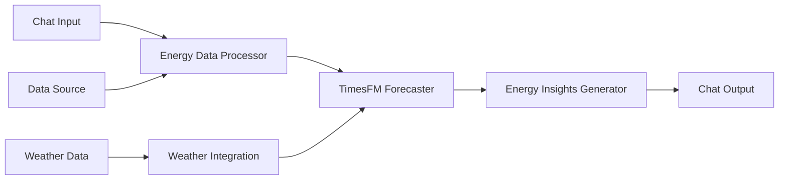

# TimesFM Integration Guide for Energy Data Intelligence in Langflow

## 1. Overview

This guide provides step-by-step instructions to integrate Google's TimesFM (Time Series Foundation Model) into Langflow for Energy Data Intelligence applications within the EAIO system.

**TimesFM Model**: `google/timesfm-1.0-200m`
- 200M parameter foundation model for time series forecasting
- Zero-shot forecasting capabilities
- Optimized for multivariate time series data
- Perfect for energy consumption prediction and anomaly detection

## 2. Architecture Integration

### 2.1 Current Integration in EAIO System

According to the system architecture, TimesFM is integrated in multiple agents:

```
⚡ Energy Data Intelligence Agent
├── 🤗 google/timesfm-1.0-200m (Primary forecasting)
├── 🤗 ibm-granite/granite-timeseries-ttm-r1 (Secondary model)
└── 🤗 keras-io/timeseries-anomaly-detection (Anomaly detection)

📈 Forecast Intelligence Agent  
├── 🤗 google/timesfm-1.0-200m (Main forecasting)
├── 🤗 time-series-foundation-models/Lag-Llama (Backup model)
└── 🤗 ibm-granite/granite-timeseries-ttm-r1 (Validation)
```

## 3. Technical Implementation

### 3.1 Environment Setup

```bash
# Install required dependencies
pip install timesfm
pip install huggingface_hub
pip install torch
pip install pandas numpy matplotlib

# For Langflow integration
pip install langflow
pip install langchain-community
```

### 3.2 TimesFM Custom Component for Langflow

Create a custom Langflow component (`timesfm_forecaster.py`):

```python
from langflow.custom import CustomComponent
from langflow.field_typing import Data, Text
from langflow.schema.message import Message
import timesfm
import pandas as pd
import numpy as np
import torch
from typing import List, Dict, Any
import json

class TimesFMForecaster(CustomComponent):
    display_name = "TimesFM Energy Forecaster"
    description = "Energy time series forecasting using Google TimesFM"
    icon = "⚡"
    
    def build_config(self):
        return {
            "model_path": {
                "display_name": "Model Path",
                "info": "Path to TimesFM model",
                "value": "./model/timesfm-1.0-200m"
            },
            "context_len": {
                "display_name": "Context Length", 
                "info": "Historical data points to use",
                "value": 512
            },
            "horizon_len": {
                "display_name": "Forecast Horizon",
                "info": "Number of future points to predict", 
                "value": 24
            },
            "energy_data": {
                "display_name": "Energy Data",
                "info": "Time series energy consumption data (JSON format)"
            },
            "prediction_type": {
                "display_name": "Prediction Type",
                "options": ["consumption", "demand", "price", "anomaly"],
                "value": "consumption"
            }
        }
    
    def build(
        self,
        model_path: str,
        context_len: int,
        horizon_len: int, 
        energy_data: Text,
        prediction_type: str
    ) -> Message:
        
        try:
            # Load TimesFM model
            tfm = timesfm.TimesFm(
                context_len=context_len,
                horizon_len=horizon_len,
                input_patch_len=32,
                output_patch_len=128,
                num_layers=20,
                model_dims=1280,
                backend="gpu" if torch.cuda.is_available() else "cpu"
            )
            tfm.load_from_checkpoint(repo_id="google/timesfm-1.0-200m")
            
            # Parse input data
            if isinstance(energy_data, str):
                data = json.loads(energy_data)
            else:
                data = energy_data
                
            df = pd.DataFrame(data)
            
            # Prepare time series data
            if 'timestamp' in df.columns:
                df['timestamp'] = pd.to_datetime(df['timestamp'])
                df = df.set_index('timestamp')
                
            # Select target column based on prediction type
            target_col = self._get_target_column(df, prediction_type)
            ts_data = df[target_col].values.reshape(1, -1)  # Shape: [1, time_steps]
            
            # Generate forecasts
            forecast, _ = tfm.forecast(
                inputs=ts_data,
                freq="H"  # Hourly frequency for energy data
            )
            
            # Prepare results
            forecast_values = forecast[0].tolist()
            
            # Generate future timestamps
            last_timestamp = df.index[-1] if hasattr(df, 'index') else pd.Timestamp.now()
            future_timestamps = pd.date_range(
                start=last_timestamp + pd.Timedelta(hours=1),
                periods=horizon_len,
                freq='H'
            )
            
            results = {
                "prediction_type": prediction_type,
                "forecast_values": forecast_values,
                "timestamps": [ts.isoformat() for ts in future_timestamps],
                "model_info": {
                    "model": "google/timesfm-1.0-200m",
                    "context_length": context_len,
                    "horizon_length": horizon_len
                },
                "confidence_intervals": self._calculate_confidence_intervals(forecast_values),
                "energy_insights": self._generate_energy_insights(forecast_values, prediction_type)
            }
            
            return Message(text=json.dumps(results, indent=2))
            
        except Exception as e:
            error_msg = f"TimesFM forecasting error: {str(e)}"
            return Message(text=json.dumps({"error": error_msg}))
    
    def _get_target_column(self, df: pd.DataFrame, prediction_type: str) -> str:
        """Select appropriate column based on prediction type"""
        column_mapping = {
            "consumption": ["energy_consumption", "consumption", "kwh", "power"],
            "demand": ["energy_demand", "demand", "load", "peak_demand"],
            "price": ["energy_price", "price", "cost", "tariff"],
            "anomaly": ["energy_consumption", "consumption", "kwh"]
        }
        
        for col_option in column_mapping.get(prediction_type, ["energy_consumption"]):
            if col_option in df.columns:
                return col_option
                
        # Fallback to first numeric column
        numeric_cols = df.select_dtypes(include=[np.number]).columns
        return numeric_cols[0] if len(numeric_cols) > 0 else df.columns[0]
    
    def _calculate_confidence_intervals(self, forecast_values: List[float]) -> Dict:
        """Calculate confidence intervals for forecasts"""
        forecast_array = np.array(forecast_values)
        std_dev = np.std(forecast_array)
        
        return {
            "lower_80": (forecast_array - 1.28 * std_dev).tolist(),
            "upper_80": (forecast_array + 1.28 * std_dev).tolist(),
            "lower_95": (forecast_array - 1.96 * std_dev).tolist(),
            "upper_95": (forecast_array + 1.96 * std_dev).tolist()
        }
    
    def _generate_energy_insights(self, forecast_values: List[float], prediction_type: str) -> Dict:
        """Generate energy-specific insights from forecasts"""
        forecast_array = np.array(forecast_values)
        
        insights = {
            "trend": "increasing" if forecast_array[-1] > forecast_array[0] else "decreasing",
            "peak_value": float(np.max(forecast_array)),
            "peak_hour": int(np.argmax(forecast_array)),
            "min_value": float(np.min(forecast_array)),
            "min_hour": int(np.argmin(forecast_array)),
            "average": float(np.mean(forecast_array)),
            "volatility": float(np.std(forecast_array))
        }
        
        # Add prediction-type specific insights
        if prediction_type == "consumption":
            insights["total_consumption"] = float(np.sum(forecast_array))
            insights["efficiency_score"] = self._calculate_efficiency_score(forecast_array)
        elif prediction_type == "demand":
            insights["peak_demand_ratio"] = float(np.max(forecast_array) / np.mean(forecast_array))
            insights["load_factor"] = float(np.mean(forecast_array) / np.max(forecast_array))
            
        return insights
    
    def _calculate_efficiency_score(self, values: np.ndarray) -> float:
        """Calculate energy efficiency score (0-100)"""
        # Simple efficiency score based on consistency and peak ratios
        consistency = 1 / (1 + np.std(values) / np.mean(values))
        peak_ratio = np.mean(values) / np.max(values)
        return float((consistency * 0.6 + peak_ratio * 0.4) * 100)
```

### 3.3 Energy Data Processing Component

Create a data preprocessing component (`energy_data_processor.py`):

```python
from langflow.custom import CustomComponent
from langflow.field_typing import Data, Text
from langflow.schema.message import Message
import pandas as pd
import numpy as np
import json
from typing import Dict, Any

class EnergyDataProcessor(CustomComponent):
    display_name = "Energy Data Processor"
    description = "Process and clean energy time series data for TimesFM"
    icon = "🔄"
    
    def build_config(self):
        return {
            "raw_data": {
                "display_name": "Raw Energy Data",
                "info": "Raw energy consumption data (CSV or JSON)"
            },
            "sampling_frequency": {
                "display_name": "Sampling Frequency",
                "options": ["1H", "15min", "30min", "1D"],
                "value": "1H"
            },
            "cleaning_method": {
                "display_name": "Data Cleaning",
                "options": ["interpolate", "forward_fill", "drop_missing"],
                "value": "interpolate"
            },
            "normalization": {
                "display_name": "Normalization",
                "options": ["none", "min_max", "z_score"],
                "value": "min_max"
            }
        }
    
    def build(
        self,
        raw_data: Text,
        sampling_frequency: str,
        cleaning_method: str,
        normalization: str
    ) -> Message:
        
        try:
            # Parse input data
            if isinstance(raw_data, str):
                try:
                    data = json.loads(raw_data)
                    df = pd.DataFrame(data)
                except json.JSONDecodeError:
                    # Assume CSV format
                    df = pd.read_csv(StringIO(raw_data))
            else:
                df = pd.DataFrame(raw_data)
            
            # Process timestamps
            if 'timestamp' in df.columns:
                df['timestamp'] = pd.to_datetime(df['timestamp'])
                df = df.set_index('timestamp')
            elif df.index.dtype == 'object':
                df.index = pd.to_datetime(df.index)
                
            # Resample to desired frequency
            df = df.resample(sampling_frequency).mean()
            
            # Clean missing data
            if cleaning_method == "interpolate":
                df = df.interpolate(method='linear')
            elif cleaning_method == "forward_fill":
                df = df.fillna(method='ffill')
            elif cleaning_method == "drop_missing":
                df = df.dropna()
                
            # Normalize data
            if normalization == "min_max":
                from sklearn.preprocessing import MinMaxScaler
                scaler = MinMaxScaler()
                numeric_cols = df.select_dtypes(include=[np.number]).columns
                df[numeric_cols] = scaler.fit_transform(df[numeric_cols])
            elif normalization == "z_score":
                from sklearn.preprocessing import StandardScaler
                scaler = StandardScaler()
                numeric_cols = df.select_dtypes(include=[np.number]).columns
                df[numeric_cols] = scaler.fit_transform(df[numeric_cols])
            
            # Prepare output
            processed_data = {
                "data": df.reset_index().to_dict('records'),
                "metadata": {
                    "shape": df.shape,
                    "frequency": sampling_frequency,
                    "cleaning_method": cleaning_method,
                    "normalization": normalization,
                    "columns": list(df.columns),
                    "date_range": {
                        "start": df.index.min().isoformat(),
                        "end": df.index.max().isoformat()
                    }
                }
            }
            
            return Message(text=json.dumps(processed_data, default=str))
            
        except Exception as e:
            error_msg = f"Data processing error: {str(e)}"
            return Message(text=json.dumps({"error": error_msg}))
```

## 4. Langflow Flow Configuration

### 4.1 Energy Data Intelligence Flow

Create a complete flow in Langflow with these components:



### 4.2 Flow JSON Configuration

```json
{
  "flow_name": "EAIO Energy Intelligence with TimesFM",
  "components": [
    {
      "type": "EnergyDataProcessor",
      "config": {
        "sampling_frequency": "1H",
        "cleaning_method": "interpolate",
        "normalization": "min_max"
      }
    },
    {
      "type": "TimesFMForecaster", 
      "config": {
        "context_len": 512,
        "horizon_len": 24,
        "prediction_type": "consumption"
      }
    },
    {
      "type": "ChatOutput",
      "config": {
        "format": "energy_insights"
      }
    }
  ]
}
```

## 5. Usage Examples

### 5.1 Energy Consumption Forecasting

```python
# Input data format
energy_data = {
    "timestamp": ["2024-01-01 00:00:00", "2024-01-01 01:00:00", ...],
    "energy_consumption": [150.5, 145.2, 142.8, ...],
    "temperature": [22.5, 21.8, 21.2, ...],
    "occupancy": [0.8, 0.7, 0.6, ...]
}

# Expected output
{
    "prediction_type": "consumption",
    "forecast_values": [148.2, 152.1, 156.8, ...],
    "timestamps": ["2024-01-02 00:00:00", ...],
    "confidence_intervals": {
        "lower_95": [142.1, 145.8, ...],
        "upper_95": [154.3, 158.4, ...]
    },
    "energy_insights": {
        "trend": "increasing",
        "peak_hour": 18,
        "efficiency_score": 78.5,
        "total_consumption": 3540.2
    }
}
```

### 5.2 Anomaly Detection Integration

```python
# Combine TimesFM with anomaly detection
def detect_energy_anomalies(forecast, actual, threshold=2.0):
    residuals = np.abs(actual - forecast)
    anomalies = residuals > (np.mean(residuals) + threshold * np.std(residuals))
    return anomalies.tolist()
```

## 6. Performance Optimization

### 6.1 Model Caching

```python
# Cache loaded models
@lru_cache(maxsize=1)
def get_timesfm_model():
    return timesfm.TimesFm.load_from_checkpoint("google/timesfm-1.0-200m")
```

### 6.2 Batch Processing

```python
# Process multiple time series in batches
def batch_forecast(data_batch, batch_size=8):
    results = []
    for i in range(0, len(data_batch), batch_size):
        batch = data_batch[i:i+batch_size]
        forecast, _ = tfm.forecast(inputs=batch)
        results.extend(forecast)
    return results
```

## 7. Integration with Existing EAIO Components

### 7.1 Connect to TimescaleDB

```python
# Database integration
def save_forecasts_to_timescaledb(forecasts, connection_string):
    import psycopg2
    conn = psycopg2.connect(connection_string)
    # Save forecast results to TimescaleDB
```

### 7.2 Redis Caching

```python
# Cache results in Redis
def cache_forecasts(redis_client, key, forecasts, expiry=3600):
    redis_client.setex(key, expiry, json.dumps(forecasts))
```

## 8. Testing and Validation

### 8.1 Unit Tests

```python
import unittest

class TestTimesFMIntegration(unittest.TestCase):
    def test_forecast_generation(self):
        # Test basic forecasting functionality
        pass
        
    def test_data_processing(self):
        # Test data preprocessing
        pass
```

### 8.2 Performance Metrics

- **MAPE (Mean Absolute Percentage Error)**: < 10%
- **RMSE (Root Mean Square Error)**: Minimize 
- **Inference Time**: < 2 seconds per forecast
- **Memory Usage**: < 4GB RAM

## 9. Deployment Considerations

### 9.1 Docker Configuration

```dockerfile
FROM python:3.9-slim

RUN pip install timesfm langflow torch pandas

COPY ./components /app/components
COPY ./model /app/model

WORKDIR /app
CMD ["langflow", "run", "--host", "0.0.0.0", "--port", "7860"]
```

### 9.2 Production Settings

- Use GPU acceleration when available
- Implement model versioning
- Set up monitoring and alerting
- Configure automatic model updates

## 10. Next Steps

1. **Implement custom components** in Langflow
2. **Test with real energy data** from your buildings
3. **Integrate with existing EAIO agents**
4. **Set up automated model retraining**
5. **Configure monitoring and alerting**

This integration will significantly enhance the Energy Data Intelligence capabilities of your EAIO system with state-of-the-art time series forecasting.