# EAIO Stakeholder Agentic Workflows Analysis

## Overview
This document analyzes user questions by stakeholder groups and designs multi-agent workflows for the Energy AI Optimizer (EAIO) system. Based on the stakeholder analysis and available database queries, we define specific use cases and agentic workflows to serve each stakeholder group effectively.

  Building Owners/Property Managers (15 câu hỏi chi tiết):
  - Financial Performance: 5 câu hỏi với agent mapping và SQL queries cụ thể
  - Strategic Planning: 5 câu hỏi với ROI analysis và benchmarking
  - Compliance & Reporting: 5 câu hỏi với regulatory và ESG reporting

  Energy/Sustainability Consultants (15 câu hỏi chi tiết):
  - Technical Analysis: 5 câu hỏi với comprehensive audit và correlation analysis
  - Advanced Optimization: 5 câu hỏi với demand response và renewable integration
  - Validation & Verification: 5 câu hỏi với IPMVP protocols và uncertainty analysis

  Mỗi câu hỏi đều có:
  - Agent Mapping: Xác định agent chính và phụ trợ
  - Query Mapping: Tham chiếu đến queries trong agent_database_queries.md
  - SQL Code: Snippets của primary queries được sử dụng

  Total: 45 câu hỏi chi tiết với mapping hoàn chỉnh cho cả 3 nhóm stakeholders.

---

## 1. Stakeholder-Specific User Questions Analysis

### 1.1 Facility Managers Questions

#### Operational Monitoring Questions:

##### **"What's the current energy consumption status of Building A?"**
**Agent Mapping**: Energy Data Intelligence Agent  
**Query Mapping**: 
- Basic Energy Consumption Pattern Analysis (hourly patterns)
- Data Completeness Analysis (quality verification)
```sql
-- Primary Query: Current consumption status
SELECT DATE_TRUNC('hour', timestamp) as hour, meter_type, 
       AVG(value) as avg_consumption, SUM(value) as total_consumption
FROM energy.meter_readings 
WHERE building_id = 'Building_A' AND timestamp >= CURRENT_TIMESTAMP - INTERVAL '24 hours'
AND quality = 'good' GROUP BY DATE_TRUNC('hour', timestamp), meter_type;
```

##### **"Are there any equipment failures or anomalies detected today?"**
**Agent Mapping**: Energy Data Intelligence Agent + Forecast Intelligence Agent  
**Query Mapping**: 
- Consumption Outlier Detection (statistical analysis)
- Equipment Failure Prediction (risk scoring)
```sql
-- Primary Query: Anomaly detection
WITH consumption_stats AS (SELECT meter_id, AVG(value) as mean_consumption, STDDEV(value) as std_consumption...)
-- Identifies outliers using IQR and statistical bounds
```

##### **"How is our building performing compared to yesterday/last week?"**
**Agent Mapping**: Energy Data Intelligence Agent  
**Query Mapping**: 
- Daily Consumption Trends by Building Type
- Peak Demand Analysis (load factor comparison)
```sql
-- Primary Query: Performance comparison
SELECT DATE_TRUNC('day', timestamp) as day, meter_type,
       SUM(value) as daily_consumption,
       LAG(SUM(value)) OVER (ORDER BY DATE_TRUNC('day', timestamp)) as previous_day
FROM energy.meter_readings WHERE building_id = $1...
```

##### **"Which systems are consuming the most energy right now?"**
**Agent Mapping**: Energy Data Intelligence Agent  
**Query Mapping**: 
- Basic Energy Consumption Pattern Analysis (by meter type)
- Peak Demand Analysis (current demand ranking)
```sql
-- Primary Query: Current system ranking
SELECT meter_type, meter_id, SUM(value) as current_consumption
FROM energy.meter_readings 
WHERE building_id = $1 AND timestamp >= CURRENT_TIMESTAMP - INTERVAL '1 hour'
ORDER BY current_consumption DESC;
```

##### **"What maintenance alerts do I need to address immediately?"**
**Agent Mapping**: System Control Agent + Forecast Intelligence Agent  
**Query Mapping**: 
- System Status and Control Point Monitoring
- Equipment Failure Prediction (maintenance recommendations)
```sql
-- Primary Query: Critical maintenance alerts
SELECT meter_id, failure_risk_score, maintenance_recommendation
FROM (Equipment Failure Prediction Query)
WHERE failure_risk_score >= 4 ORDER BY failure_risk_score DESC;
```

#### Performance Optimization Questions:

##### **"What are the top 3 energy-saving opportunities for this month?"**
**Agent Mapping**: Optimization Strategy Specialist Agent  
**Query Mapping**: 
- Building-Specific Optimization Recommendations
- ROI Analysis for Energy Efficiency Measures
```sql
-- Primary Query: Top optimization opportunities
SELECT primary_recommendation, potential_savings, implementation_priority
FROM (Building-Specific Optimization Query)
WHERE implementation_priority IN ('high', 'medium') 
ORDER BY potential_savings DESC LIMIT 3;
```

##### **"How can I reduce peak demand during utility peak hours?"**
**Agent Mapping**: Forecast Intelligence Agent + System Control Agent  
**Query Mapping**: 
- Peak Demand and Load Shifting Analysis
- Automated Control Parameter Optimization
```sql
-- Primary Query: Demand response opportunities
SELECT utility_period, potential_load_reduction, dr_recommendation
FROM (Load Shifting Potential Analysis)
WHERE utility_period = 'utility_peak' AND potential_load_reduction > 0;
```

##### **"Which setpoint adjustments would save the most energy?"**
**Agent Mapping**: System Control Agent  
**Query Mapping**: 
- Automated Control Parameter Optimization
- Safety and Comfort Constraint Enforcement
```sql
-- Primary Query: Optimal setpoint recommendations
SELECT hour_of_day, occupancy_schedule, recommended_temp_setpoint, savings_potential
FROM (Setpoint Analysis Query)
WHERE savings_potential > 0 ORDER BY savings_potential DESC;
```

##### **"What's the optimal schedule for HVAC systems this week?"**
**Agent Mapping**: System Control Agent + Weather Intelligence Agent  
**Query Mapping**: 
- Automated Control Parameter Optimization (scheduling)
- Weather-Based Energy Demand Prediction
```sql
-- Primary Query: Weekly HVAC schedule
SELECT day_of_week, hour_of_day, control_command, 
       recommended_temp_setpoint, occupancy_schedule
FROM (Control Commands Query)
ORDER BY day_of_week, hour_of_day;
```

##### **"Are there any comfort complaints that need attention?"**
**Agent Mapping**: System Control Agent + Validator Agent  
**Query Mapping**: 
- Safety and Comfort Constraint Enforcement
- System Quality Assurance and Error Detection
```sql
-- Primary Query: Comfort constraint violations
SELECT building_id, meter_type, constraint_status, violation_severity_percent, safety_action
FROM (Constraint Violations Analysis)
WHERE constraint_status IN ('over_consumption', 'under_consumption');
```

#### Troubleshooting Questions:

##### **"Why did energy consumption spike at 2 PM yesterday?"**
**Agent Mapping**: Energy Data Intelligence Agent + Weather Intelligence Agent  
**Query Mapping**: 
- Unusual Pattern Detection
- Weather-Energy Correlation Analysis
```sql
-- Primary Query: Consumption spike analysis
SELECT timestamp, consumption, hour_of_day, time_category, consumption_ratio,
       avg_temperature, temp_correlation
FROM (Unusual Pattern Detection + Weather Correlation)
WHERE timestamp BETWEEN 'yesterday 1PM' AND 'yesterday 3PM';
```

##### **"Which meter is showing unusual readings?"**
**Agent Mapping**: Energy Data Intelligence Agent  
**Query Mapping**: 
- Consumption Outlier Detection
- Data Quality Assessment
```sql
-- Primary Query: Unusual meter identification
SELECT meter_id, outlier_type, z_score, consumption_value, mean_consumption
FROM (Outlier Detection Query)
WHERE outlier_type IN ('iqr_outlier', 'statistical_outlier');
```

##### **"How do I override the automated system for emergency maintenance?"**
**Agent Mapping**: System Control Agent + Validator Agent  
**Query Mapping**: 
- Safety and Comfort Constraint Enforcement
- System Quality Assurance (emergency protocols)
```sql
-- Primary Query: Emergency override validation
SELECT constraint_status, safety_action, recommended_setpoint
FROM (Safety Constraints Analysis)
WHERE safety_action LIKE '%EMERGENCY%';
```

##### **"What caused the temperature control issues in Zone 3?"**
**Agent Mapping**: System Control Agent + Energy Data Intelligence Agent  
**Query Mapping**: 
- System Status and Control Point Monitoring
- Consumption Outlier Detection (zone-specific)
```sql
-- Primary Query: Zone-specific issue analysis
SELECT meter_name, system_status, control_health_score, control_recommendation
FROM (Control Systems Monitoring)
WHERE meter_name LIKE '%Zone 3%' OR meter_name LIKE '%Zone_3%';
```

### 1.2 Building Owners/Property Managers Questions

#### Financial Performance Questions:

##### **"What's our monthly energy cost savings so far?"**
**Agent Mapping**: Optimization Strategy Specialist Agent + Energy Data Intelligence Agent  
**Query Mapping**: 
- ROI Analysis for Energy Efficiency Measures
- Building Baseline Energy Performance Analysis
```sql
-- Primary Query: Monthly cost savings tracking
SELECT DATE_TRUNC('month', timestamp) as month, 
       SUM(baseline_cost - optimized_cost) as monthly_savings,
       AVG((baseline_cost - optimized_cost) / baseline_cost * 100) as savings_percentage
FROM (ROI Analysis Query) WHERE timestamp >= DATE_TRUNC('year', CURRENT_DATE)
GROUP BY DATE_TRUNC('month', timestamp) ORDER BY month;
```

##### **"How is the ROI tracking against our 18-month target?"**
**Agent Mapping**: Optimization Strategy Specialist Agent  
**Query Mapping**: 
- ROI Analysis for Energy Efficiency Measures
- Building-Specific Optimization Recommendations
```sql
-- Primary Query: ROI tracking vs target
SELECT investment_date, total_investment, cumulative_savings, 
       (cumulative_savings / total_investment * 100) as current_roi,
       target_roi, months_elapsed, roi_trajectory
FROM (ROI Analysis Query) WHERE investment_date >= CURRENT_DATE - INTERVAL '18 months';
```

##### **"Which buildings in our portfolio are underperforming?"**
**Agent Mapping**: Energy Data Intelligence Agent + Validator Agent  
**Query Mapping**: 
- Building Performance Benchmarking
- Data Quality Assessment (validation)
```sql
-- Primary Query: Portfolio performance ranking
SELECT building_id, current_eui, benchmark_eui, 
       (current_eui - benchmark_eui) as performance_gap,
       performance_percentile, improvement_potential
FROM (Building Benchmarking Query)
WHERE performance_percentile < 25 ORDER BY performance_gap DESC;
```

##### **"What's the payback period for the HVAC upgrade proposal?"**
**Agent Mapping**: Optimization Strategy Specialist Agent + Forecast Intelligence Agent  
**Query Mapping**: 
- ROI Analysis for Energy Efficiency Measures
- Long-term Energy Forecasting
```sql
-- Primary Query: HVAC upgrade payback analysis
SELECT upgrade_cost, annual_savings, simple_payback_years,
       net_present_value, internal_rate_of_return,
       risk_adjusted_payback
FROM (Investment Analysis Query)
WHERE investment_type = 'hvac_upgrade';
```

##### **"How much have we saved compared to baseline?"**
**Agent Mapping**: Energy Data Intelligence Agent  
**Query Mapping**: 
- Building Baseline Energy Performance Analysis
- Daily Consumption Trends by Building Type
```sql
-- Primary Query: Baseline vs current performance
SELECT baseline_period, current_period, baseline_total_consumption,
       current_total_consumption, absolute_savings, percentage_savings,
       avoided_costs
FROM (Baseline Comparison Query)
WHERE building_id = $1 AND baseline_period = 'pre_optimization';
```

#### Strategic Planning Questions:

##### **"What are the best energy efficiency investments for next year?"**
**Agent Mapping**: Optimization Strategy Specialist Agent + Forecast Intelligence Agent  
**Query Mapping**: 
- Building-Specific Optimization Recommendations
- Equipment Failure Prediction (replacement planning)
```sql
-- Primary Query: Investment opportunity prioritization
SELECT investment_category, total_investment_required, annual_savings_potential,
       payback_period, risk_score, implementation_priority
FROM (Investment Opportunities Query)
WHERE implementation_year = EXTRACT(YEAR FROM CURRENT_DATE) + 1
ORDER BY payback_period ASC, annual_savings_potential DESC LIMIT 10;
```

##### **"How does our building rank against industry benchmarks?"**
**Agent Mapping**: Energy Data Intelligence Agent  
**Query Mapping**: 
- Building Performance Benchmarking
- Energy Use Intensity (EUI) Comparisons
```sql
-- Primary Query: Industry benchmark comparison
SELECT building_id, building_type, current_eui, industry_median_eui,
       industry_top_quartile_eui, percentile_ranking, certification_readiness
FROM (Building Benchmarking Query)
WHERE building_type = $1 AND certification_target = 'energy_star';
```

##### **"What's the potential value increase from Energy Star certification?"**
**Agent Mapping**: Optimization Strategy Specialist Agent  
**Query Mapping**: 
- Energy Star Score Estimation
- ROI Analysis for Energy Efficiency Measures (certification)
```sql
-- Primary Query: Energy Star certification value
SELECT current_energy_star_score, target_energy_star_score,
       required_improvements, estimated_asset_value_increase,
       certification_costs, net_value_creation
FROM (Energy Star Analysis)
WHERE building_id = $1 AND certification_level >= 75;
```

##### **"Which optimization measures have the highest ROI?"**
**Agent Mapping**: Optimization Strategy Specialist Agent  
**Query Mapping**: 
- Building-Specific Optimization Recommendations
- ROI Analysis for Energy Efficiency Measures
```sql
-- Primary Query: ROI-ranked optimization measures
SELECT optimization_measure, investment_cost, annual_savings,
       simple_payback_months, npv_10_year, implementation_complexity
FROM (Optimization ROI Ranking)
ORDER BY npv_10_year DESC, simple_payback_months ASC;
```

##### **"How can we achieve our 30% energy reduction target?"**
**Agent Mapping**: Optimization Strategy Specialist Agent + Forecast Intelligence Agent  
**Query Mapping**: 
- Building-Specific Optimization Recommendations
- Load Shifting Potential Analysis
```sql
-- Primary Query: Energy reduction pathway analysis
SELECT reduction_pathway, cumulative_savings_percent, total_investment,
       implementation_timeline, risk_factors, confidence_level
FROM (Energy Reduction Scenarios)
WHERE target_reduction_percent >= 30 
ORDER BY total_investment ASC, confidence_level DESC;
```

#### Compliance & Reporting Questions:

##### **"Generate our Energy Star submission report"**
**Agent Mapping**: Validator Agent + Energy Data Intelligence Agent  
**Query Mapping**: 
- Energy Star Score Estimation
- Data Quality Assessment (compliance verification)
```sql
-- Primary Query: Energy Star submission data
SELECT building_id, reporting_year, total_energy_use, gross_floor_area,
       occupancy_hours, energy_star_score, percentile_ranking,
       data_quality_flags, submission_readiness
FROM (Energy Star Reporting Query)
WHERE reporting_year = EXTRACT(YEAR FROM CURRENT_DATE) - 1;
```

##### **"What's our current carbon footprint and reduction progress?"**
**Agent Mapping**: Energy Data Intelligence Agent + Weather Intelligence Agent  
**Query Mapping**: 
- Carbon Footprint Analysis by Energy Source
- Weather-Energy Correlation Analysis (seasonal adjustments)
```sql
-- Primary Query: Carbon footprint tracking
SELECT reporting_period, total_emissions_mtco2e, scope1_emissions,
       scope2_emissions, emissions_intensity, reduction_from_baseline,
       renewable_energy_percentage
FROM (Carbon Footprint Analysis)
ORDER BY reporting_period DESC;
```

##### **"Are we meeting all regulatory compliance requirements?"**
**Agent Mapping**: Validator Agent  
**Query Mapping**: 
- System Quality Assurance and Error Detection
- Safety and Comfort Constraint Enforcement
```sql
-- Primary Query: Compliance status check
SELECT regulation_type, compliance_status, last_assessment_date,
       next_assessment_due, violations_count, remediation_actions
FROM (Regulatory Compliance Assessment)
WHERE compliance_status IN ('non_compliant', 'at_risk');
```

##### **"Prepare ESG performance summary for investors"**
**Agent Mapping**: Energy Data Intelligence Agent + Optimization Strategy Specialist Agent  
**Query Mapping**: 
- Building Performance Benchmarking
- ROI Analysis for Energy Efficiency Measures
```sql
-- Primary Query: ESG performance metrics
SELECT reporting_period, energy_intensity_reduction, carbon_reduction_percent,
       green_building_certifications, esg_score, investor_metrics,
       sustainability_investments, performance_vs_peers
FROM (ESG Performance Dashboard)
WHERE reporting_period >= CURRENT_DATE - INTERVAL '12 months';
```

##### **"How do we compare to ASHRAE 90.1 standards?"**
**Agent Mapping**: Validator Agent + Energy Data Intelligence Agent  
**Query Mapping**: 
- Safety and Comfort Constraint Enforcement (standards compliance)
- Building Performance Benchmarking
```sql
-- Primary Query: ASHRAE 90.1 compliance analysis
SELECT system_type, current_performance, ashrae_standard_requirement,
       compliance_status, gap_analysis, upgrade_recommendations
FROM (ASHRAE Compliance Assessment)
WHERE standard_version = '90.1-2019';
```

### 1.3 Energy/Sustainability Consultants Questions

#### Technical Analysis Questions:

##### **"Perform a comprehensive energy audit analysis for Building B"**
**Agent Mapping**: Energy Data Intelligence Agent + Weather Intelligence Agent + Forecast Intelligence Agent  
**Query Mapping**: 
- Basic Energy Consumption Pattern Analysis
- Weather-Energy Correlation Analysis
- Equipment Failure Prediction
```sql
-- Primary Query: Comprehensive energy audit data
SELECT audit_period, total_energy_use, energy_by_end_use,
       load_profile_analysis, efficiency_opportunities,
       weather_correlation_factors, equipment_condition_scores
FROM (Comprehensive Energy Audit Query)
WHERE building_id = 'Building_B';
```

##### **"What are the weather correlation patterns for heating/cooling loads?"**
**Agent Mapping**: Weather Intelligence Agent  
**Query Mapping**: 
- Weather-Energy Correlation Analysis
- Heating/Cooling Degree Day Analysis
```sql
-- Primary Query: Weather correlation analysis
SELECT season, temperature_range, heating_correlation_coefficient,
       cooling_correlation_coefficient, base_load, weather_sensitivity_factor
FROM (Weather Correlation Analysis)
WHERE meter_type IN ('heating', 'cooling', 'electricity');
```

##### **"Analyze the effectiveness of the recently implemented measures"**
**Agent Mapping**: Validator Agent + Energy Data Intelligence Agent  
**Query Mapping**: 
- System Quality Assurance and Error Detection
- Building Baseline Energy Performance Analysis
```sql
-- Primary Query: Measure effectiveness analysis
SELECT measure_name, implementation_date, pre_performance, post_performance,
       actual_savings, predicted_savings, effectiveness_ratio,
       persistence_factor
FROM (Measure Effectiveness Analysis)
WHERE implementation_date >= CURRENT_DATE - INTERVAL '12 months';
```

##### **"Compare performance across different building types in the portfolio"**
**Agent Mapping**: Energy Data Intelligence Agent  
**Query Mapping**: 
- Building Performance Benchmarking
- Energy Use Intensity (EUI) Comparisons
```sql
-- Primary Query: Portfolio performance comparison
SELECT building_type, COUNT(*) as building_count, AVG(eui) as avg_eui,
       PERCENTILE_CONT(0.25) WITHIN GROUP (ORDER BY eui) as q1_eui,
       PERCENTILE_CONT(0.75) WITHIN GROUP (ORDER BY eui) as q3_eui,
       best_performer, worst_performer
FROM (Portfolio Benchmarking)
GROUP BY building_type ORDER BY avg_eui;
```

##### **"Export raw data for third-party modeling and verification"**
**Agent Mapping**: Energy Data Intelligence Agent + Validator Agent  
**Query Mapping**: 
- Data Quality Assessment
- Raw Energy Data Export
```sql
-- Primary Query: Data export with quality metrics
SELECT timestamp, meter_id, value, unit, quality, confidence_score,
       data_source, validation_status
FROM energy.meter_readings 
WHERE building_id = $1 AND timestamp BETWEEN $2 AND $3
AND quality IN ('good', 'fair') ORDER BY timestamp;
```

#### Advanced Optimization Questions:

##### **"What are the optimal demand response strategies for this building?"**
**Agent Mapping**: Forecast Intelligence Agent + System Control Agent  
**Query Mapping**: 
- Peak Demand and Load Shifting Analysis
- Automated Control Parameter Optimization
```sql
-- Primary Query: Demand response optimization
SELECT dr_event_type, optimal_response_strategy, load_reduction_potential,
       financial_incentive, comfort_impact_score, automation_feasibility
FROM (Demand Response Optimization)
WHERE building_id = $1 ORDER BY load_reduction_potential DESC;
```

##### **"How can we implement advanced control algorithms?"**
**Agent Mapping**: System Control Agent + Forecast Intelligence Agent  
**Query Mapping**: 
- Automated Control Parameter Optimization
- Equipment Failure Prediction (control system health)
```sql
-- Primary Query: Advanced control implementation
SELECT control_strategy, algorithm_type, implementation_complexity,
       expected_savings, required_sensors, integration_requirements
FROM (Advanced Control Analysis)
WHERE building_id = $1 AND feasibility_score >= 0.7;
```

##### **"What's the potential for renewable energy integration?"**
**Agent Mapping**: Weather Intelligence Agent + Optimization Strategy Specialist Agent  
**Query Mapping**: 
- Weather-Based Energy Demand Prediction
- ROI Analysis for Energy Efficiency Measures (renewable)
```sql
-- Primary Query: Renewable energy potential
SELECT renewable_type, generation_potential_kwh, capacity_factor,
       installation_cost, payback_period, grid_integration_requirements
FROM (Renewable Energy Assessment)
WHERE building_id = $1 ORDER BY payback_period ASC;
```

##### **"Analyze the building envelope performance impact"**
**Agent Mapping**: Weather Intelligence Agent + Energy Data Intelligence Agent  
**Query Mapping**: 
- Weather-Energy Correlation Analysis
- Building Thermal Performance Analysis
```sql
-- Primary Query: Building envelope analysis
SELECT envelope_component, thermal_performance, air_leakage_rate,
       weather_sensitivity, upgrade_recommendations, energy_impact
FROM (Building Envelope Analysis)
WHERE building_id = $1 ORDER BY energy_impact DESC;
```

##### **"What are the opportunities for thermal energy storage?"**
**Agent Mapping**: Forecast Intelligence Agent + System Control Agent  
**Query Mapping**: 
- Peak Demand and Load Shifting Analysis
- System Status and Control Point Monitoring
```sql
-- Primary Query: Thermal storage opportunities
SELECT storage_type, capacity_potential, load_shifting_value,
       installation_requirements, operational_strategy, financial_benefits
FROM (Thermal Storage Analysis)
WHERE building_id = $1 AND feasibility_score >= 0.6;
```

#### Validation & Verification Questions:

##### **"Validate the savings claims from the optimization system"**
**Agent Mapping**: Validator Agent + Energy Data Intelligence Agent  
**Query Mapping**: 
- System Quality Assurance and Error Detection
- Building Baseline Energy Performance Analysis
```sql
-- Primary Query: Savings validation analysis
SELECT validation_period, claimed_savings, validated_savings,
       validation_confidence, measurement_uncertainty, adjustment_factors
FROM (Savings Validation Analysis)
WHERE building_id = $1 AND validation_method = 'IPMVP_Option_C';
```

##### **"Perform M&V analysis according to IPMVP protocols"**
**Agent Mapping**: Validator Agent + Weather Intelligence Agent  
**Query Mapping**: 
- System Quality Assurance and Error Detection
- Weather-Energy Correlation Analysis (normalization)
```sql
-- Primary Query: IPMVP M&V analysis
SELECT reporting_period, baseline_model, adjusted_baseline,
       reporting_period_consumption, avoided_consumption,
       uncertainty_bounds, cv_rmse
FROM (IPMVP_MV_Analysis)
WHERE building_id = $1 AND protocol_option = 'Option_C';
```

##### **"What's the measurement uncertainty in our savings calculations?"**
**Agent Mapping**: Validator Agent  
**Query Mapping**: 
- System Quality Assurance and Error Detection
- Data Quality Assessment
```sql
-- Primary Query: Measurement uncertainty analysis
SELECT uncertainty_source, uncertainty_magnitude, impact_on_savings,
       confidence_interval, measurement_accuracy, calibration_status
FROM (Measurement Uncertainty Analysis)
WHERE building_id = $1 ORDER BY uncertainty_magnitude DESC;
```

##### **"Generate third-party audit documentation"**
**Agent Mapping**: Validator Agent + Energy Data Intelligence Agent  
**Query Mapping**: 
- System Quality Assurance and Error Detection
- Data Quality Assessment
```sql
-- Primary Query: Third-party audit documentation
SELECT audit_requirement, documentation_status, data_completeness,
       validation_evidence, compliance_status, audit_trail
FROM (Third_Party_Audit_Documentation)
WHERE building_id = $1 AND audit_standard = 'ISO_50001';
```

##### **"Compare actual vs predicted performance"**
**Agent Mapping**: Forecast Intelligence Agent + Validator Agent  
**Query Mapping**: 
- Long-term Energy Forecasting
- System Quality Assurance and Error Detection
```sql
-- Primary Query: Actual vs predicted performance
SELECT forecast_period, predicted_consumption, actual_consumption,
       variance_percent, prediction_accuracy, model_performance_metrics
FROM (Performance_Prediction_Validation)
WHERE building_id = $1 ORDER BY forecast_period DESC;
```

---

## 2. EAIO System Architecture

### 2.1 Complete System Architecture Overview

```mermaid
graph TB
    subgraph "Stakeholder Layer"
        FM[🔧 Facility Managers]
        BO[💼 Building Owners]
        EC[🔬 Energy Consultants]
    end
    
    subgraph "Input/Output Layer"
        CI[📥 Chat Input<br/>Stakeholder Questions]
        CO[📤 Chat Output<br/>Analysis Results]
    end
    
    subgraph "Coordination Layer"
        COORD[🎯 Coordinator Agent<br/>GPT-4o-mini<br/>Query Routing & Synthesis]
    end
    
    subgraph "Specialized Agent Layer"
        EDA[⚡ Energy Data Intelligence Agent<br/>Consumption Patterns<br/>Anomaly Detection]
        WIA[🌤️ Weather Intelligence Agent<br/>Weather Correlations<br/>Climate Analysis]
        OSA[🎯 Optimization Strategy Agent<br/>ROI Analysis<br/>Investment Planning]
        FIA[📈 Forecast Intelligence Agent<br/>Predictive Modeling<br/>Demand Forecasting]
        SCA[⚙️ System Control Agent<br/>HVAC Optimization<br/>Automated Control]
        VA[🛡️ Validator Agent<br/>Data Quality<br/>Compliance Verification]
    end
    
    subgraph "Database Layer"
        TSDB[(🗄️ EAIO TimescaleDB<br/>Real-time Energy Data<br/>Historical Analytics)]
    end
    
    subgraph "External Systems"
        BMS[🏢 Building Management System]
        WEATHER[🌡️ Weather Services]
        GRID[⚡ Energy Grid]
    end
    
    %% Stakeholder Flows
    FM --> CI
    BO --> CI
    EC --> CI
    
    %% Main Processing Flow
    CI --> COORD
    COORD --> CO
    
    %% Coordinator to Agents
    COORD -.->|Route Query| EDA
    COORD -.->|Route Query| WIA
    COORD -.->|Route Query| OSA
    COORD -.->|Route Query| FIA
    COORD -.->|Route Query| SCA
    COORD -.->|Route Query| VA
    
    %% Agents to Database
    EDA --> TSDB
    WIA --> TSDB
    OSA --> TSDB
    FIA --> TSDB
    SCA --> TSDB
    VA --> TSDB
    
    %% Database to External Systems
    TSDB <--> BMS
    TSDB <--> WEATHER
    TSDB <--> GRID
    
    %% Response Flow
    EDA -.->|Analysis Results| COORD
    WIA -.->|Analysis Results| COORD
    OSA -.->|Analysis Results| COORD
    FIA -.->|Analysis Results| COORD
    SCA -.->|Analysis Results| COORD
    VA -.->|Analysis Results| COORD
    
    %% Styling
    classDef stakeholder fill:#e1f5fe,stroke:#01579b,stroke-width:2px
    classDef coordinator fill:#fff3e0,stroke:#e65100,stroke-width:3px
    classDef agent fill:#f3e5f5,stroke:#4a148c,stroke-width:2px
    classDef database fill:#e8f5e8,stroke:#1b5e20,stroke-width:2px
    classDef external fill:#fff8e1,stroke:#ff8f00,stroke-width:1px
    
    class FM,BO,EC stakeholder
    class COORD coordinator
    class EDA,WIA,OSA,FIA,SCA,VA agent
    class TSDB database
    class BMS,WEATHER,GRID external
```



### 2.2 Agent Specialization Matrix

```mermaid
graph LR
    subgraph "Stakeholder Needs"
        direction TB
        FM_NEEDS["🔧 Facility Managers<br/>• Real-time Monitoring<br/>• Equipment Alerts<br/>• Performance Tracking<br/>• Maintenance Scheduling"]
        BO_NEEDS["💼 Building Owners<br/>• Financial Performance<br/>• ROI Analysis<br/>• Strategic Planning<br/>• Compliance Reports"]
        EC_NEEDS["🔬 Energy Consultants<br/>• Technical Analysis<br/>• Advanced Optimization<br/>• Validation & Verification<br/>• Custom Modeling"]
    end
    
    subgraph "Agent Expertise"
        direction TB
        EDA_EXP["⚡ Energy Data Intelligence<br/>• Consumption Patterns<br/>• Anomaly Detection<br/>• Baseline Analysis<br/>• Performance Benchmarking"]
        WIA_EXP["🌤️ Weather Intelligence<br/>• Weather Correlations<br/>• Climate Impact<br/>• Seasonal Patterns<br/>• Degree Day Analysis"]
        OSA_EXP["🎯 Optimization Strategy<br/>• ROI Calculations<br/>• Investment Analysis<br/>• Cost-Benefit Studies<br/>• Energy Star Certification"]
        FIA_EXP["📈 Forecast Intelligence<br/>• Predictive Modeling<br/>• Demand Forecasting<br/>• Equipment Failure Prediction<br/>• Load Shifting Analysis"]
        SCA_EXP["⚙️ System Control<br/>• HVAC Optimization<br/>• Setpoint Management<br/>• Automated Control<br/>• Comfort Constraints"]
        VA_EXP["🛡️ Validator<br/>• Data Quality Assurance<br/>• Compliance Verification<br/>• Safety Validation<br/>• Error Detection"]
    end
    
    %% Primary Mappings
    FM_NEEDS -.->|Primary| EDA_EXP
    FM_NEEDS -.->|Primary| SCA_EXP
    FM_NEEDS -.->|Secondary| FIA_EXP
    FM_NEEDS -.->|Validation| VA_EXP
    
    BO_NEEDS -.->|Primary| OSA_EXP
    BO_NEEDS -.->|Supporting| EDA_EXP
    BO_NEEDS -.->|Forecasting| FIA_EXP
    BO_NEEDS -.->|Compliance| VA_EXP
    
    EC_NEEDS -.->|Analysis| EDA_EXP
    EC_NEEDS -.->|Correlation| WIA_EXP
    EC_NEEDS -.->|Strategy| OSA_EXP
    EC_NEEDS -.->|Modeling| FIA_EXP
    EC_NEEDS -.->|Control| SCA_EXP
    EC_NEEDS -.->|Validation| VA_EXP
    
    classDef stakeholder fill:#e1f5fe,stroke:#01579b,stroke-width:2px
    classDef agent fill:#f3e5f5,stroke:#4a148c,stroke-width:2px
    
    class FM_NEEDS,BO_NEEDS,EC_NEEDS stakeholder
    class EDA_EXP,WIA_EXP,OSA_EXP,FIA_EXP,SCA_EXP,VA_EXP agent
```



### 2.3 Database Integration Architecture

```mermaid
graph TB
    subgraph "EAIO TimescaleDB Schema"
        direction TB
        BUILDINGS[(🏢 energy.buildings<br/>Building Metadata<br/>EUI, Ratings, Characteristics)]
        METERS[(📊 energy.energy_meters<br/>Meter Registry<br/>Installation & Status)]
        READINGS[(📈 energy.meter_readings<br/>Time-series Data<br/>Hypertable - 108 chunks)]
        WEATHER[(🌡️ energy.weather_data<br/>Weather Time-series<br/>Hypertable - 25 chunks)]
        ANALYTICS[(🧠 energy.energy_analytics<br/>AI Analysis Results<br/>Insights & Recommendations)]
        HOURLY[(⏰ energy.meter_readings_hourly<br/>Hourly Aggregations<br/>Materialized View)]
        DAILY[(📅 energy.daily_building_consumption<br/>Daily Aggregations<br/>Materialized View)]
        MONTHLY[(📆 energy.monthly_building_profiles<br/>Monthly Aggregations<br/>Materialized View)]
    end
    
    subgraph "Agent Query Patterns"
        direction TB
        EDA_Q["⚡ Energy Data Intelligence<br/>• Consumption Patterns<br/>• Anomaly Detection<br/>• Baseline Analysis"]
        WIA_Q["🌤️ Weather Intelligence<br/>• Weather Correlations<br/>• Degree Day Analysis<br/>• Climate Impact"]
        OSA_Q["🎯 Optimization Strategy<br/>• ROI Analysis<br/>• Investment Calculations<br/>• Performance Benchmarking"]
        FIA_Q["📈 Forecast Intelligence<br/>• Predictive Modeling<br/>• Equipment Failure Prediction<br/>• Load Forecasting"]
        SCA_Q["⚙️ System Control<br/>• Control Optimization<br/>• Setpoint Analysis<br/>• Safety Constraints"]
        VA_Q["🛡️ Validator<br/>• Data Quality Assessment<br/>• Compliance Verification<br/>• Error Detection"]
    end
    
    %% Primary Data Flows
    BUILDINGS --> EDA_Q
    BUILDINGS --> OSA_Q
    BUILDINGS --> VA_Q
    
    METERS --> EDA_Q
    METERS --> SCA_Q
    METERS --> VA_Q
    
    READINGS --> EDA_Q
    READINGS --> FIA_Q
    READINGS --> SCA_Q
    
    WEATHER --> WIA_Q
    WEATHER --> FIA_Q
    
    HOURLY --> EDA_Q
    HOURLY --> OSA_Q
    HOURLY --> FIA_Q
    
    DAILY --> EDA_Q
    DAILY --> OSA_Q
    DAILY --> WIA_Q
    
    MONTHLY --> OSA_Q
    MONTHLY --> FIA_Q
    
    ANALYTICS --> VA_Q
    ANALYTICS --> OSA_Q
    
    classDef table fill:#e8f5e8,stroke:#1b5e20,stroke-width:2px
    classDef hypertable fill:#c8e6c9,stroke:#2e7d32,stroke-width:3px
    classDef view fill:#dcedc8,stroke:#558b2f,stroke-width:2px
    classDef agent fill:#f3e5f5,stroke:#4a148c,stroke-width:2px
    
    class BUILDINGS,METERS,ANALYTICS table
    class READINGS,WEATHER hypertable
    class HOURLY,DAILY,MONTHLY view
    class EDA_Q,WIA_Q,OSA_Q,FIA_Q,SCA_Q,VA_Q agent
```



---

## 3. Multi-Agent Workflow Designs

### 3.1 Facility Manager Daily Operations Workflow


### 3.2 Building Owner ROI Analysis Workflow


### 3.3 Energy Consultant Deep Analysis Workflow


### 3.4 Emergency Response Workflow


### 3.5 Cross-Stakeholder Collaborative Workflow


---

## 4. Agent Orchestration Patterns

### 4.1 Sequential Processing Pattern
Used for: Complex analysis requiring step-by-step data processing
- **Flow**: User Query → Agent 1 → Agent 2 → Agent 3 → Response
- **Example**: Energy audit requiring baseline → weather analysis → optimization → validation

### 4.2 Parallel Processing Pattern  
Used for: Independent data collection that can run simultaneously
- **Flow**: User Query → Parallel(Agent 1, Agent 2, Agent 3) → Merge → Response
- **Example**: Dashboard generation requiring current data from multiple sources

### 4.3 Conditional Branching Pattern
Used for: Decision-driven workflows based on data analysis
- **Flow**: User Query → Analysis Agent → Decision Point → Appropriate Specialist Agent → Response
- **Example**: Alert handling routing to appropriate response protocol

### 4.4 Iterative Refinement Pattern
Used for: Optimization and learning workflows
- **Flow**: User Query → Initial Analysis → Refinement Loop → Validation → Response
- **Example**: Optimization strategy development with iterative improvement

---

## 5. Implementation Considerations

### 5.1 Agent Communication Protocols
- **State Management**: Shared context across agent interactions
- **Data Formatting**: Standardized data exchange between agents
- **Error Handling**: Graceful degradation when agents fail
- **Performance Monitoring**: Track agent response times and accuracy

### 5.2 Database Query Optimization
- **Query Caching**: Cache frequently used query results
- **Parallel Execution**: Run independent queries simultaneously
- **Result Streaming**: Stream large datasets to prevent timeouts
- **Incremental Updates**: Update only changed data for efficiency

### 5.3 User Experience Design
- **Progressive Disclosure**: Show summary first, details on demand
- **Real-time Updates**: Live updates for monitoring workflows
- **Contextual Help**: Agent-specific guidance and explanations
- **Multi-modal Output**: Charts, tables, and narrative summaries

### 5.4 Security and Compliance
- **Data Privacy**: Ensure sensitive data protection
- **Access Control**: Role-based access to different agent capabilities
- **Audit Logging**: Track all agent interactions and decisions
- **Regulatory Compliance**: Meet energy reporting requirements

---

## 6. Success Metrics and KPIs

### 6.1 Stakeholder Satisfaction Metrics
- **Facility Managers**: Response time < 30 seconds, 95% accuracy
- **Building Owners**: ROI reports delivered in < 2 minutes
- **Energy Consultants**: Data export completed in < 5 minutes

### 6.2 System Performance Metrics
- **Agent Coordination**: Successful multi-agent workflows > 98%
- **Database Performance**: Query response time < 5 seconds
- **Error Recovery**: Automatic error recovery > 95%

### 6.3 Business Impact Metrics
- **Energy Savings**: 20-30% reduction in energy consumption
- **Cost Savings**: $50K-$500K annually per building
- **User Adoption**: 90% active user engagement within 3 months

---

*This agentic workflow design ensures that each stakeholder receives tailored, accurate, and actionable information through coordinated multi-agent interactions, leveraging the full capabilities of the EAIO system's specialized agents and comprehensive database queries.*