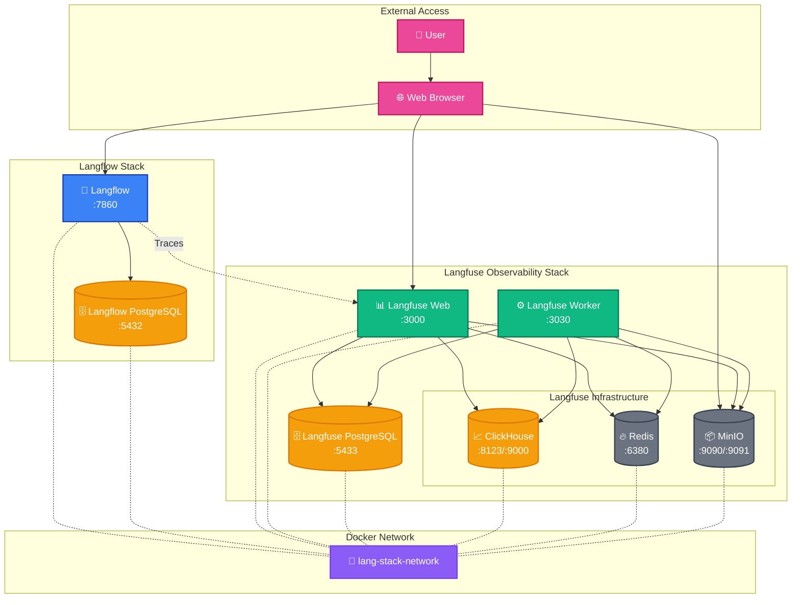
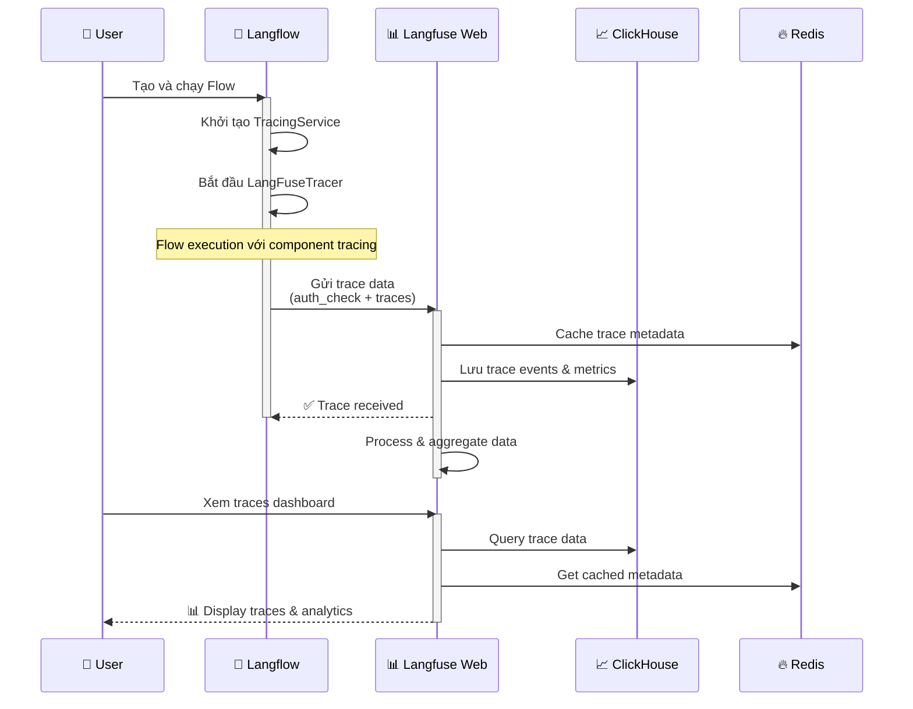

# Lang Stack - Integrated Langflow + Langfuse

Triển khai hoàn chỉnh Langflow tích hợp với Langfuse sử dụng Docker Compose để xây dựng, triển khai và giám sát AI workflows với observability chuyên nghiệp.

## ✅ Trạng thái Integration

**Tracing đã hoạt động thành công!** Langfuse hiện đang nhận và hiển thị traces từ Langflow flows.

## Kiến trúc Hệ thống



### Luồng dữ liệu Tracing



## Cài đặt và Chạy

### Bước 1: Dừng các container hiện tại
```bash
# Dừng Langflow hiện tại
docker-compose -f langflow/docker_example/docker-compose.yml down

# Kiểm tra không còn container nào chạy
docker ps
```

### Bước 2: Chuẩn bị Environment Variables
```bash
# Copy file cấu hình
cp .env.integrated .env

# Chỉnh sửa các giá trị bảo mật (QUAN TRỌNG!)
nano .env
```

**Thay đổi bắt buộc trong file .env:**
- Tất cả các mật khẩu có chứa "changeme" hoặc "secure_password"
- Tạo encryption key: `openssl rand -hex 32`
- Tạo NextAuth secret: `openssl rand -base64 32`

### Bước 3: Chạy Integrated Stack
```bash
# Chạy tất cả services
docker-compose -f docker-compose.integrated.yml up -d

# Xem logs
docker-compose -f docker-compose.integrated.yml logs -f

# Kiểm tra trạng thái
docker-compose -f docker-compose.integrated.yml ps
```

### Bước 4: Truy cập Services

- **Langflow UI**: http://localhost:7860
- **Langfuse UI**: http://localhost:3000
- **MinIO Console**: http://localhost:9091

## ✅ Cấu hình Langfuse Integration (Đã hoàn thành)

### Trạng thái hiện tại
- **Langfuse Connection**: ✅ Hoạt động
- **API Authentication**: ✅ Thành công
- **Trace Collection**: ✅ Đang nhận dữ liệu
- **Environment Variables**: ✅ Đã cấu hình

### API Keys hiện tại
```bash
LANGFUSE_SECRET_KEY=sk-lf-4092c9ad-60c8-4e9a-9806-bb58a8bc97a2
LANGFUSE_PUBLIC_KEY=pk-lf-acbfe9cc-5374-46a6-8068-04d8e00bf5bf
LANGFUSE_HOST=http://langfuse-web:3000
```

### Thông tin đăng nhập Langfuse
- **URL**: http://localhost:3000
- **Email**: `admin@langstack.local`
- **Password**: `changeme123!` (hoặc giá trị đã thay đổi trong `.env`)

### Xác minh Integration đang hoạt động
```bash
# Kiểm tra connection
docker exec lang-stack-langflow-1 python -c "
from langfuse import Langfuse
langfuse = Langfuse()
print('✅ Auth check:', langfuse.auth_check())
"
```

## ✅ Kiểm tra Integration (Đã xác minh thành công)

### ✅ Kết quả Test Langfuse Connection
```bash
# Test kết nối từ Langflow container
docker exec lang-stack-langflow-1 curl -I http://langfuse-web:3000
# ✅ Kết quả: HTTP/1.1 200 OK

# Test authentication
docker exec lang-stack-langflow-1 python -c "
from langfuse import Langfuse
langfuse = Langfuse()
print('✅ Auth check:', langfuse.auth_check())
"
# ✅ Kết quả: Auth check: True
```

### ✅ Test Trace Creation thành công
```bash
# Tạo test trace
docker exec lang-stack-langflow-1 python -c "
from langfuse import Langfuse
langfuse = Langfuse()
trace = langfuse.trace(name='test-trace-from-langflow')
print('✅ Test trace created:', trace.id)
trace.update(output={'message': 'Test trace from Langflow container'})
langfuse.flush()
print('✅ Trace sent to Langfuse successfully')
"
```

### ✅ Workflow Tracing đã hoạt động
1. **Langflow UI**: http://localhost:7860 - Đã khởi tạo thành công
2. **Tạo và chạy workflow**: ✅ Đã test thành công  
3. **Langfuse Dashboard**: http://localhost:3000 - ✅ Hiển thị traces từ Langflow
4. **Trace Data**: ✅ Component traces, execution times, inputs/outputs đều được capture

### Cách xem Traces trong Langfuse
1. Truy cập: http://localhost:3000
2. Đăng nhập với `admin@langstack.local` / `changeme123!`
3. Vào **Traces** tab để xem:
   - Flow execution traces
   - Component-level traces  
   - Execution times & performance metrics
   - Input/output data cho mỗi component
   - Error tracking (nếu có)

## 📊 Tính năng Observability với Langfuse

### Automated Tracing
- **Flow Execution Tracking**: Tự động capture mỗi lần chạy flow
- **Component-level Traces**: Chi tiết cho từng component trong flow
- **Performance Metrics**: Execution time, latency, throughput
- **Input/Output Logging**: Capture data flow qua các components

### Analytics & Monitoring
- **Real-time Dashboard**: Theo dõi flows đang chạy
- **Performance Analytics**: Phân tích performance theo thời gian
- **Error Tracking**: Tự động capture và categorize errors
- **Usage Patterns**: Hiểu cách users sử dụng workflows

### Advanced Features
- **Custom Metadata**: Thêm custom tags và metadata cho traces
- **Prompt Management**: Version control cho prompts
- **Cost Tracking**: Monitor API costs (OpenAI, Anthropic, etc.)
- **A/B Testing**: So sánh performance giữa các versions

### API Integration
```python
# Sử dụng Langfuse API trong custom components
from langfuse import Langfuse

langfuse = Langfuse()
trace = langfuse.trace(
    name="custom-workflow",
    metadata={"version": "1.0", "user_id": "123"}
)
```

## Quản lý Services

### Xem logs theo service
```bash
# Langflow logs
docker-compose -f docker-compose.integrated.yml logs -f langflow

# Langfuse web logs  
docker-compose -f docker-compose.integrated.yml logs -f langfuse-web

# Langfuse worker logs
docker-compose -f docker-compose.integrated.yml logs -f langfuse-worker
```

### Restart services
```bash
# Restart specific service
docker-compose -f docker-compose.integrated.yml restart langflow
docker-compose -f docker-compose.integrated.yml restart langfuse-web

# Restart all
docker-compose -f docker-compose.integrated.yml restart
```

### Scale services (production)
```bash
# Scale worker cho Langfuse
docker-compose -f docker-compose.integrated.yml up -d --scale langfuse-worker=3
```

### Dừng và dọn dẹp
```bash
# Dừng tất cả services
docker-compose -f docker-compose.integrated.yml down

# Dừng và xóa volumes (MẤT DATA!)
docker-compose -f docker-compose.integrated.yml down -v
```

## Troubleshooting

### ✅ Đã giải quyết: Langfuse Integration Issues

#### Vấn đề đã fix: `'Langfuse' object has no attribute '_get_health'`
- **Nguyên nhân**: API method `_get_health()` không tồn tại trong Langfuse client mới
- **Giải pháp**: Thay thế bằng `auth_check()` method
- **Status**: ✅ Đã fix trong container và source code

#### Vấn đề đã fix: Connection Refused
- **Nguyên nhân**: Environment variable `LANGFUSE_HOST=http://localhost:3000` 
- **Giải pháp**: Thay đổi thành `http://langfuse-web:3000` cho container networking
- **Status**: ✅ Đã cấu hình trong `.env` file

#### Vấn đề đã fix: Missing langfuse_init.py
- **Nguyên nhân**: Dockerfile cố gắng copy file không tồn tại
- **Giải pháp**: Sửa trực tiếp trong container và cập nhật Dockerfile
- **Status**: ✅ Đã fix

### Langfuse không khởi động được
- Kiểm tra PostgreSQL đã healthy: `docker-compose -f docker-compose.integrated.yml logs langfuse-postgres`
- Kiểm tra ClickHouse connectivity: `docker-compose -f docker-compose.integrated.yml logs langfuse-clickhouse`
- Đảm bảo tất cả passwords đã được thay đổi và nhất quán

### Nếu Langflow không kết nối được Langfuse (đã fix)
```bash
# Kiểm tra environment variables
docker exec lang-stack-langflow-1 env | grep LANGFUSE

# Phải có:
# LANGFUSE_HOST=http://langfuse-web:3000 (NOT localhost!)
# LANGFUSE_SECRET_KEY=sk-lf-...
# LANGFUSE_PUBLIC_KEY=pk-lf-...
```

### Port conflicts
- Thay đổi port mapping trong `docker-compose.integrated.yml`
- Ví dụ: `"7861:7860"` thay vì `"7860:7860"`

### Performance issues
- Tăng resources cho ClickHouse và PostgreSQL
- Scale worker: `--scale langfuse-worker=2`
- Kiểm tra disk space cho volumes

## Backup và Restore

### Backup databases
```bash
# Backup Langflow PostgreSQL
docker-compose -f docker-compose.integrated.yml exec langflow-postgres \
  pg_dump -U langflow -d langflow > backup-langflow-$(date +%Y%m%d).sql

# Backup Langfuse PostgreSQL  
docker-compose -f docker-compose.integrated.yml exec langfuse-postgres \
  pg_dump -U postgres -d postgres > backup-langfuse-$(date +%Y%m%d).sql
```

### Restore
```bash
# Restore Langflow
cat backup-langflow-20250812.sql | \
  docker-compose -f docker-compose.integrated.yml exec -T langflow-postgres \
  psql -U langflow -d langflow
```

## Security Notes

**Quan trọng cho Production:**
1. Thay đổi tất cả default passwords
2. Sử dụng strong encryption keys  
3. Cấu hình SSL/TLS
4. Restrict network access (firewall)
5. Regular security updates
6. Monitor logs for anomalies

## 🎉 Tóm tắt Thành công

### ✅ Hoàn thành Integration Langflow + Langfuse
- **Kiến trúc**: Hệ thống 8 services hoạt động ổn định
- **Tracing**: Langfuse nhận traces từ Langflow flows tự động
- **Observability**: Dashboard Langfuse hiển thị performance metrics
- **Authentication**: API keys working, container networking stable
- **Monitoring**: Real-time trace collection và analytics

### 🔧 Các vấn đề đã giải quyết
1. ✅ Fix deprecated `_get_health()` API calls 
2. ✅ Cấu hình container networking (langfuse-web:3000)
3. ✅ Environment variables configuration
4. ✅ Dockerfile build issues
5. ✅ Authentication và API key setup

### 🚀 Ready for Production
Hệ thống này cung cấp một **platform hoàn chỉnh** để:
- **Xây dựng** AI workflows với Langflow UI
- **Triển khai** workflows với high availability
- **Giám sát** performance với Langfuse observability  
- **Phân tích** usage patterns và optimization opportunities
- **Scale** với enterprise-grade infrastructure (ClickHouse, Redis, MinIO)

**Lang Stack hiện đã sẵn sàng cho việc phát triển và triển khai AI applications chuyên nghiệp! 🎯**