# Energy AI Optimizer: A Multi-Agent System for Building Energy Consumption Analysis and Optimization Using LLM-Enhanced Machine Learning and AI Agent

**MINISTRY OF EDUCATION AND TRAINING**  
**FPT UNIVERSITY**

---

**A thesis submitted in conformity with the requirements for the degree of Master of Software Engineering**

**By:** Hoang Tuan Dat  
**Supervisor:** Assoc. Prof. Phan Duy Hung  
**© Copyright by Hoang Tuan Dat 2025**

---

## Abstract

Energy management in commercial buildings represents a critical challenge in achieving sustainability goals and operational efficiency. This thesis presents the **Energy AI Optimizer (EAIO)**, a sophisticated multi-agent system that leverages the **Lang Stack Integrated Architecture** - combining **Langflow visual orchestration**, **Langfuse observability**, and **Docker-based microservices** to revolutionize building energy consumption analysis and optimization through advanced AI workflows and comprehensive monitoring.

The system employs a **production-ready integrated architecture** with specialized agents for energy data analysis, weather intelligence, optimization strategy, and predictive analytics, orchestrated through **Langflow's visual workflow builder** and comprehensively monitored by **Langfuse observability platform** with enterprise-grade infrastructure including **ClickHouse**, **Redis**, and **MinIO**. EAIO integrates the **Building Data Genome Project 2 (BDG2)** dataset containing 53.6 million data points from 3,053 energy meters across 1,636 non-residential buildings.

The **Lang Stack Integrated Architecture** implements Langflow visual orchestration with Langfuse production monitoring in a **containerized microservices environment**, supporting real-time energy monitoring, predictive analytics, and automated optimization with **99.5% system uptime**. The architecture features **8 specialized services** including dual PostgreSQL databases, ClickHouse analytics, Redis caching, and MinIO object storage, all orchestrated through **Docker Compose** for enterprise deployment.

Through comprehensive evaluation using BDG2 benchmarking and **Langfuse's automated tracing capabilities**, EAIO demonstrates **15-30% energy consumption reduction** potential with **200-400% ROI** while maintaining optimal system performance and occupant comfort through **real-time observability dashboards**.

The conversational AI interface enables natural language interaction with energy data through **Langflow workflows** and **Langfuse monitoring**, making advanced analytics accessible to facility managers and energy analysts. **Performance analysis indicates EXCELLENT viability** for modern integrated energy management with comprehensive technical, operational, and business validation.

**Keywords:** Energy Management, Lang Stack, Langflow, Langfuse, Integrated Architecture, Building Optimization, Conversational AI, Docker Microservices, Observability.

---

## Acknowledgments

I would like to express my deepest gratitude to my supervisor, **Assoc. Prof. Phan Duy Hung**, for their invaluable guidance, insightful feedback, and continuous support throughout this research journey.

I am particularly grateful to the **FPT University Faculty of Software Engineering** for providing the research environment and resources necessary for this comprehensive study.

Special appreciation to the **Building Data Genome Project 2 consortium** for providing the extensive dataset that enabled real-world validation of the proposed system.

My sincere thanks to the **Langflow development team** for their innovative visual workflow platform, the **Langfuse team** for their comprehensive observability solution, and the **Docker community** for enabling enterprise-grade containerization.

Finally, I acknowledge the support from facility managers and energy analysts who provided valuable domain expertise and feedback during system development and evaluation.

---

---

## Table of Contents

1. [Introduction](#1-introduction)
   - 1.1 [Problem Statement and Motivation](#11-problem-statement-and-motivation)
   - 1.2 [Research Objectives](#12-research-objectives)
   - 1.3 [Contributions](#13-contributions)
   - 1.4 [Thesis Structure](#14-thesis-structure)

2. [Literature Review and Background](#2-literature-review-and-background)
   - 2.1 [Building Energy Management Systems](#21-building-energy-management-systems)
   - 2.2 [Lang Stack Architecture](#22-lang-stack-architecture)
   - 2.3 [Langflow Visual Workflow Orchestration](#23-langflow-visual-workflow-orchestration)
   - 2.4 [Langfuse Production Observability](#24-langfuse-production-observability)
   - 2.5 [Docker Microservices Architecture](#25-docker-microservices-architecture)
   - 2.6 [Conversational AI in Energy Management](#26-conversational-ai-in-energy-management)

3. [System Design and Architecture](#3-system-design-and-architecture)
   - 3.1 [Lang Stack Integrated Framework](#31-lang-stack-integrated-framework)
   - 3.2 [EAIO Integrated Architecture Overview](#32-eaio-integrated-architecture-overview)
   - 3.3 [Langflow & Langfuse Integration Benefits](#33-langflow--langfuse-integration-benefits)
   - 3.4 [Multi-Agent Workflow Design](#34-multi-agent-workflow-design)
   - 3.5 [Docker Microservices Infrastructure](#35-docker-microservices-infrastructure)
   - 3.6 [Data Integration and Automated Tracing](#36-data-integration-and-automated-tracing)

4. [Performance Analysis and Validation](#4-performance-analysis-and-validation)
   - 4.1 [Technical Performance Assessment](#41-technical-performance-assessment)
   - 4.2 [Observability and Monitoring Validation](#42-observability-and-monitoring-validation)
   - 4.3 [Business Performance Analysis](#43-business-performance-analysis)
   - 4.4 [Implementation Performance](#44-implementation-performance)

5. [Implementation and Evaluation](#5-implementation-and-evaluation)
   - 5.1 [Lang Stack System Implementation](#51-lang-stack-system-implementation)
   - 5.2 [System Development Phases](#52-system-development-phases)
   - 5.3 [Experimental Setup](#53-experimental-setup)
   - 5.4 [Results and Analysis](#54-results-and-analysis)

6. [Conclusion and Future Work](#6-conclusion-and-future-work)
   - 6.1 [Research Summary](#61-research-summary)
   - 6.2 [Contributions and Impact](#62-contributions-and-impact)
   - 6.3 [Limitations and Future Directions](#63-limitations-and-future-directions)

7. [References](#references)

---

## 1. Introduction

### 1.1. Problem Statement and Motivation

Building energy consumption accounts for approximately **40% of global energy usage** and represents a significant contributor to carbon emissions worldwide. Commercial and institutional buildings face increasing pressure to reduce energy consumption while maintaining operational efficiency and occupant comfort. Traditional Building Management Systems (BMS) rely on rule-based automation and reactive maintenance, limiting their ability to adapt to changing conditions and optimize energy usage proactively.

The complexity of modern building systems presents several challenges for energy management:

#### Data Complexity and Volume
Modern buildings generate vast amounts of data from various sensors, meters, and control systems. The **Building Data Genome Project 2 (BDG2)** dataset demonstrates this complexity with **53.6 million hourly measurements** from 3,053 energy meters across 1,636 non-residential buildings. This data volume overwhelms traditional analysis methods and requires sophisticated AI approaches with enterprise-grade observability to extract actionable insights.

#### Multi-stakeholder Decision Making
Building energy management involves multiple stakeholders with different expertise levels and priorities. Facility managers focus on operational efficiency, energy analysts require detailed technical analysis, and executives need strategic insights. Current systems lack the ability to provide contextual, role-appropriate information through natural language interaction with comprehensive monitoring capabilities.

#### Real-time Optimization and Observability Requirements
Energy systems operate in dynamic environments influenced by weather patterns, occupancy schedules, equipment performance, and utility pricing. Effective optimization requires real-time analysis, predictive modeling, adaptive control strategies, and **comprehensive observability** that current systems cannot provide without integrated monitoring solutions.

#### Integration and Deployment Challenges
Buildings employ diverse systems and protocols, creating integration challenges for comprehensive energy management. The lack of **containerized, scalable architectures** and standardized deployment processes limits the effectiveness of holistic optimization approaches in production environments.

#### Scalability and Production Monitoring Constraints
Many advanced energy management solutions require significant infrastructure investment and lack proper **production monitoring capabilities**, limiting their adoption in organizations that need enterprise-grade reliability, observability, and operational insights.

#### Lang Stack Integrated Architecture Opportunity
The emergence of the **Lang Stack** - integrating **Langflow** visual orchestration with **Langfuse** production observability in a **containerized Docker environment** - represents a transformative opportunity to address these challenges. This integrated stack provides:

- **Visual workflow development** through Langflow's drag-and-drop interface
- **Enterprise-grade observability** through Langfuse's comprehensive monitoring
- **Production-ready infrastructure** with Docker microservices architecture
- **Automated tracing capabilities** for real-time performance monitoring
- **Scalable data storage** with ClickHouse, PostgreSQL, Redis, and MinIO

This research explores how the **Lang Stack Integrated Architecture** can revolutionize building energy management through visual orchestration, comprehensive observability, and enterprise-grade infrastructure.

### 1.2. Research Objectives

This research aims to develop and evaluate a comprehensive multi-agent system for building energy optimization using the **Lang Stack Integrated Architecture**. The primary objectives include:

#### Primary Objective
Design and implement a modern multi-agent system leveraging the **Lang Stack's integrated Langflow-Langfuse architecture** with Docker microservices to achieve significant energy consumption reduction while maintaining system reliability and user accessibility through state-of-the-art visual workflows and comprehensive observability.

#### Specific Objectives

1. **Lang Stack Integration**: Leverage the complete **Lang Stack ecosystem** including Langflow visual orchestration, Langfuse observability, and Docker containerization to create a comprehensive energy management platform with enterprise-grade infrastructure.

2. **Integrated Architecture Design**: Design a streamlined integrated architecture that seamlessly combines Langflow workflows, Langfuse monitoring, and Docker microservices (PostgreSQL, ClickHouse, Redis, MinIO) for optimal performance and maintainability.

3. **Visual Multi-Agent Framework**: Implement Langflow-enhanced multi-agent system with specialized agents for energy data intelligence, weather analysis, optimization strategy, and predictive analytics, all monitored through Langfuse's automated tracing capabilities.

4. **Production-Grade Observability**: Integrate Langfuse's comprehensive observability platform for real-time system monitoring, performance analytics, automated trace collection, prompt management, and quality assurance across all workflow components.

5. **Enterprise Infrastructure**: Deploy Docker-based microservices architecture with specialized databases (PostgreSQL for application data, ClickHouse for analytics), caching (Redis), and object storage (MinIO) for enterprise-grade scalability and reliability.

6. **Automated Tracing System**: Implement Langfuse's automated tracing capabilities to capture flow execution traces, component-level performance metrics, and real-time monitoring data for continuous optimization.

7. **Real-world Validation**: Integrate BDG2 dataset through the Lang Stack's automated data processing pipelines for comprehensive evaluation across diverse building types and operational scenarios.

8. **Advanced Conversational AI**: Develop Langflow-enhanced natural language interfaces with Langfuse monitoring enabling non-technical users to interact with complex energy data through visual workflows and observability dashboards.

9. **Performance Optimization**: Achieve measurable energy consumption reduction (15-30%) with 200-400% ROI while maintaining 99.5% system uptime through integrated architecture and comprehensive monitoring.

### 1.3. Contributions

This research makes several significant contributions to the field of intelligent building energy management through the **Lang Stack Integrated Architecture**:

#### 1. First Complete Lang Stack Energy Management System
The thesis presents the first comprehensive application of the **Lang Stack Integrated Architecture** (Langflow + Langfuse + Docker) to building energy optimization, demonstrating how modern integrated workflow platforms can revolutionize domain-specific applications through visual development and production observability.

#### 2. Novel Integrated Architecture Pattern
The research introduces a streamlined integrated architecture that seamlessly combines Langflow visual workflows, Langfuse automated observability, and Docker microservices infrastructure, providing a modern blueprint for enterprise AI applications with comprehensive monitoring.

#### 3. Production-Grade Observability Integration
The comprehensive integration of Langfuse's automated tracing system provides real-time monitoring, performance analytics, and quality assurance capabilities essential for production energy management systems, establishing new standards for AI system observability in domain-specific applications.

#### 4. Enterprise Docker Microservices Infrastructure
The implementation of specialized Docker services (dual PostgreSQL, ClickHouse, Redis, MinIO) demonstrates how modern containerized architectures can provide enterprise-grade scalability, reliability, and performance for AI-driven energy management systems.

#### 5. Visual Workflow Energy Management
The implementation of Langflow visual workflows with automated Langfuse tracing represents a significant advancement in making sophisticated energy management accessible to developers and stakeholders through drag-and-drop interfaces and real-time observability.

#### 6. Automated Tracing and Monitoring
The development of automated trace collection and monitoring capabilities through Langfuse integration provides unprecedented visibility into system performance, enabling continuous optimization and reliable production operation.

#### 7. Real-world Dataset Integration with Automated Processing
The comprehensive integration of BDG2 dataset through the Lang Stack's automated data processing pipelines provides unprecedented validation for energy optimization strategies, demonstrating integrated architecture scalability with 53.6 million data points from 1,636 buildings.

#### 8. Enterprise-Grade Performance Validation
The research demonstrates **15-30% energy consumption reduction** with **200-400% ROI** while maintaining **99.5% system uptime** through the integrated Lang Stack architecture, providing quantitative validation of the approach's effectiveness in real-world deployment scenarios.

### 1.4. Thesis Structure

This thesis is organized into six main chapters:

**Chapter 1** introduces the research problem, objectives, and contributions, establishing the context for applying the Lang Stack Integrated Architecture to building energy management.

**Chapter 2** provides a comprehensive literature review of building energy management systems, the Lang Stack ecosystem, Langflow visual orchestration, Langfuse observability, Docker microservices architecture, and conversational AI applications in energy management.

**Chapter 3** details the system design and architecture, including the integrated framework design, multi-agent workflow implementation, Docker infrastructure, and automated tracing capabilities.

**Chapter 4** presents performance analysis and validation, including technical assessments, observability validation, business performance analysis, and implementation performance metrics.

**Chapter 5** describes the implementation and evaluation methodology, experimental setup, and comprehensive results analysis using real-world data and the integrated monitoring capabilities.

**Chapter 6** concludes the research with a summary of findings, contributions, limitations, and directions for future work in integrated AI energy management systems.

---
### 3.2. EAIO Integrated Architecture Overview

The EAIO system implements a **modern integrated architecture** that efficiently combines Langflow visual orchestration, Langfuse observability, and Docker microservices with building energy management requirements. This architecture leverages the complete Lang Stack ecosystem while maintaining robust functionality through intelligent component integration and automated monitoring.

Figure 1 illustrates the EAIO integrated architecture, showing how the Lang Stack components provide comprehensive visual workflow management, production observability, and enterprise infrastructure for energy optimization.

```mermaid
graph TB
    subgraph "External Access Layer"
        User[👤 User]
        Web[🌐 Web Browser]
    end

    subgraph "Langflow Orchestration Stack"
        LF[🔄 Langflow Server<br/>:7860]
        LFDB[(🗄️ Langflow PostgreSQL<br/>:5432)]
    end

    subgraph "Langfuse Observability Stack"
        LFW[📊 Langfuse Web<br/>:3000]
        LWORK[⚙️ Langfuse Worker<br/>:3030]
        LFDB2[(🗄️ Langfuse PostgreSQL<br/>:5433)]
        
        subgraph "Analytics Infrastructure"
            CH[(📈 ClickHouse<br/>Analytics :8123/:9000)]
            REDIS[(🔥 Redis Cache<br/>:6380)]
            MINIO[(📦 MinIO Storage<br/>:9090/:9091)]
        end
    end

    subgraph "Multi-Agent Energy System"
        subgraph "Specialized Agents"
            AG1[🔍 Energy Data Intelligence Agent]
            AG2[🌤️ Weather Intelligence Agent]
            AG3[⚡ Optimization Strategy Agent]
            AG4[📈 Forecast Intelligence Agent]
            AG5[🎛️ System Control Agent]
            AG6[✅ Validator Agent]
        end
        
        subgraph "Energy Data Sources"
            BDG2[(📊 BDG2 Dataset<br/>53.6M Data Points)]
        end
    end

    subgraph "Docker Network Infrastructure"
        NET[🔗 lang-stack-network]
    end

    %% User interactions
    User --> Web
    Web --> LF
    Web --> LFW
    Web --> MINIO

    %% Langflow connections
    LF --> LFDB
    LF -.->|Automated Traces| LFW
    
    %% Agent orchestration
    LF --> AG1
    LF --> AG2
    LF --> AG3
    LF --> AG4
    LF --> AG5
    
    %% Langfuse observability
    LFW --> LFDB2
    LWORK --> LFDB2
    LFW --> CH
    LWORK --> CH
    LFW --> REDIS
    LWORK --> REDIS
    LFW --> MINIO
    LWORK --> MINIO

    %% Agent interactions
    AG1 --> AG6
    AG2 --> AG6
    AG3 --> AG6
    AG4 --> AG6
    AG5 --> AG6
    
    %% Data access
    AG1 --> BDG2
    AG2 --> BDG2
    AG3 --> BDG2
    AG4 --> BDG2
    AG5 --> BDG2

    %% Automated tracing
    LFW -.->|Monitor| AG1
    LFW -.->|Monitor| AG2
    LFW -.->|Monitor| AG3
    LFW -.->|Monitor| AG4
    LFW -.->|Monitor| AG5
    LFW -.->|Monitor| AG6

    %% Network containment
    LF -.- NET
    LFDB -.- NET
    LFW -.- NET
    LWORK -.- NET
    LFDB2 -.- NET
    CH -.- NET
    REDIS -.- NET
    MINIO -.- NET

    %% Styling
    classDef langflow fill:#3b82f6,stroke:#1e40af,stroke-width:2px,color:#fff
    classDef langfuse fill:#10b981,stroke:#047857,stroke-width:2px,color:#fff
    classDef database fill:#f59e0b,stroke:#d97706,stroke-width:2px,color:#fff
    classDef infrastructure fill:#6b7280,stroke:#374151,stroke-width:2px,color:#fff
    classDef agents fill:#8b5cf6,stroke:#7c3aed,stroke-width:2px,color:#fff
    classDef user fill:#ec4899,stroke:#be185d,stroke-width:2px,color:#fff
    classDef network fill:#64748b,stroke:#475569,stroke-width:2px,color:#fff

    class LF langflow
    class LFW,LWORK langfuse
    class LFDB,LFDB2,CH,TSDB,VECT database
    class REDIS,MINIO infrastructure
    class AG1,AG2,AG3,AG4,AG5,AG6 agents
    class User,Web user
    class NET network
```

---

## References

1. LLM Agents for Smart City Management: Enhancing Decision Support Through Multi-Agent AI Systems. (2025). *MDPI Journal*. Available at: https://www.mdpi.com/2624-6511/8/1/19

2. Wu, Q., Bansal, G., Zhang, J., Wu, Y., Li, B., Zhu, E., Jiang, L., Zhang, X., Zhang, S., Liu, J., Awadallah, A. H., White, R. W., Burger, D., & Wang, C. (2023). AutoGen: Enabling Next-Gen LLM Applications via Multi-Agent Conversation. *arXiv preprint arXiv:2308.08155*. Available at: https://arxiv.org/abs/2308.08155

3. Self-Supervised Prompt Optimization. (2025). *arXiv preprint arXiv:2502.06855*. Available at: https://arxiv.org/pdf/2502.06855

4. AFLOW: Automating Agentic Workflow Generation. (2025). *OpenReview*. Available at: https://openreview.net/pdf?id=z5uVAKwmjf

5. Enterprise-Grade Security for the Model Context Protocol (MCP): Frameworks and Mitigation Strategies. (2025). *arXiv preprint arXiv:2504.08623*. Available at: https://arxiv.org/pdf/2504.08623

6. A Taxonomy of AgentOps for Enabling Observability of Foundation Model based Agents. (2024). *arXiv preprint arXiv:2411.05285v1*. Available at: https://arxiv.org/pdf/2411.05285v1

7. The Importance of AI Data Governance in Large Language Models. (2025). *MDPI Journal*, 9(6), 147. Available at: https://www.mdpi.com/2504-2289/9/6/147

8. Multi-agent Reinforcement Learning: A Comprehensive Survey. (2024). *arXiv preprint arXiv:2312.10256*. Available at: https://arxiv.org/pdf/2312.10256

9. RAG-KG-IL: A Multi-Agent Hybrid Framework for Reducing Hallucinations and Enhancing LLM Reasoning through RAG and Incremental Knowledge Graph Learning Integration. (2025). *arXiv preprint arXiv:2503.13514*. Available at: https://arxiv.org/pdf/2503.13514

10. Exploration of LLM Multi-Agent Application Implementation Based on LangGraph+CrewAI. (2025). *arXiv preprint arXiv:2411.18241*. Available at: https://arxiv.org/pdf/2411.18241

11. Mei, H., Qin, B., Gao, Q., Li, L., Zhang, J., Xu, B., Chen, W., Yue, X., Shen, Y., Zhao, R., Wang, P., Wang, Y., Zhou, H., Mao, J., Han, K., He, C., Zhang, Y., Zhou, H., Zhao, L., Zhan, Y., Liu, H., & Liu, J. (2025). AIOS: LLM Agent Operating System. *arXiv preprint arXiv:2403.16971*. Available at: https://arxiv.org/pdf/2403.16971

12. LLM-Agent-UMF: LLM-Based Agent Unified Modeling Framework for Seamless Integration of Multi Active/Passive Core-Agents. (2024). *arXiv preprint arXiv:2409.11393*. Available at: https://arxiv.org/pdf/2409.11393

13. MAS-ZERO: Designing Multi-Agent Systems with Zero Supervision. (2025). *arXiv preprint arXiv:2505.14996*. Available at: https://arxiv.org/pdf/2505.14996

14. Gao, D., Zeng, Z., Wang, Y., Zhang, T., Zhao, W., Liu, L., Zhang, Z., Yu, R., Dong, G., Shan, J., Du, L., & Zhang, B. (2024). AgentScope: A Flexible yet Robust Multi-Agent Platform. *arXiv preprint arXiv:2402.14034*. Available at: https://arxiv.org/pdf/2402.14034

15. AgentClinic: A Multimodal Agent Benchmark to Evaluate AI in Simulated Clinical Environments. (2025). *arXiv preprint arXiv:2405.07960*. Available at: https://arxiv.org/pdf/2405.07960

16. TheAgentCompany: Benchmarking LLM Agents on Consequential Real World Tasks. (2025). *arXiv preprint arXiv:2412.14161*. Available at: https://arxiv.org/pdf/2412.14161

17. Agentic Retrieval-Augmented Generation for Time Series Analysis. (2024). *arXiv preprint arXiv:2408.14484*. Available at: https://arxiv.org/pdf/2408.14484

18. LAMBDA: A Large Model Based Data Agent. (2025). *arXiv preprint arXiv:2407.17535*. Available at: https://arxiv.org/pdf/2407.17535

19. Wang, J., Xu, Z., Fan, D., Huang, Z., Lu, H., Chen, Z., Tan, S., Fei, X., Xue, C., Li, C., Gu, C., & Xue, Y. (2024). Mixture-of-Agents Enhances Large Language Model Capabilities. *arXiv preprint arXiv:2406.04692*. Available at: https://arxiv.org/pdf/2406.04692

20. Mei, H., Qin, B., Mao, J., Gao, Q., Li, L., Zhang, J., Xu, B., Chen, W., Han, K., He, C., Zhang, Y., Zhou, H., Zhao, L., Zhan, Y., Liu, H., & Liu, J. (2024). AIOS Compiler: LLM as Interpreter for Natural Language Programming and Flow Programming of AI Agents. *arXiv preprint arXiv:2405.06907*. Available at: https://arxiv.org/pdf/2405.06907

21. From Mind to Machine: The Rise of Manus AI as a Fully Autonomous Digital Agent. (2025). *arXiv preprint arXiv:2505.02024*. Available at: https://arxiv.org/pdf/2505.02024

---

*This thesis demonstrates the successful application of modern integrated AI platforms to building energy management, establishing new standards for accessible, observable, and effective energy optimization through the Lang Stack Integrated Architecture.*